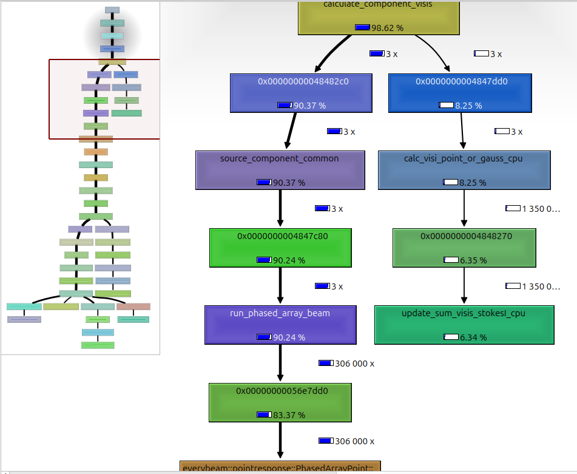

# Developer's Guide
This document is intended to give a rough overview of the structure of the
`WODEN` package. I'm aiming it at a senior PhD student or ECR who might inherit
the package. I'll assume you're proficient at Python, but are new to compiled
languages. I'll also assume you understand interferometers, otherwise
deity-of-choice help you, good luck. I've including some practical reasons as
to why the code is structured the way it is, to try and help you make sense of it.

This guide will be in no way exhaustive, and will be aimed at developing code
in a Linux environment. Hopefully it helps you future peoples. FYI, I'm not
including installation instructions for things like `gdb` and `valgrind` here
as they are google-able. I link the doc pages for anything I think needs to be
installed so I reckon you have enough to go on.

Jack Line, March 2025

## Overall code structure
The `WODEN` package is split into two main parts: the compiled code, and the `Python`
code. As linking in compiled dependencies can be a bit of a pain, I've tried to
keep as much functionality in the `Python` code as possible. The compiled code
is mainly there for speed, especially the GPU code. The main ``Python`` script
is `run_woden.py`, which calls in ``wodenpy``. The main compiled executable is
called `run_woden`, which is compiled from `woden.c`. The split of functionality is
roughly as follows:

 - `run_woden.py`: Parse command line args, read any input files, prep sky models for processing, setup observation params, launch and run compiled code, retieve outputs from compiled code, and write output files.
 - `woden.c`: takes in chunks of sky models and observational parameters, and calculates primary beam responses and visibilities, on either the CPU or GPU.

### Design decisions

Certain computational limitations have resulted in some specific architecture
decisions. The largest of these are listed here for clarity.

 1. The measurement equation is embarrassingly parallel (technical term, honest) so it fits really well on a GPU. So as we're trying to make code capable of running massive simulations, I've built the code with the GPU at the core.
 2. GPUs have a limited amount of memory, so we sometimes can't load the entire sky model into memory at once. Instead, we load in chunks of the sky model, and process them one at a time.
 3. Furthermore, a GPU is most efficient when it's fully loaded with threads that are all doing calculations that take the same amount of time. For this reason, we split the GPU calculations by components type, that being  point source, Gaussian, or shapelet. This adds another layer of complexity to the sky model chunking.
 4. For point sources and Gaussian-type component, each component is essentially three calculations: calculate primary beam, extrapolate flux density, calculate visibility via measurement equation. It's therefore most sensible to go parallel over both the components, and the baselines, which maximise load over the GPU. Shapelet models however have a bespoke number of basis function-related calculations, which scale to how complicated each shapelet model is. A simple model might only have 30 basis function calls; Fornax A has 3000 per lobe. So instead, we go parallel over the basis-functions, and the baselines, which maximises load over the GPU. However, this again adds another layer of complexity to the sky model chunking.
 5. One extra layer complexity is that very very large sky models (such as 21cm models) can have 40+ million components. Depending on the system, this can be too large to even read into memory, let alone process. So `WODEN` has been setup to lazy-load the sky model. This requires a first pass to count the number of components and their types, without loading the full catalogue information. Using this information, we can make a map of chunks to process, and then read in batches of full information of chunks of sky model, and pass them to the GPU (or CPU) for processing.
 6. Finally, as the CPU is essentially idle when the GPU is running, it's most efficient to have the CPU read in the next chunk of sky model, and prepare it for the GPU, while the GPU is processing the current chunk. So `run_woden.py` has been setup to run multiple threads, so that we always have sky model information ready to feed into the GPU.
 7. A separate consideration is when using the EveryBeam primary beam code, which is only available on the CPU. The majority of compute time is spent running EveryBeam calcs. It makes no sense having the GPU sitting there idle, so I've made a CPU-only version. In this case, we don't actually want the CPU to be reading in the next chunk of sky model, as it's busy processing the current chunk. So `run_woden.py` works the launching of visibility compute threads and sky-model reading threads differently depending on whether the CPU or GPU is being used.
 8. Speaking of CPU-only mode, I've implemented this by having fully equivalent functions in the CPU and GPU code. Any code in the `src` directory that has `common` in the name is designed to either call an equivalent function with either `cpu` or `gpu` in the name. Given the fact that CPU and GPU memory are separate physical things, there are extra commands to copy from CPU into GPU memory, but aside from that, it should be obvious where to split the code. I've done this with the intention that if you want to add a new feature, once you get it working in either GPU or CPU code, you can just write an equivalent without thinking too hard. It also means there are multiple examples of GPU/CPU equivalents, which you can use as examples to learn from (hopefully).
 9. The base compiled language is `C`. This wasn't really a decision per se, just that the `RTS` ([Mitchell et al. 2008](https://ieeexplore.ieee.org/document/4703504)) was written in `C/CUDA` and that's how I learnt to do this stuff. This does require a level of "name mangling" (see [Compiled code practicalities](#compiled-code-practicalities) below for more details on what that means). I think if you translate the `C` into `C++` you could avoid the name mangling. If you really wanted to, you could consider rewriting into `rust` as that is more memory-safe, but you'd have to change the entire `CMake` build architecture, the Testing environment, and the `Python` bindings. There are no state secrets in the code; the only risks we have really are memory leaks and segfaults.
 10. For the `EveryBeam` MWA beam model, I've had to make my own branch of EveryBeam. This is because in `WODEN` we precess the array position back to J2000, rather than precessing every source position forward to the current epoch. The default in `EveryBeam` is to precess all the source, which is does under the hood. The only way I could work out to switch this off was to create a copy of the MWA telescope object within `EveryBeam` itself, called `MWALocal`, that takes in `az,za` coords directly. There might be a way to overload the current MWA telescope object, but I'm too new to `C++` to make it work. If you want to tidy things up, talk the the authors of the `EveryBeam` package. For me, the `hyperbeam` MWA model is superior, so I think it's low priority to fix this.

### More detailed breakdown
Here is a more fine-grained breakdown of the code, to try and help you find your way around.

#### Python code
Most of the heavy calculations are done by the compiled code. So along with making preparatory calculations and I/O, the Python code needs to be able to communicate with the compiled code. It does this via the [ctypes](https://docs.python.org/3/library/ctypes.html) library. Unfortunately, you can't directly feed `numpy` arrays nor bespoke classes into `C` functions, so we have to convert them into `C`-compatible types, via the `ctypes` library. Furthermore, I use the [concurrent.futures.ProcessPoolExecutor](https://docs.python.org/3/library/concurrent.futures.html#concurrent.futures.ProcessPoolExecutor) to handle launching multiple threads in `run_woden.py`. Unfortunately, anything submitted to a `ProcessPoolExecutor` must be picklable, so we can't pass `ctypes` objects directly. So there is a an amount of class duplication, where we fille `Python` type classes that can be sent into each thread, and then converted into `C`-compatible types.

 - `run_woden.py` - Serves essentially as a `main` function for the entire simulation package. It handles setting up parallel threads to read in sky model chunks, and to launch the compiled code to process them. It also handles writing out the output files.
 - `wodenpy.array_layout` - contains methods to setup the Python array layout class. Main functionality here is to precess the array back to J2000, and calculate the local XYZ coordinates of the baselines for each time step. Quick background; nearly all radio catalogues are set in J2000 coord system, a.k.a back in the year 2000. Source positions precess over time, so we need to convert them to the current epoch. Rather than precess every Ra,Dec back to J2000, we instead precess the _array_ back to J2000, and then calculate the local XYZ coordinates of the baselines for each time step. This is much quicker than precessing every source position and is entirely equivalent.
 - `wodenpy.observational` - contains boring date and position calculations, mostly for the header of the UVFITS files.
 - `wodenpy.phase_rotate` - contains a method to _undo_ the phase tracking applied by `WODEN`. Some pipelines (the `RTS` was one) apply their own phase tracking, so an option was added to remove our phase tracking after the fact.
 - `wodenpy.primary_beam` - currently, this just contains a `ctypes` interface to the `WODEN` wrappers around the `EveryBeam` code. Being able to call the code from `Python` meant it was easy to make notebooks to prove functionality and visualise the results.
 - `wodenpy.skymodel` - the most complicated part of `wodenpy`. Contains methods to read the FITS sky mode format, along with legacy code to read the old `WODEN` text format, and `hyperdrive` yaml format. For the deprecated sky models, I just convert them internally into a FITS model, so we can apply the same code to all sky models. The functionality included here is as follows: read the number and types of all components in a sky model; crop everything below the horizon for the given observational params; make a map of all chunks to process, splitting things by point source, Gaussian, and shapelet components into appropriate size chunks; create sets of chunking maps based on the number of threads being used to read in the sky model in a way that will balance the computational load over all threads; using those chunking maps, read in the full sky model information for each chunk into a Python class.
 - `wodenpy.use_libwoden` - I've tried to keep all `ctypes` functionality in here. Contains many `ctypes`-class definitions in here. These class definitions have to match _precisely_ to the equivalent `C` `struct` definitions that exist in `include/woden_struct_defs.h`. And by precisely, I mean the order in which attributes appear, and the exact data type. Now, a complication here, is that the compiled code comes in two flavours: one that uses `float` values (32-bit), and one that uses `double` values (64-bit). The `float` code is faster, but less accurate. As the `ctypes` equivalent classes must match the `C` `struct` definitions _exactly_, to avoid huge code duplication, some of the `ctypes` classes have to be generated dynamically, as using `float` or `double` is a command line option; this will create a Class that uses either `ctypes.c_float` or `ctypes.c_double` for certain array. So in `use_libwoden.create_woden_struct_classes`, there is a single controlling class where we can create these dynamic `ctype` classes, to keep the centralised and consistent. This submodule also contains the `ctypes` interface to the compiled code `run_woden` function.
 - `wodenpy.uvfits` - contains methods to write out the UVFITS files. You could consider swapping this out for [pyuvdata](https://pyuvdata.readthedocs.io/en/latest/) to be more consistent with the rest of the radio astronomy community. I've kept it in `WODEN` as it's lightweight and works with all the packages we need it to.
 - `wodenpy.wodenpy_setup` - handles parsing command line arguments, checking they are sane and will be able to run, all logging functionality, and code to work out what git/release version of `WODEN` is being run.

#### Compiled code
There will be more details on the compiled code later, but I'll quickly mention a few things here. Anything ending in `.c` is `C` code, `.cc` is `C++`, and `.cpp` is `CUDA/HIP` (so GPU code for NVIDIA/AMD cards). The GPU and CPU codes must be compiled separately, and linked later, hence different extensions. The `.cpp` extension for GPU code is weird, as that normally means `c++`, but `hipcc` (`HIP` compiler) likes the `.cpp` extension.

 - `calculate_visibilities_common.c` - this is the gateway to the visibility calculation code, and calls either CPU or GPU code from the below depending on the `woden_settings` passed to it. This centralises the visibility calculation code, so anyting common between component types (point,gaussian,shapelet) and device (CPU/GPU) isn't repeated
 - `calculate_visibilities_cpu.c/calculate_visibilities_gpu.cpp` - contain specific functions for malloc-ing and free-ing memory required by `calculate_visibilities_common.c` in device specific ways.
 - `call_everybeam.cc` - this contains all the wrappers around the `EveryBeam` code. Has links to `casacore` (shudder). Multiple `EveryBeam` functions are not thread-safe, so I've selected a couple of functions that are, using the [mutex](https://en.cppreference.com/w/cpp/thread/mutex) functionality written into those specific functions. Gotta be done as we have multiple threads running during CPU-only mode.
 - `check_compilation_flags.c` - this simply checks whether the code was compiled with the `-DHAVE_EVERYBEAM` flag (set by CMake at compilation time, see below). This function is wrapped into `wodenpy`, so it can check if we can use EveryBeam or not and error if the user asks for it when it doesn't exist.
 - `fundamental_coords_cpu.c/fundamental_coords_gpu.cpp` - contain functions to calculate `lmn` and `uvw` coords on CPU or GPU.
 - `hyperbeam_error.c` - this is a little wrapper around the `EveryBeam` error handling, so that it goes to the `WODEN` logger.
 - `logger.c` - small logging functionality that can be linked to the `Python` logger. This allows all logging messages and errors to go to one lovely centralised place.
 - `primary_beam_cpu.c/primary_beam_gpu.cpp` - contains all the native primary beam functionality, and wrappers around the `hyperbeam` code.
 - `shapelet_basis.c` - loads a stored shapelet basis function loop up table into memory. I actually don't think this is used anymore, as the shapelet basis functions are now calculated in `wodenpy/use_libwoden/shapelets.py`. This depends on the `numpy.polynomial.hermite` function however, so I think I've left this here in case some future numpy tweak breaks everything. Dunno, could be removed.
 - `source_components_common.c` - calls all the code needed to calculate everything needed for each component visibility calculation, including: calling the correct primary beam calculations; Stokes flux density extrapolation; calculating the measurement equation; visibility envelope calculations (the extra bits needed to make a point source into a Gaussian or a Shapelet); applying the primary beam to Stokes IQUV to make linear instrumental pols.
 - `source_components_cpu.c/source_components_gpu.cpp` - these contain all the functionality mentioned in `source_components_common.c`, on either the CPU or GPU. These contain the bulk of the visibility calculation code.
 - `visibility_set.c` - handles setting up a few extra arrays that sit in the `visibility_set` structs. Has a few legacy functions that write the visibility set to a text file; could be useful for debugging if the Python interface breaks down in the future.
 - `woden.c` - this contains `run_woden`, the main function for the compiled code. It reads in the sky model chunks, and calls the `calculate_visibilities_common` function to calculate the visibilities. `run_woden` is called from `run_woden.py` via the `ctypes` interface. It handles looping over the number of coarse-bands requested, so can call `calculate_visibilities_common` multiple times. It also does some primary beam setup, depending on what primary beam is requested.

## Compiled code practicalities
If you're comfortable with compiled code, you can probably skip this section. Or read it and laugh at my attempt to explain it from my hodge-podge learnings if you're a real Comp-Sci person. If you're unfamiliar, here is a general breakdown of day to day workings with the compiled code. This isn't a "here is how you malloc" guide; more of a "these are the tricky bits of this code base I wish someone had told me about". I would suggest finding a tutorial on `C` if you're new to it, as memory allocation, pointers, dereferencing etc is a bit of a minefield.

Compiled code does what it says on the tin, it has to be compiled. Broadly speaking, you can compile code into an executable to run a program, or into a library that you can call from another program. We do the latter with `WODEN`, so we can call things from `Python`. Different languages use different compilers. Given we use `C`, `C++`, and `CUDA`/`HIP`, we compile three separate libraries; we then link the `C++` and `CUDA/HIP` into the `C` library. On linux, I end up using the compiler `gcc` for `C`, `g++` for `C++`, and `nvcc/hipcc` for `CUDA/HIP`. We create three libraries overall (for the 64 bit version):

 - `libwodenGPU_double.so` - compiled with either `nvcc` or `hipcc` 
 - `libuse_everybeam.so` - compiled with `g++`
 - `libwoden_double.so` - compiled with `gcc`

We link `libwodenGPU_double.so` and `libuse_everybeam.so` to `libwoden_double.so`, which allows the `C` code to call the `C++` and `GPU` libraries. All of this compilation and linking is handled by `CMake`, which is a build system that can handle all the different compilers and flags needed to compile the code. I'll touch on that in the next subsection. For right now, there are a couple of things to note regarding name mangling, macros, and compilation flags.

### Name mangling
Yes, this is a real term. It refers to the fact that in `C++`, function names are _mangled_; the compiler literally changes the name of the function. It does this (as I understand it) because in `C++` you can "overload" functions. This is where you have multiple functions with the same name, that usually share common functionality, but take in different arguments. For example, you could have two functions called `beam_calc`, but one that takes in `ra,dec`, and another that takes in `az/za`. The compiler has to mangle the names to tell them apart and point to different bits of code. Irregardless of why, `C` doesn't do this, so when you compile `C++` code, you have to tell the `C` code what the mangled name is. Practically, it boils down to any function you want to call from `C` that was compiled from `C++` needs to be declared as `extern "C"` in the `C++/CUDA/HIP` code.

As stated above, in this project, anything ending in `.c` is `C` code, `.cc` is `C++`, and `.cpp` is either `CUDA` or `HIP` code. With compiled code, it's normal to have all of the function declaration (the name and arguments, but not body of the function) in a separate `.h` header file. This usually includes lines like `#include <stdlib.h>` to include standard libraries, alongside the declarations. This means you can then use that header to include the functions to other files. 

For example, in `include/calculate_visibilities_gpu.h`, you'll see this declaration:

```cpp
extern "C" void set_visibilities_to_zero_gpu(visibility_set_t *d_visibility_set,
                              visibility_set_t *chunk_visibility_set, int num_visis);
```

where the function definition lives in `src/calculate_visibilities_gpu.cpp`. Here, the `extern "C"` tells the compiler to not mangle the function name. The `void` bit refers to the fact that this function doesn't have a return value. *Importantly*, to correctly include this function in the `C` code, you need to the "C" in the `C` code. So in `include/calculate_visibilities_common.h`, you'll see this:

```c
extern void set_visibilities_to_zero_gpu(visibility_set_t *d_visibility_set,
                              visibility_set_t *chunk_visibility_set, int num_visis);
```

as `C` has no concept of name mangling so doesn't need the "C" part. Slightly annoying, but once you know how to do it, it's OK. To repeat, any functions from `C++` and `CUDA/HIP` code that you want to call from `C` need to be declared as `extern "C"` in the `C++/CUDA/HIP` code, and then included in the `C` code as just `extern`.

### Macros and compilation flags
OK, so I keep saying `CUDA/HIP` code. This is because `CUDA` works on `NVIDIA` graphics cards but not `AMD` cards, and we want to run `WODEN` everywhere. So for `AMD` cards, we use `HIP`. Technically, `HIP` can run on both `NVIDIA` and `AMD`, but `CUDA` is highly optimised, and at the time of writing I think offers the best performance on `NVIDIA`. However, `CUDA` and `HIP` are two different languages, so have different APIs. Luckily, they're similar enough that we can use `macros` to switch between them.

For example, the two different commands to synchronise the GPU are `cudaDeviceSynchronize` and `hipDeviceSynchronize`. Now, a `macro` is a symbolic name that represents a value, expression, or code snippet. So you can define a `macro` that points a new function name to an existing function. So for example, we can make a new function called `gpuDeviceSynchronize`, via the following `macro`:

```cpp
#define gpuDeviceSynchronize cudaDeviceSynchronize
```

which means `gpuDeviceSynchronize` would call the `CUDA` function `cudaDeviceSynchronize`. Now, we can wrap this in a kind of `if/else` logic by combining with it with compilation flags. A very minimal example of a first stage of `nvcc` compilation for our purposes looks like the following:

```bash
nvcc -c -Xcompiler -fPIC foo.cu -o foo.o
```

where we compile `foo.c` into an object file `foo.o`. Now, if we add `-D__NVCC__` at this stage:

```bash
nvcc -c -Xcompiler -fPIC -D__NVCC__ foo.cu -o foo.o
```

it means `__NVCC__` is defined within the output `foo.o`. We can therefore use this flag as a switch to control macros, via:

```cpp
#ifdef __NVCC__
#define gpuDeviceSynchronize cudaDeviceSynchronize
#else
#define gpuDeviceSynchronize hipDeviceSynchronize
#endif
```

Et voila! If we do this, we can write all of our code to just use `gpuDeviceSynchronize`, and as long as we pass the correct flags at compilation time, it'll either compile `CUDA` or `HIP` code. Magic! Massively cuts down on code duplication. So if you're browsing any of the `*gpu*.cpp`, this explains why there are no calls to either CUDA or HIP in them. The are many many macros that live in `include/gpu_macros.h`. Massive shoutout to Marcin Sokolowski and Cristian Di Pietrantonio who first wrote this code, which I chukced a couple of tweaks on.

### CMake build system

Again, this won't be a tutorial on `CMake`, but I'll give you a brief overview, with some `WODEN` project specifics.

[CMake](https://cmake.org/) is a tool to make building compiled libraries and executables easier. While there is some learning curve, it not only makes it easier to get the compilation and linkage commands for various compilers in the correct order, but it (usually) can auto-magically find the correct compiler and flags for your system. It's widely used in radio astronomy (examples include [WSClean](https://wsclean.readthedocs.io/en/latest/index.html) and [OSKAR](https://ska-telescope.gitlab.io/sim/oskar/index.html)).

`CMake` instructions hang out in files called `CMakeLists.txt`. Everytime you make a sub-directory that contains code that needs to be compiled, you often include another `CMakeLists.txt` file in that directory. `CMake` commands are a language unto themselves, which allows you to input command line options and do logic operations. This is how we take advantage of the `CUDA`/`HIP` compiler flags I mentioned above. In the toplevel `CMakeLists.txt`, you'll see lines like this:

```cmake
option(USE_HIP "Enable the GPU acceleration for AMD GPUs." OFF)
##default to using CUDA to be somewhat backwards compatible
option(USE_CUDA "Enable the GPU acceleration for NVIDIA GPUs." ON)

if(USE_HIP)
  set(USE_CUDA OFF)
endif()
```
this sets two command line options, `USE_HIP` and `USE_CUDA`, which can be set to `ON` or `OFF`. `USE_CUDA` is set to default `ON`. If `USE_HIP` is set to `ON`, then `USE_CUDA` is set to `OFF`. When building with `CMake`, you can set these options via the command line, like so (any command line option like this must have `-D` added in front):

```bash
cmake -DUSE_HIP=ON ..
```

Later in the file you'll find lines like this:

```cmake
if(USE_CUDA)
   set(CMAKE_CUDA_FLAGS "${CMAKE_CUDA_FLAGS} -D__NVCC__ ")
elseif(USE_HIP)
   ... do something else way more complicated
endif()
```

the specifics here don't matter too much (I will not go into the `HIP` compilation stuff here). The logic is if `USE_CUDA==ON`, we modify the existing compilation flags for CUDA `CMAKE_CUDA_FLAGS` to also include the `__NVCC__` flag; as discussed above, that sets specific marcos in our source code to compile the necessary `CUDA` code. The point here it you can set up logical compilation options based on user input, and `CMake` parses it all and creates a `Makefile` that will compile the code with the correct flags.

Other typical lines found in `CMake` files are to help `CMake` find the correct libraries. For example, in the toplevel `CMakeLists.txt`, you'll see lines like this:

```cmake
##Try and find the hyperbeam library--------------------------------------------
set(HINTS_HBEAM_INC "/usr/local/include/;${HBEAM_ROOT}/;")
set(HINTS_HBEAM_LIB "/usr/local/lib/;${HBEAM_ROOT}")

find_path(HBEAM_INC mwa_hyperbeam.h HINTS ${HINTS_HBEAM_INC})
find_library(HBEAM_LIB mwa_hyperbeam HINTS ${HINTS_HBEAM_LIB} REQUIRED)
```

where we set two variables `HINTS_HBEAM_INC, HINTS_HBEAM_LIB` to give `CMake` hints as to where to find a header file `mwa_hyperbeam.h` and a library `mwa_hyperbeam`. The variable `HBEAM_ROOT` can be passed on the command line via `cmake -DHBEAM_ROOT=path/to/thing`, allowing the user to point to their local setup. The command `find_path` will search for the header file in the hinted directories; the `find_library` command will search for a library matching `mwa_hyperbeam`. `find_library` is where CMake will earn it's money as it'll look for various naming versions e.g. `libmwa_hyperbeam.so`, `libmwa_hyperbeam.a`, `mwa_hyperbeam.so`, `mwa_hyperbeam.a`, etc. As we pass the `REQUIRED` arg, `CMake` will stop the build if it can't find the `hyperbeam` library and tell us why.

## Testing setup
Another lovely feature of `CMake` is that it comes with a testing suite, [ctest](https://cmake.org/cmake/help/book/mastering-cmake/chapter/Testing%20With%20CMake%20and%20CTest.html). Inside `WODEN/cmake_testing`, you'll find a litany of tests included. What each of them does is detailed in the online documentation [here](https://woden.readthedocs.io/en/latest/testing/cmake_testing.html). `ctest` is nice because it means we can centralise all compilation and testing through the single `CMake` system. However, it does mean that you have to write a lot of `CMake` code to get it to work. 

### Compiled code testing
At it's core, adding a `C/C++/GPU` test looks like this:

```cmake
   add_executable(test_name_exe test_name.c)
   target_link_libraries(add in necessary libraries)
   target_compile_options(add specific compilation flags)
   add_test(test_name test_name_exe)
```

where `test_name.c` is where you actually write the test code. `target_link_libraries` is where you link in any libraries you need to run the test. In `WODEN/cmake_testing/GPU_or_C_code/CMakelists.txt`, I create top level libraries `calculate_visibilities_GPU_float`, `calculate_visibilities_GPU_double`, `calculate_visibilities_CPU_float` ,`calculate_visibilities_CPU_double`, `use_everybeam` that contain all the code that we are testing (so compiled from everything that lives in `WODEN/src`). All tests have links to these libraries, depending on what precision we are testing. `target_compile_options` is where you set up the compilation flags for the test, and finally `add_test` tells `ctest` to run the executable you've created, calling it `test_name`.

`ctest` is lacking a couple of features that like, and so I embellish it using [Unity](https://github.com/ThrowTheSwitch/Unity). This lets us use basic testing features like `TEST_ASSERT_EQUAL` and `TEST_ASSERT_FLOAT_WITHIN`. Adds a little coding overhead, but there are enough tests in `WODEN` that you can use as a template to create new ones. It means compiled `WODEN` tests look like this (this would be contents of `test_name.c` as above):

```c

#include <unity.h>
void setUp (void) {} /* Must be included for Unity to be happy */
void tearDown (void) {} /* Must be included for Unity to be happy */

void test_something(void)
{
    amazing test code here
}

int main(void)
{
    UNITY_BEGIN();
    RUN_TEST(test_something);
    return UNITY_END();
}
```

Of further note, I create a function called `DEFINE_COMP_FLAGS`, which takes a precision (`FLOAT` or `DOUBLE`) as an argument. This function sets up a number of compilation flags, which means we can write the same test code for both `FLOAT` and `DOUBLE` precision, and just keep switching compilation flags by calling this function. Specifcally, in most `CMakeLists.txt` files, you'll see lines like this:

```cmake
foreach(PRECISION IN LISTS DOUBLE)
##Set the flags depending on the precision
  DEFINE_COMP_FLAGS(${PRECISION} C_FLAGS CUDA_FLAGS C_COVER_FLAGS)
  ...
  add some tests here
  ...
endforeach()
```
which just loops over whatever tests we are adding with both precision flags. These flags are important because they allow us to compile code with debugging flags (`-g`, which enables things like backtracing errors to exact lines) and coverage flags (`--coverage`, which allows for coverage testing, see below).

### Python code testing
As for Python code, I use the [unittest](https://docs.python.org/3/library/unittest.html) library. This is a standard library that comes with Python, and is pretty easy to use. I simply write the tests in Python, and then call them from `ctest` via calls like:

```cmake
add_test(python_test_name ${PYTHON_EXECUTABLE} ${CMAKE_CURRENT_SOURCE_DIR}/test_name.py)
```

This means we run all tests for all languages from one centralised system.

### Code coverage
As noted above, adding the `--coverage` flag at compilation time means we collect the information necessary for code coverage testing. As we have a nice top-level compiled libraries `calculate_visibilities_CPU_double` and `use_everybeam`, we can just grab the coverage outputs from these two libraries and collate them. I do this via the [gcov](https://gcc.gnu.org/onlinedocs/gcc/Gcov.html) command, with the exact commands in  `WODEN/coverage_outputs/create_cov_reports.sh`. 

As for the Python tests, I use the `coverage` module (install via `pip install coverage`). Best I can tell, you have to call all tests one by one, and then collate them at the end. I do this in `WODEN/coverage_outputs/create_cov_reports.sh` as well. Of note is the `--source=wodenpy` flag, which tells `coverage` to just add coverage for `wodenpy` when testing the library. When testing a script, change that to `--source=run_woden` or whatever the script name is. I've setup the script tests so they actually import the `main` function from each script, so that the coverage is calculated as if it was a module.

Once those outputs have been created, you can then run `source send_reports_to_codecov.sh` to update the [codecov](https://about.codecov.io/) hosted coverage report. You will need an environment variable `WODEN_CODECOV_TOKEN` to be able to do this. You should be gifted this by Jack or Nichole or someone if you end up developing `WODEN`.

## Debugging tips 'n' tricks

Righto, so you've been developing some compiled code, and it keeps erroring or segfaulting. What do you do? First things first, have you written a unit test for the new functionality? If not, do that first. It can be a pain and feel like you are wasting time, but in the long run, you will be saving days of angry debugging. Trust me. When I add a new feature these days, I write the test first.

### Debugging from a test executable

If the unit test itself is segfaulting, it's time to crack out the debugger. I'm biased towards Linux as that's what I develop in. If you've used the current testing framework, your test executable will end up in `WODEN/build/cmake_testing` somewhere. Let's use `test_fill_primary_beam_settings` as an example. I use `gdb` ([GNU Debugger](https://sourceware.org/gdb/)) to debug. To run `gdb` on the test executable, you can do the following:

```bash
cd WODEN/build/cmake_testing/GPU_or_C_code/beam_settings
gdb ./test_fill_primary_beam_settings_double_app
```

This will open up `gdb` and you can then run the test by typing `r`. If it segfaults, you can then type `bt` to run a backtrace to see where it's segfaulting. As we compile with `-g` for the tests, you should get a file and line number. Just finding out where it crashes helps isolate the error more often than not. There are many MANY things you can do with `gdb`, but I won't go into them here. To be honest I don't know that many beyond `p $variable` to print a variable, which you can use to check certain variables have been set correctly. If you're testing `GPU` code, you can also use [cuda-gdb](https://docs.nvidia.com/cuda/cuda-gdb/index.html) (for NVIDIA) or [ROCgdb](https://rocm.docs.amd.com/projects/ROCgdb/en/latest/) (for AMD), which works equivalently to `gdb` (`gdb` alone cannot see the GPU memory).

### Debugging from run_woden.py

So what if all the tests work, but `run_woden.py` causes a segfault? First thing to do, recomplile the main code in debug mode, via

```bash
cd WODEN/build
cmake -DTARGET_GROUP=DEBUG ..
make -j8
```

this will rebuild everything with the `-g` flag, allowing you greater information when debugging. Once that's done, run `run_woden.py` in `gdb`:

```bash
gdb --args python /path/to/run_woden.py --arg1=1 --arg2=2
```
where obviously you replace `--arg1, --arg2` with whatever options you're running `run_woden.py` with. Once running, you can use `gdb` as you would on a normal executable.

If you have a more malicious error, such as a non-repeatable segfault, you can use a core dump if your system uses one. The exact way you system saves a core dump will vary, but if you get hold of one, amend the `gdb` command to:

```bash
gdb -c core.687667 --args python /path/to/run_woden.py --arg1=1 --arg2=2
```

which will use the information from the core dump, rather than executing the code again. Hitting run (`r`) then backtrace (`bt`) on this particular example gave me this output, where I was running on the OzStar Ngarrgu Tindebeek cluster:

```
#0  0x0000155554f8a7dd in __memmove_avx_unaligned_erms () from /lib64/libc.so.6
#1  0x000015554090d366 in std::char_traits<char>::copy (__n=117, __s2=<optimized out>, __s1=<optimized out>)
    at /dev/shm/easybuild/GCCcore/11.3.0/system-system/gcc-11.3.0/stage3_obj/x86_64-pc-linux-gnu/libstdc++-v3/include/bits/char_traits.h:437
#2  std::__cxx11::basic_string<char, std::char_traits<char>, std::allocator<char> >::_S_copy (__n=117, __s=<optimized out>, __d=<optimized out>)
    at /dev/shm/easybuild/GCCcore/11.3.0/system-system/gcc-11.3.0/stage3_obj/x86_64-pc-linux-gnu/libstdc++-v3/include/bits/basic_string.h:359
#3  std::__cxx11::basic_string<char, std::char_traits<char>, std::allocator<char> >::_S_copy (__n=117, __s=<optimized out>, __d=<optimized out>)
    at /dev/shm/easybuild/GCCcore/11.3.0/system-system/gcc-11.3.0/stage3_obj/x86_64-pc-linux-gnu/libstdc++-v3/include/bits/basic_string.h:354
#4  std::__cxx11::basic_string<char, std::char_traits<char>, std::allocator<char> >::_M_assign (this=0x3959700, __str=...)
    at /dev/shm/easybuild/GCCcore/11.3.0/system-system/gcc-11.3.0/stage3_obj/x86_64-pc-linux-gnu/libstdc++-v3/include/bits/basic_string.tcc:272
#5  0x00001555352ccfcb in casacore::Aipsrc::genParse(casacore::Block<casacore::String>&, casacore::Block<casacore::String>&, unsigned int&, casacore::String const&) ()
   from /fred/oz048/achokshi/software/casacore/3.5.0_NO_MPI/lib/libcasa_casa.so.7
#6  0x00001555352cdc51 in casacore::Aipsrc::doParse(casacore::String&) () from /fred/oz048/achokshi/software/casacore/3.5.0_NO_MPI/lib/libcasa_casa.so.7
#7  0x00001555352ce146 in casacore::Aipsrc::parse() () from /fred/oz048/achokshi/software/casacore/3.5.0_NO_MPI/lib/libcasa_casa.so.7
#8  0x0000155554ebff38 in __pthread_once_slow () from /lib64/libc.so.6
#9  0x00001555352c92b3 in casacore::Aipsrc::find(casacore::String&, casacore::String const&, unsigned int) () from /fred/oz048/achokshi/software/casacore/3.5.0_NO_MPI/lib/libcasa_casa.so.7
#10 0x00001555352d1ecc in casacore::AipsrcValue<bool>::find(bool&, casacore::String const&) () from /fred/oz048/achokshi/software/casacore/3.5.0_NO_MPI/lib/libcasa_casa.so.7
#11 0x00001555352d1f51 in casacore::AipsrcValue<bool>::find(bool&, casacore::String const&, bool const&) () from /fred/oz048/achokshi/software/casacore/3.5.0_NO_MPI/lib/libcasa_casa.so.7
#12 0x00001555358278ec in casacore::TableLock::init() () from /fred/oz048/achokshi/software/casacore/3.5.0_NO_MPI/lib/libcasa_tables.so.7
#13 0x0000155535807c62 in casacore::Table::Table(casacore::String const&, casacore::Table::TableOption, casacore::TSMOption const&) () from /fred/oz048/achokshi/software/casacore/3.5.0_NO_MPI/lib/libcasa_tables.so.7
#14 0x0000155536f292e0 in casacore::MSTable<casacore::MSMainEnums>::MSTable(casacore::String const&, casacore::Table::TableOption) () from /fred/oz048/achokshi/software/casacore/3.5.0_NO_MPI/lib/libcasa_ms.so.7
#15 0x0000155536ea1639 in casacore::MeasurementSet::MeasurementSet(casacore::String const&, casacore::Table::TableOption) () from /fred/oz048/achokshi/software/casacore/3.5.0_NO_MPI/lib/libcasa_ms.so.7
#16 0x000015553813e81c in load_everybeam_telescope (status=0x7ffffffe455c, ms_path=0x155536976090 "pointed_HBA.ms", element_response_model=0x155537ef8d14 "hamaker", use_differential_beam=false, use_channel_frequency=true, 
    coeff_path=0x155537ef8d12 " ", use_local_mwa=true) at /fred/oz048/jline/software_nt/WODEN_dev/src/call_everybeam.cc:78
#17 0x000015553813f524 in load_and_run_lofar_beam(const char *, const char *, const char *, int, int *, int, double, double, double *, double *, int, double *, int, double *, bool, bool, bool, bool, complex double *) (
    ms_path=0x155536976090 "pointed_HBA.ms", element_response_model=0x155537ef8d14 "hamaker", coeff_path=0x155537ef8d12 " ", num_stations=70, station_idxs=0x7ffffffe4600, num_dirs=96, ra0=3.1227780042532944, 
    dec0=0.86826639628213897, ras=0x12ebfc0, decs=0x20a2540, num_times=2, mjd_sec_times=0x7ffffffe45f0, num_freqs=2, freqs=0x39811b0, apply_beam_norms=true, parallactic_rotate=true, element_only=false, iau_order=true, 
    jones=0x3effed0) at /fred/oz048/jline/software_nt/WODEN_dev/src/call_everybeam.cc:294
#18 0x000015553773871c in source_component_common (woden_settings=0x155538b5cab0, beam_settings=0x39828d0, cpu_freqs=0x39811b0, mem_freqs=0x39811b0, chunked_source=0x3875cb0, mem_chunked_source=0x3875cb0, 
    mem_component_beam_gains=0x37d0560, comptype=POINT, mem_visibility_set=0x396cf00) at /fred/oz048/jline/software_nt/WODEN_dev/src/source_components_common.c:435
#19 0x00001555377310e5 in calculate_component_visis (comptype=POINT, mem_calc_visi_inouts=0x37da870, cpu_channel_freqs=0x39811b0, woden_settings=0x155538b5cab0, beam_settings=0x39828d0, source=0x3875cb0, 
    mem_chunked_source=0x3875cb0, mem_visibility_set=0x396cf00, num_beams=70, use_twobeams=1, do_gpu=0) at /fred/oz048/jline/software_nt/WODEN_dev/src/calculate_visibilities_common.c:53
#20 0x0000155537731cc2 in calculate_visibilities (array_layout=0x155537fba9d0, cropped_sky_models=0x15553a4a3510, beam_settings=0x39828d0, woden_settings=0x155538b5cab0, visibility_set=0x1555369761b0, sbf=0x15552425d010)
    at /fred/oz048/jline/software_nt/WODEN_dev/src/calculate_visibilities_common.c:330
#21 0x0000155537730bbd in run_woden (woden_settings=0x155538b5cab0, visibility_sets=0x1555369761b0, cropped_sky_models=0x15553a4a3510, array_layout=0x155537fba9d0, sbf=0x15552425d010)
    at /fred/oz048/jline/software_nt/WODEN_dev/src/woden.c:80
```

which is pretty full-on, but told me that when calling `load_everybeam_telescope` at line `call_everybeam.cc:78`, some kind of `casacore` error happened. This one pointed towards an error in the compilation of the underlying `casacore` library. This is the kind of forensic detective work you have to sometimes do with compiled langauges.


### Common boo-boos

Here is a list errors I have often created that you might also:
 - Compilation goes weird and says it can't find a function, and then you can see weird shiz like `_Z8myfunctionv`. This is a name mangling error. You've probably forgotten to put `extern "C"` in the `C++/GPU` function declaration.
 - Everything runs fine, but all the values from the GPU come out as 0.0. Sometimes you've simply forgotten to copy the data back from the GPU to the CPU. However, sometimes insidiously, you've forgotten to free some device memory, which you re-allocate later in a loop, and for some reason it doesn't cause a segfault. It just gives you 0.0s and a silent middle finger. I've never found a good way to check this other than commenting out bits of code until you find the offending line. A good trick for memory related things is to print the memory address of the pointer you're using (e.g. `printf("Pointer address: %p\n", pointer);`), which you can use to check memory is allocated and freed correctly.
 - All the CPU/GPU tests run completely fine, but when you call things from Python, either you get zeros, or segfaults. Here you might have added a new member to a `struct` on the `C` side, but haven't added that attribute to the `ctypes` equivalent class on the `Python` side. Even more sinister, you might have added it, but in a different _order_ to the `C` side. The order / type of attributes in the `ctypes` class must match _exactly_ to the `C` `struct` definition. 

## Profiling WODEN

OK, so as it stands as of version `2.5`, all of the heavy calculation happens in the compiled code. The `run_woden.py` wrapper adds a layer of difficulty to profiling, as it multithreads in Python and calls the external compiled code. If you therefore call `run_woden.py` to profile to compiled code, your life will be very very hard.

The most practical way I've found of profiling is to create a separate executable, from within the testing framework detailed above, which I can then call with [valgrind callgrind](https://valgrind.org/docs/manual/cl-manual.html). This is by no means the only profiling tool out there, but it's one I've managed to use, and you can get graphical outputs from it.

An example of this profiling lives here: `WODEN/cmake_testing/GPU_or_C_code/calculate_visibilities/make_exe_to_profile_lofar_everybeam.c`. It runs `calculate_visibilities` for the LOFAR EveryBeam primary beam model with 50 stations, 100 points sources (all power-law SEDs), 10 time steps, 20 frequency steps, all in CPU mode. It goes through all the pain of filling in the sky model, array layout etc etc that is normally done by `run_woden.py`. This example gets compiled alongside all the unit tests, but not run by default. To profile it, using `valgrind`, run:

```bash
cd WODEN/build/cmake_testing/GPU_or_C_code/calculate_visibilities
valgrind --tool=callgrind ./profile_lofar_everybeam
```

Be warned, profiling code makes things infinitely slower. This example is small enough, only takes about 5 mins to run on my machine. Once it's run, you can use [kcachegrind](https://kcachegrind.github.io/html/Home.html) to view the output, via something like this:

```bash
kcachegrind callgrind.out.3056699
```

which will open up a GUI that looks something like this:


Again, plenty of tutorials online for how, and there are a tonne of features. For now I'll just focus on the call graph in the bottom right corner. Here we have a call graph, and can see that 99.74% of our time has been spent calling `calculate_visibilities`. This is good, means our test is doing what it should. If I scroll down a little, I see this:



This is telling me that `run_phased_array_beam` (which is calculating the LOFAR phased array beam) is taking up 90.24% of the time, so is the dominant calculation. You can keep scrolling around and seeing exactly where time is being spent, to try and see if there are any easy gains to be made. Handy.

## Making the release docker images
Hopefully it should be pretty straight forward to maintain the docker images, at least the CUDA one. Probably the most annoying part of this is that you'll have to install [docker](https://docs.docker.com/engine/install/) on your machine. 

In `WODEN/docker`, you'll find the Docker files for the CUDA version (`Dockerfile_cuda`). There is a HIP version, but only for the Pawsey Setonix supercluster (`Dockerfile_setonix`). I don't have access to any other AMD GPUs, so this was the only place that it could be tested. Running the script `make_docker_image.sh` will create the images. It's also set up to push to my repo, so if you inherit this project, you'll probably have to push somewhere else.

Each time you make a new release, you'll need to tweak a couple of things. At the top of `Dockerfile_cuda`, you'll see lines that looks like this:

```dockerfile
ENV WODEN_TAG=v2.5.0
ENV EVERYBEAM_TAG=mwa_python_wrapper
ENV HYPER_VERSION=0.10.0
ENV RUST_VERSION=1.84.0
```

which sets version of repos to copy. Modify that to whatever release you're building, and whatever version of the dependencies you want. In
`make_docker_image.sh`, there is a line like `woden_version="2.5"`. Again, change that to match whatever version you are building. Finally, in the line `docker push jlbline/woden-${woden_version}:cuda-$arch`, you'll need to change `jlbline` to your docker repo. 

## Miscellaneous

### LOFAR considerations
 - I've implemented the maths to have off-cardianl dipoles (i.e. dipoles that are aligned NE-SW and NW-SE, rather that E-W N-S). I think only LBA stations are off-cardinal (??) but I don't really know. The off-cardinal dipoles only make a difference to the visibilities if the sky model has polarised components; stokes I plonks out the same. We need something to compare output visibilities to, and I haven't been able to do that. Currently, you can optionally use them by setting the `--off_cardinal_dipoles` flag in `run_woden.py`. However, I've also set a list up in `wodenpy.use_libwoden.beam_settings.BeamGroups.off_cardinal_beam_values` where you can add primary beam types to default to off-cardinal dipoles. If after more investgation you find that off-cardinal dipoles are needed, add values to that `off_cardinal_beam_values` list; that will trigger `wodenpy.use_libwoden.woden_settings.fill_woden_settings_python` to set `woden_settings.off_cardinal_dipoles = 1`.
 - Related note, if only `LBA` stations are off-cardinal, you'll need to work out how to distinguish `LBA` for `HBA`. At the moment the code just sees that a measurement set is `LOFAR`, and that's it.