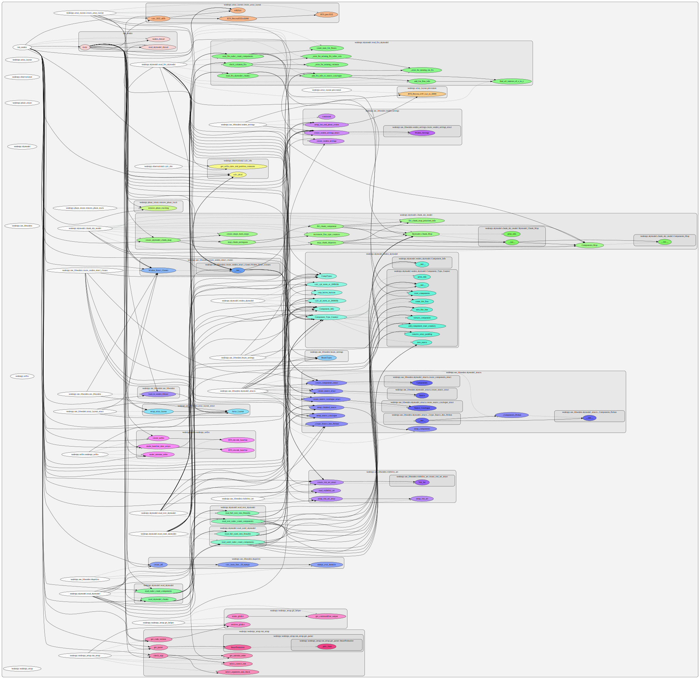
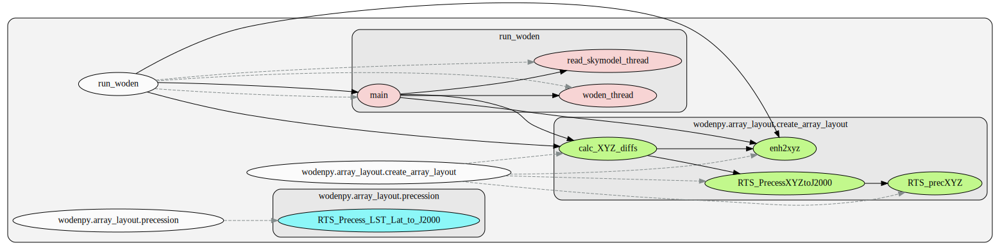
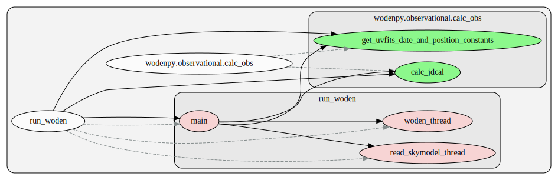
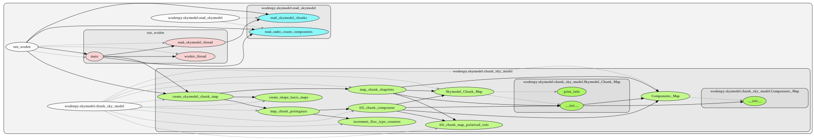
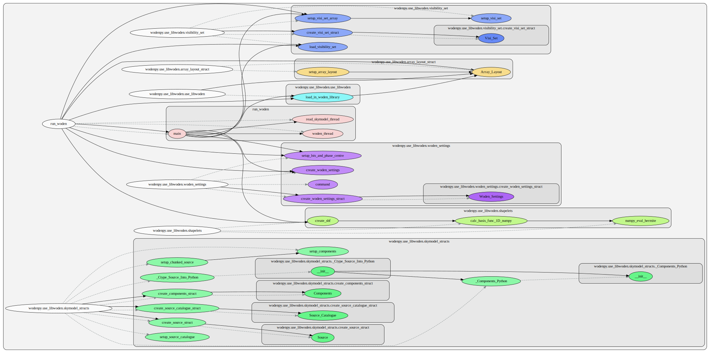
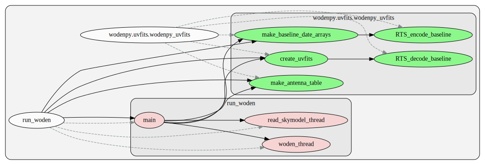
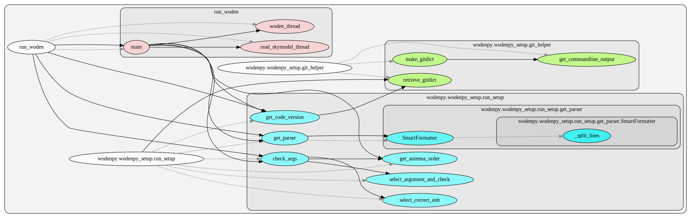
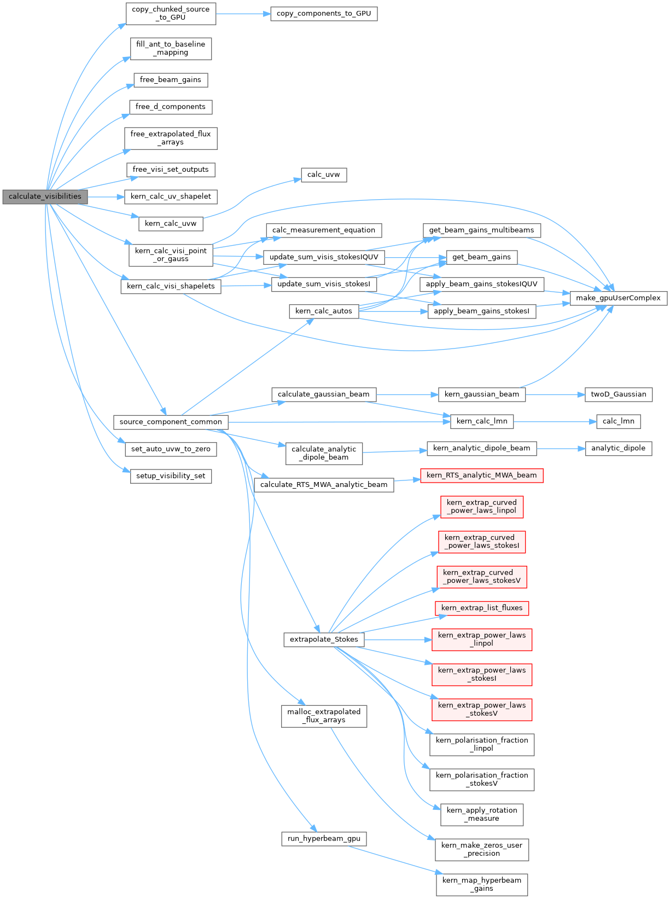
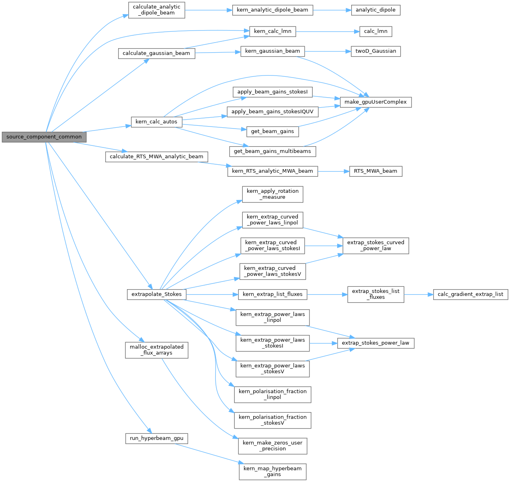

Call Graphs
-------------------

Ok, here is an attempt to map out the structure of ``WODEN``. These call graphs split into two sets: one for the Python side, the other for the C/GPU side. They are generated using the ``WODEN/docs/sphinx/code_graphs/run_make_graph.sh``, via the ``pyan`` Python module, and ``Doxygen``.

Python Call Graphs
~~~~~~~~~~~~~~~~~~~~

Firstly, the entire ``wodenpy`` call graph looks like this. Obviously this is a mess, so scroll on for individual submodules call graphs.

``wodenpy/array_layout``:

``wodenpy/observational``:

``wodenpy/skymodel``:

``wodenpy/use_libwoden``:

``wodenpy/uvfits``:

``wodenpy/wodenpy_setup``:

C/GPU Call Graphs
~~~~~~~~~~~~~~~~~~~~
Eventually, ``run_woden.py`` calls the C/GPU function ``calculate_visibilities``. This is the call graph for ``calculate_visibilities``; note that ``dot`` has truncated some boxes (which are rendered red), as it has a maximum width. Scroll further for a second graph that starts the function ``source_component_common``, which includes the missing calls.

Call graph starting at ``source_component_common``:

