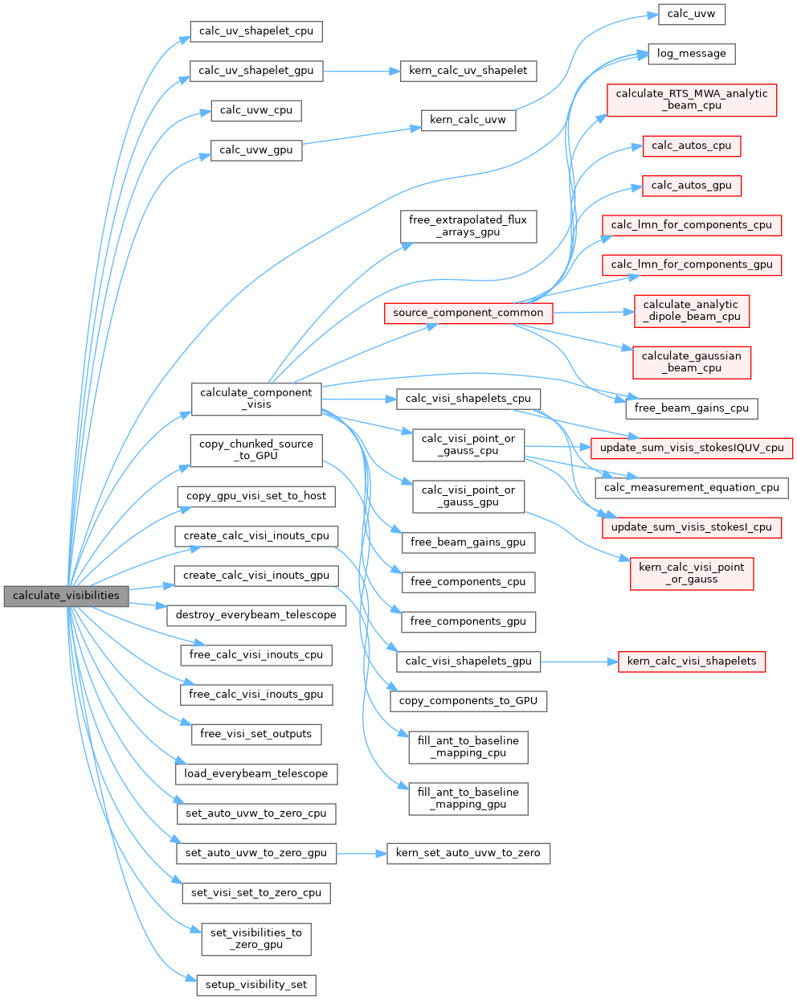
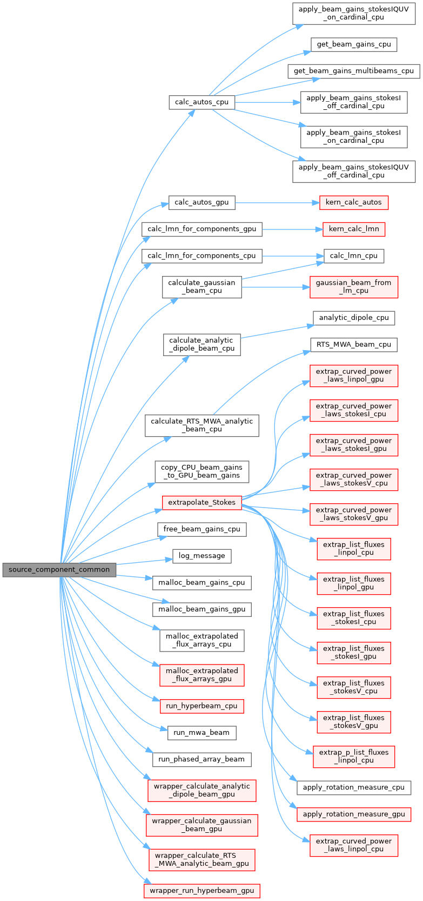

Call Graphs
-------------------

Ok, here is an attempt to map out the structure of ``WODEN``. I used to have a static mapper for the Python side, but it's no longer functional (``pyan3``). So I'm leaving that for now. There must be a way to use ``doxygen`` (which I use for the C/C++/GPU code) but I can't get it working. 

.. Python Call Graphs
.. ~~~~~~~~~~~~~~~~~~~~

.. Firstly, the entire ``wodenpy`` call graph looks like this. Obviously this is a mess, so scroll on for individual submodules call graphs.

.. .. image:: wodenpy_all.svg
..    :width: 100%
..    :align: center

.. ``wodenpy/array_layout``:

.. .. image:: wodenpy_array_layout.svg
..     :width: 100%
..     :align: center

.. ``wodenpy/observational``:

.. .. image:: wodenpy_observational.svg
..     :width: 100%
..     :align: center

.. ``wodenpy/skymodel``:

.. .. image:: wodenpy_skymodel.svg
..     :width: 100%
..     :align: center

.. ``wodenpy/use_libwoden``:

.. .. image:: wodenpy_use_libwoden.svg
..     :width: 100%
..     :align: center

.. ``wodenpy/uvfits``:

.. .. image:: wodenpy_uvfits.svg
..     :width: 100%
..     :align: center

.. ``wodenpy/wodenpy_setup``:

.. .. image:: wodenpy_wodenpy_setup.svg
..     :width: 100%
..     :align: center

C/GPU Call Graphs
~~~~~~~~~~~~~~~~~~~~
Eventually, ``run_woden.py`` calls the C/GPU function ``calculate_visibilities``. This is the call graph for ``calculate_visibilities``; note that ``dot`` has truncated some boxes (which are rendered red), as it has a maximum width. Scroll further for a second graph that starts the function ``source_component_common``, which includes the missing calls.

Call graph starting at ``source_component_common``:

