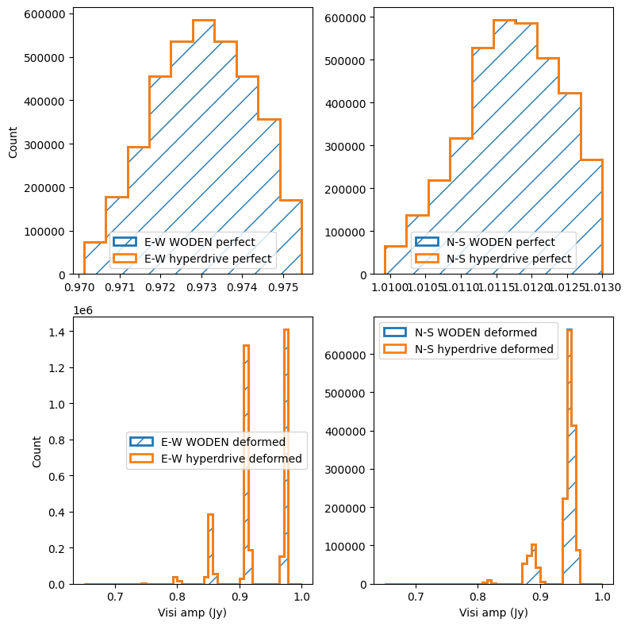
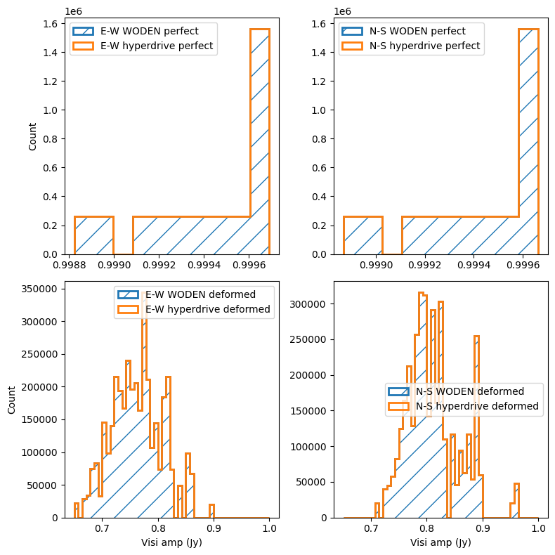

.. _`MWA wiki entry on the metafits file`: https://mwatelescope.atlassian.net/wiki/spaces/MP/pages/24969594/Metafits+files

MWA dipole amplitudes and flags simulations
=============================================

.. note:: If running ``hyperdrive``, it is assumed you are using ``v3.0.0``, and you have pointed ``$MWA_BEAM_FILE`` to the interpolated MWA FEE ``h5`` file.

MWA dipole flagging
*********************

MWA receiving elements (tiles) are 4 by 4 sets of cross-dipoles. Due to the harsh nature of the Inyarrimanha Ilgari Bundara, our Murchison Radio-astronomy Observatory, sometimes these dipoles die. When they do, they are flagged as inoperable within the ``metafits`` file. For full details, see   ; in short, any value in the ``Delays`` column in ``TILEDATA`` with a value of 32 is flagged.

Here we run two simulation with and without these flags. By default, ``WODEN`` runs without the flags. In this simulation we use a single 1 Jy flat spectrum point source, at the phase centre, and very close to zenith. This means without dipole flags, all visibilities should come out close to a 1Jy amplitude. With dipole flags, some visibilities should be less than 1 Jy, given less signal is collected from tiles with missing dipoles::

  SRCLIST=srclist_singlepoint_power.yaml
  META=../metafits/1126115208_metafits.fits

  time run_woden.py \
    --ra0=0.0 --dec0=-27.0 \
    --num_freq_channels=32 --num_time_steps=14 \
    --freq_res=40e+3 --time_res=8.0 \
    --cat_filename=srclist_singlepoint_power.yaml \
    --metafits_filename=$META \
    --band_nums=1 \
    --output_uvfits_prepend=woden_dipflags \
    --primary_beam=MWA_FEE_interp \
    --lowest_channel_freq=181.775e+6 \
    --use_MWA_dipflags

  time run_woden.py \
    --ra0=0.0 --dec0=-27.0 \
    --num_freq_channels=32 --num_time_steps=14 \
    --freq_res=40e+3 --time_res=8.0 \
    --cat_filename=srclist_singlepoint_power.yaml \
    --metafits_filename=$META \
    --band_nums=1 \
    --output_uvfits_prepend=woden_noflags \
    --primary_beam=MWA_FEE_interp \
    --lowest_channel_freq=181.775e+6

We also run ``hyperdrive`` as a point of comparison::

  hyperdrive vis-simulate \
    -s $SRCLIST -m $METAFITS \
    --freq-res $FINE_CHAN_RES --num-fine-channels $NCHANS \
    --num-timesteps 14 \
    -o hyperdrive_dipflags.uvfits

  hyperdrive vis-simulate \
    -s $SRCLIST -m $METAFITS \
    --freq-res $FINE_CHAN_RES --num-fine-channels $NCHANS \
    --num-timesteps 14 --unity-dipole-gains \
    -o hyperdrive_noflags.uvfits

If we run ``python compare_dipole_amps.py``, we get the following report and plot, again showing that ``WODEN`` and ``hyperdrive`` agree to within an absolute tolerance of 5e-6 Jy::

  Perfect beams real E-W all close?  True
  Perfect beams imag E-W all close?  True
  Perfect beams real N-S all close?  True
  Perfect beams imag N-S all close?  True
  Deformed beams real E-W all close?  True
  Deformed beams imag E-W all close?  True
  Deformed beams real N-S all close?  True
  Deformed beams imag N-S all close?  True

We can see groups of visibilities that have a combination of one or both tiles with one or more missing dipoles as expected in the bottom row of these amplitude histograms.

MWA dipole amplitudes
***********************
It's also possible to feed bespoke dipole amplitudes to the MWA FEE beam, by including a ``Dipamps`` column in the ``TILEDATA`` table. This should be a (16 by num tiles) array of floats, with values between 0 and 1. The first row corresponds to 16 amplitudes of the E-W polarisation of the first tile, second row the N-S polarisation of the first tile, and so on. We repeat the same simulation and comparison to ``hyperdrive`` as for the dipole flags, with a metafits file that includes the dipole amplitudes::

  time run_woden.py \
    --ra0=0.0 --dec0=-27.0 \
    --num_freq_channels=32 --num_time_steps=14 \
    --freq_res=40e+3 --time_res=8.0 \
    --cat_filename=srclist_singlepoint_power.yaml \
    --metafits_filename=$META \
    --band_nums=1 \
    --output_uvfits_prepend=woden_dipamps \
    --primary_beam=MWA_FEE_interp \
    --lowest_channel_freq=181.775e+6 \
    --use_MWA_dipamps

  time run_woden.py \
      --ra0=0.0 --dec0=-27.0 \
      --num_freq_channels=32 --num_time_steps=14 \
      --freq_res=40e+3 --time_res=8.0 \
      --cat_filename=srclist_singlepoint_power.yaml \
      --metafits_filename=$META \
      --band_nums=1 \
      --output_uvfits_prepend=woden_default \
      --primary_beam=MWA_FEE_interp \
      --lowest_channel_freq=181.775e+6

  SRCLIST=srclist_singlepoint_power.yaml
  METAFITS=../metafits/1088285600_DipAmps.metafits
  FINE_CHAN_RES=40
  NCHANS=32
  
  hyperdrive vis-simulate \
      -s $SRCLIST -m $METAFITS \
      --freq-res $FINE_CHAN_RES --num-fine-channels $NCHANS \
      --num-timesteps 14 \
      -o hyperdrive_dipamps.uvfits
  
  hyperdrive vis-simulate \
      -s $SRCLIST -m $METAFITS \
      --freq-res $FINE_CHAN_RES --num-fine-channels $NCHANS \
      --num-timesteps 14 --unity-dipole-gains \
      -o hyperdrive_perfect.uvfits

If we run ``python compare_dipole_amps.py``, we get the following report and plot, again showing that ``WODEN`` and ``hyperdrive`` agree to within an absolute tolerance or 1e-6 Jy::

  Perfect beams real E-W all close?  True
  Perfect beams imag E-W all close?  True
  Perfect beams real N-S all close?  True
  Perfect beams imag N-S all close?  True
  Deformed beams real E-W all close?  True
  Deformed beams imag E-W all close?  True
  Deformed beams real N-S all close?  True
  Deformed beams imag N-S all close?  True

The various dipole amplitudes not only change the gain of each tile, but the shape of each primary beam, leading to a more complex distribution in the amplitude histograms.