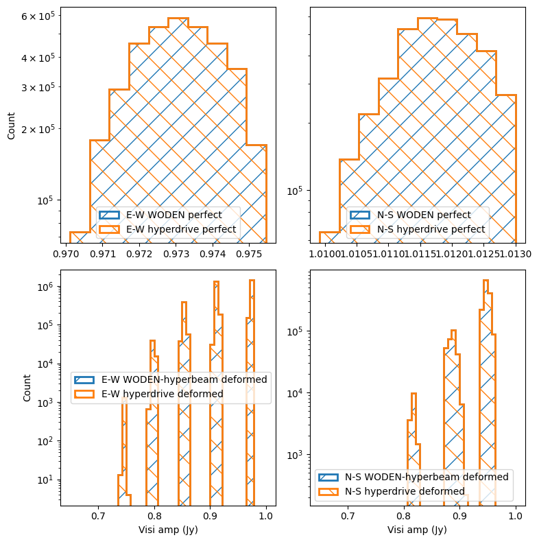
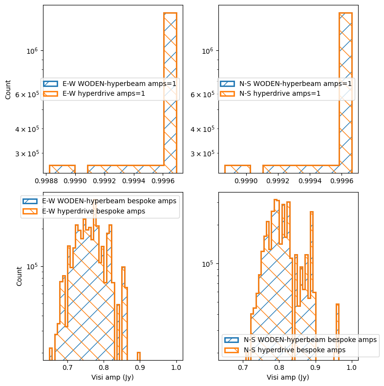
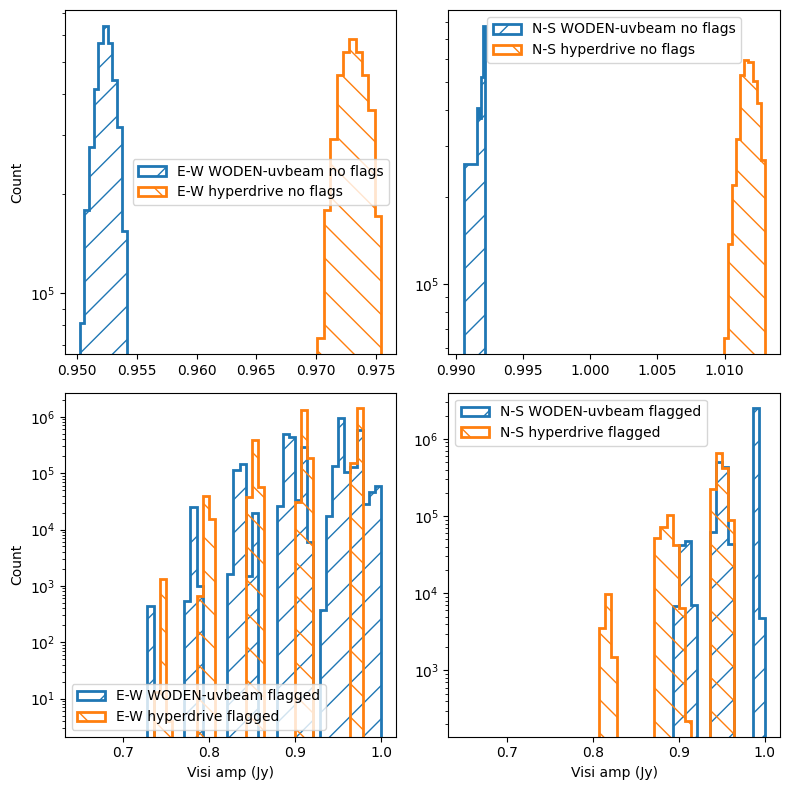
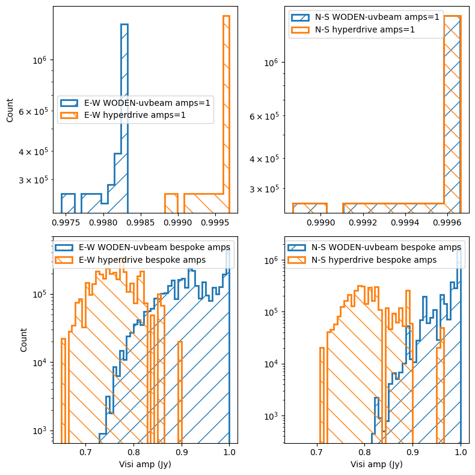

.. _`MWA wiki entry on the metafits file`: https://mwatelescope.atlassian.net/wiki/spaces/MP/pages/24969594/Metafits+files

MWA dipole amplitudes and flags simulations
=============================================

.. note:: If running ``hyperdrive``, it is assumed you are using ``v0.4.0``, and you have pointed ``$MWA_BEAM_FILE`` to the interpolated MWA FEE ``h5`` file.

We'll first look at what flagging out dipoles and changing their amplitudes does via ``hyperbeam`` in ``WODEN``. We'll compare this to simulations through ``hyperdrive``, to check we agree on polarisation ordering and resultant visibilities. After that, we'll compare that to ``UVBeam`` through ``WODEN``.

MWA dipole flagging (via ``hyperbeam``)
****************************************

MWA receiving elements (tiles) are 4 by 4 sets of cross-dipoles. Due to the harsh nature of the Inyarrimanha Ilgari Bundara, our Murchison Radio-astronomy Observatory, sometimes these dipoles die. When they do, they are flagged as inoperable within the ``metafits`` file. For full details, see `MWA wiki entry on the metafits file`_; in short, any value in the ``Delays`` column in ``TILEDATA`` with a value of 32 is flagged.

Here we run two simulation with and without these flags. By default, ``WODEN`` runs without the flags. In this simulation we use a single 1 Jy flat spectrum point source, at the phase centre. Without a primary beam at all, as the point source is at the phase centre with a spectral index of 0.0, we expect all visibilities to be ``1 + 0.0j`` Jy. I've placed this point source very close to beam centre, meaning without dipole flags, all visibilities should come out close to a 1Jy amplitude. This is an off-zenith pointing, as I wanted to bee 100% that ``WODEN`` points things in the same direction as ``hyperdrive``. There will be some variation as I'm running a 2 minute obs, so the point source moves through the beam. With dipole flags, the visibilities should vary more as the beam pattern is changed by missing dipoles. These commands can be found in ``run_woden_hyperbeam.sh``::

  SRCLIST=srclist_singlepoint_power.yaml
  META=../metafits/1126115208_metafits.fits

  time run_woden.py \
    --ra0=0.0 --dec0=-27.0 \
    --num_freq_channels=32 --num_time_steps=14 \
    --freq_res=40e+3 --time_res=8.0 \
    --cat_filename=srclist_singlepoint_power.yaml \
    --metafits_filename=$META \
    --band_nums=1 \
    --output_uvfits_prepend=woden_hypbeam_dipflags \
    --primary_beam=MWA_FEE_interp \
    --lowest_channel_freq=181.775e+6 \
    --use_MWA_dipflags

  time run_woden.py \
    --ra0=0.0 --dec0=-27.0 \
    --num_freq_channels=32 --num_time_steps=14 \
    --freq_res=40e+3 --time_res=8.0 \
    --cat_filename=srclist_singlepoint_power.yaml \
    --metafits_filename=$META \
    --band_nums=1 \
    --output_uvfits_prepend=woden_hypbeam_noflags \
    --primary_beam=MWA_FEE_interp \
    --lowest_channel_freq=181.775e+6

We also run ``hyperdrive`` as a point of comparison (in ``run_hyperdrive.sh``)::

  hyperdrive vis-simulate \
    -s $SRCLIST -m $METAFITS \
    --freq-res $FINE_CHAN_RES --num-fine-channels $NCHANS \
    --num-timesteps 14 \
    -o hyperdrive_dipflags.uvfits

  hyperdrive vis-simulate \
    -s $SRCLIST -m $METAFITS \
    --freq-res $FINE_CHAN_RES --num-fine-channels $NCHANS \
    --num-timesteps 14 --unity-dipole-gains \
    -o hyperdrive_noflags.uvfits

If we run ``python compare_dipole_flags_hyperbeam.py``, we get the following report and plot, showing that ``WODEN`` and ``hyperdrive`` agree to within an absolute tolerance of 5e-6 Jy::

  Perfect beams real E-W all close?  True
  Perfect beams imag E-W all close?  True
  Perfect beams real N-S all close?  True
  Perfect beams imag N-S all close?  True
  Deformed beams real E-W all close?  True
  Deformed beams imag E-W all close?  True
  Deformed beams real N-S all close?  True
  Deformed beams imag N-S all close?  True

Now, ``hyperbeam`` uses the zenith point of the zenith pointed beam as a normalisation point. The logic as I understand it is that the maximum response of a dipole is looking straight up. So ``hyperdrive`` calculates the value of the beam with all 16 dipoles operational, pointed at zenith, at the zenith point, and normalises everything to that. We can see that manifest as specific groups of visibilities that have a combination of one or both tiles with one or two missing dipoles as expected in the bottom row of these amplitude histograms. Of course, this is only one direction on the sky, as we're using a single point source, so it might just be the specific beam deformation at this point of the sky causing the dip in amplitudes. Or a combination of both effects.

Of potential concern is that for the N-S polarisation, with regular non-deformed beam pattern, we get some visibilities with values up to 1.013 Jy. I'd expect <= 1.0 Jy. Given this is an off-zenith beam, the zenith-normalisation might not be getting things perfectly right? It is only ~1.0% above 1.0 Jy, but when doing EoR science that's a big number.

Regardless, for our purposes, we can see that the ``WODEN`` and ``hyperdrive`` simulations agree to within 5e-6 Jy, so we at least use ``hyperbeam`` in exactly the same way as ``hyperdrive``. 

MWA dipole amplitudes (via ``hyperbeam``)
**********************************************
It's also possible to feed bespoke dipole amplitudes to the MWA FEE beam, by including a ``Dipamps`` column in the ``TILEDATA`` table. Note this isn't a standard column in the ``metafits``; this is something you add yourself for the purposes of simulation. ``Dipamps`` should be a (16 by num tiles) array of floats, with values between 0 and 1. The first row corresponds to 16 amplitudes of the E-W polarisation of the first tile, second row the N-S polarisation of the first tile, and so on. We repeat the same simulation (except we switch to a zenith pointing) and compare to ``hyperdrive`` as for the dipole flags, with a metafits file that includes the dipole amplitudes::

  SRCLIST=srclist_singlepoint_power.yaml
  METAFITS=../metafits/1088285600_DipAmps.metafits

  time run_woden.py \
    --ra0=0.0 --dec0=-27.0 \
    --num_freq_channels=32 --num_time_steps=14 \
    --freq_res=40e+3 --time_res=8.0 \
    --cat_filename=srclist_singlepoint_power.yaml \
    --metafits_filename=$META \
    --band_nums=1 \
    --output_uvfits_prepend=woden_hypbeam_dipamps \
    --primary_beam=MWA_FEE_interp \
    --lowest_channel_freq=181.775e+6 \
    --use_MWA_dipamps

  time run_woden.py \
      --ra0=0.0 --dec0=-27.0 \
      --num_freq_channels=32 --num_time_steps=14 \
      --freq_res=40e+3 --time_res=8.0 \
      --cat_filename=srclist_singlepoint_power.yaml \
      --metafits_filename=$META \
      --band_nums=1 \
      --output_uvfits_prepend=woden_hypbeam_default \
      --primary_beam=MWA_FEE_interp \
      --lowest_channel_freq=181.775e+6

  FINE_CHAN_RES=40
  NCHANS=32
  hyperdrive vis-simulate \
      -s $SRCLIST -m $METAFITS \
      --freq-res $FINE_CHAN_RES --num-fine-channels $NCHANS \
      --num-timesteps 14 \
      -o hyperdrive_dipamps.uvfits
  
  hyperdrive vis-simulate \
      -s $SRCLIST -m $METAFITS \
      --freq-res $FINE_CHAN_RES --num-fine-channels $NCHANS \
      --num-timesteps 14 --unity-dipole-gains \
      -o hyperdrive_perfect.uvfits

If we run ``python compare_dipole_amps_hyperbeam.py``, we get the following report and plot, again showing that ``WODEN`` and ``hyperdrive`` agree to within an absolute tolerance or 1e-6 Jy::

  Perfect beams real E-W all close?  True
  Perfect beams imag E-W all close?  True
  Perfect beams real N-S all close?  True
  Perfect beams imag N-S all close?  True
  Deformed beams real E-W all close?  True
  Deformed beams imag E-W all close?  True
  Deformed beams real N-S all close?  True
  Deformed beams imag N-S all close?  True

The various dipole amplitudes not only change the gain of each tile, but the shape of each primary beam, leading to a more complex distribution in the amplitude histograms than simply flagging alone.

MWA dipole flagging and amplitudes (via ``UVBeam``)
*****************************************************
.. warning:: To run this on my desktop, I had to edit ``run_woden.py``. On line ~748, in the function ``setup_MWA_uvbeams``, I had to change ``pixels_per_deg = 5`` to ``pixels_per_deg = 3``. Without this change, ``UVBeam`` requires > 45 GB of RAM, which crashed my desktop. Upon initialisation, ``UVBeam`` creates all-sky lookup tables for the primary beam. You can limit these in extent by limiting azimuth and zenith angles ranges, but ``WODEN`` is designed to be all-sky, so I won't implement that until requested. For now, just limit the pixels per degree for these lookup tables. Even with ``pixels_per_deg = 3``, each simulation took ~ 40GB of RAM, and 2.5 hours to run.

We can repeat the extact same process with ``UVBeam``. Read the warning above before running; calls are in ``run_woden_uvbeam.sh``, with plots in ``compare_dipole_flags_uvbeam.py, compare_dipole_amps_uvbeam.py``.

First, the flagging case:

As a reminder, this is an off-zenith pointing. Now, I run ``UVBeam`` with peak-normalisation enabled. This is the closest normalisation to the ``hyperdrive`` zenith normalisation. As I understand, ``UVBeam`` simply looks for the highest amplitude spot in the generated lookup tables, and normalises to that. We can immediately see that in the non-flagged case; the overall normalisation values are not equal.

Once we switch flagging on, we again see a different overall flux scale. We do at least see 5 clusters of values for E-W tiles for both, and three in the N-S. This means the same flags are being passed into the two beam models. By looking at the E-W, it's tempting to say there is a larger spread of values in the ``UVBeam`` 
case. You could explain this by the peak-normalisation, which would be different for each tile, as the maximum point in beam would change as the pattern is deformed by the missing dipoles. However the N-S polarisation doesn't show this same spread, so really this requires further investigation.

Now the dipole amplitudes case:

This time we're looking at a zenith pointing. Weirdly, without any amplitude changes, we see that the N-S pols match almost exactly; the E-W do not however. Once we switch on bespoke dipole amplitudes, we see in general that ``UVBeam`` returns higher values than ``hyperdrive``. My money is because of the normalisation difference; ``UVBeam`` is getting a unique normalisation for each tile based on deformed patterm, whereas ``hyperdrive`` is normalising to the zenith point of the zenith pointed beam. Not sure which one makes more sense to be honest.

Really, what someone should do is plot the beam patterns for all 128 tiles, and just visually check the same beam deformations are happening to the same tiles. If the patterns are the same, we can chalk this down to the normalisation differences. Ain't nobody got time for that.

Finally, let's not rule out that I've got a bug somewhere in my ``UVBeam`` implementation, it's always possible. I've got unit tests so I'm hopeful I don't, but implementing beam code correctly is notoriously hard.

