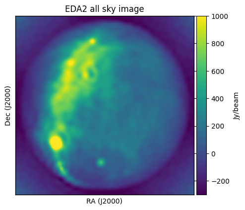

.. _`this googledoc link to pygsm_woden-list_100MHz_n256.txt`: https://drive.google.com/file/d/1TEELux33UClRTiZBFOzGJHF-XbLnZjUV/view?usp=sharing
.. _`pygdsm`: https://github.com/telegraphic/pygdsm

EDA2 Haslam Map simulation
===========================

.. note:: Running the simulation and making all the images will take up around 1.8 GB storage.

In this simulation, we'll use an all-sky healpix image with nside 256 (generated using `pygdsm`_). For the sky model, I have converted every healpixel into a point source. You'll need to download the skymodel from `this googledoc link to pygsm_woden-list_100MHz_n256.txt`_ and put it in the correct directory. If you're comfortable with ``wget`` you can do::

  $ cd WODEN/examples/EDA2_haslam
  $ wget 'https://docs.google.com/uc?export=download&id=1TEELux33UClRTiZBFOzGJHF-XbLnZjUV' -O pygsm_woden-list_100MHz_n256.txt

To run the command, do::

  $ ./EDA2_haslam_simulation.sh

which took 12 mins 45 secs on my machine. The command run is::

  run_woden.py \
    --ra0=74.79589467 --dec0=-27.0 \
    --time_res=10.0 --num_time_steps=10 \
    --freq_res=10e+3 --coarse_band_width=10e+4 \
    --lowest_channel_freq=100e+6 \
    --cat_filename=pygsm_woden-list_100MHz_n256.txt \
    --array_layout=../../test_installation/array_layouts/EDA2_layout_255.txt \
    --date=2020-02-01T12:27:45.900 \
    --output_uvfits_prepend=./data/EDA2_haslam \
    --primary_beam=EDA2 \
    --sky_crop_components \
    --band_nums=1,2,3,4,5

Here is a line by line explanation of the command.

::

  --ra0=74.79589467 --dec0=-27.0

sets the phase centre of the simulation.

::

  --time_res=10.0 --num_time_steps=10

means there will be 10 time samples with 10 seconds between each sample.

::

  --freq_res=10e+3 --coarse_band_width=10e+4 \
  --lowest_channel_freq=100e+6 --band_nums=1,2,3,4,5

this combination of arguments will create 5 uvfits file outputs, each containing 10 frequency channels of width 10 kHz. The lowest band will start at 100 MHz, giving a total frequency coverage from 100 MHz to 100.5 MHz.

::

  --cat_filename=pygsm_woden-list_100MHz_n256.txt

points towards the sky model.

::

  --array_layout=../../test_installation/array_layouts/EDA2_layout_255.txt

points towrads an array file that contains local east, north, height coordinates (in metres). This is used in conjunction with latitude to generate baseline coordinates. The default ``--latitude`` is set to the MWA which is right next to the EDA2 so good enough for the example.

::

  -date=2020-02-01T12:27:45.900

sets a UTC date which is used in conjunction with ``--longitude`` to calculate the LST (again, defaults to MWA which is good for purpose here).

::

  --output_uvfits_prepend=./data/EDA2_haslam

sets the naming convention for the outputs, in conjunction with ``--band_nums=1,2,3,4,5`` will produce the outputs::

  ./data/EDA2_haslam_band01.uvfits
  ./data/EDA2_haslam_band02.uvfits
  ./data/EDA2_haslam_band03.uvfits
  ./data/EDA2_haslam_band04.uvfits
  ./data/EDA2_haslam_band05.uvfits

\

::

  --primary_beam=EDA2

selects the EDA2 primary beam.

::

  --sky_crop_components

this means that sky model is cropped by ``COMPONENT`` and not by ``SOURCE``. This model has the diffuse sky as a single ``SOURCE``, so some ``COMPONENT`` s are always below the horizon so need this flag to not crop the whole sky out.

.. note:: The real EDA2 instrument has 256 antennas. ``CASA`` only allows a maximum of 255 elements in an array table, so imaging becomes a nightmare. For this example, to make an image, I've just left out an antenna to make my life easier.

Once you've run that, you can make an image via::

  $ ./EDA2_haslam_imaging.sh

and you'll see this:

where we can see that the EDA2 can see essentially the whole sky, albeit at poor resolution.
