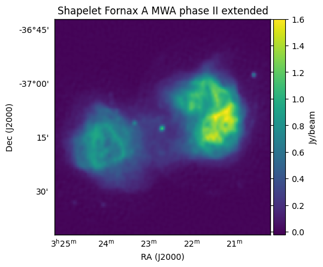

.. _Line et al. 2020: https://doi.org/10.1017/pasa.2020.18

``WODEN`` demonstrated via examples
=====================================

First off all I'll explain how the simulations and outputs are split up over frequency, and then I'll dive into some bigger simulations to show some various functionality.

.. note:: For all simulation times reported in the below, I used a single NVIDIA GeForce GTX 1080 Ti with 12 GB of RAM.

Example Simulations
--------------------

Here we'll look over a number of example simulations with various settings. You can find and run these examples in the ``WODEN/examples`` directory. I'll let you know how much storage you'll need for each set of simulation and images (things can get large with radio data).

Fornax A
^^^^^^^^^^^

If you're itching to run something, you can run and image the first simulation with the following commands. Read on to find out what you've done or read the section before running the commands

::

  $ cd WODEN/examples/FornaxA
  $ ./FornaxA_msclean_simulation.sh
  $ ./FornaxA_msclean_imaging.sh

.. note:: Running and imaging both Fornax A simulations will need 1.8 GB of storage.

In this simulation we'll compare two different models of Fornax A which were used in `Line et al. 2020`_. First up we'll look at a model made from ``WSClean`` multi-scale CLEAN outputs. The command looks like this::

  run_woden.py \
    --ra0=50.67 --dec0=-37.2 \
    --freq_res=80e+3 --num_freq_channels=16 \
    --time_res=8.0 --num_time_steps=14 \
    --metafits_filename=../metafits/1202815152_metafits_ppds.fits \
    --cat_filename=srclist_msclean_fornaxA_phase1+2.txt \
    --band_nums=1,2,3,4,5 \
    --output_uvfits_prepend=./data/FornaxA_msclean \
    --primary_beam=MWA_FEE

Here we have set the phase centre to RA, Dec = 50.67, -37.2, the fine channel frequency to 80 kHz with 16 fine channels per coarse band, the time sampling to every 8 seconds for 14 time samples, and used a ``metafits`` file for all other observational settings. I've selected to run the first 5 coarse bands via the ``--band_nums`` parameters, which combined with the ``--output_uvfits_prepend`` argument should create five ``uvfits`` files::

  data/FornaxA_msclean_band01.uvfits
  data/FornaxA_msclean_band02.uvfits
  data/FornaxA_msclean_band03.uvfits
  data/FornaxA_msclean_band04.uvfits
  data/FornaxA_msclean_band05.uvfits

each of which will contain 16 frequency and 14 time steps. I've selected to use the ``MWA_FEE`` primary beam, which will use the MWA fully embedded element (FEE) primary beam pattern (using the delays specified in the ``metafits`` to point the beam). As described in :ref:`Post compilation (optional)`, you'll need to grab an hdf5 file and set an environment variable to point to it for this to work.

The sky model is specified using ``--cat_filename``, where we have used ``convert_WSClean_list_to_WODEN.py`` to convert outputs from WSClean into a ``WODEN`` sky model via::

  convert_WSClean_list_to_WODEN.py \
    --file=msclean_output_from_WSClean-sources.txt \
    --outname=srclist_msclean_fornaxA_phase1+2.txt

The sky model contains 4544 point and 1736 Gaussian components. The whole simulation took 13 seconds on my card. If you run the imaging, you should get something that looks like this:

.. image:: FornaxA_msclean-image.png
   :width: 400pt

This is an MWA phase II extended array simulation, hence the ~ arcmin resolution. Next, we can compare this to an equivalent shapelet simulation, where the only change to the command is to change the sky model::

  --cat_filename=srclist_shapelets_fornaxA_phase1+2.txt

You can run and image the shapelet simulation via::

  $ ./FornaxA_shapelet_simulation.sh
  $ ./FornaxA_shapelet_imaging.sh

with the simulation taking 25 seconds on my GPU, and the image looking like:

