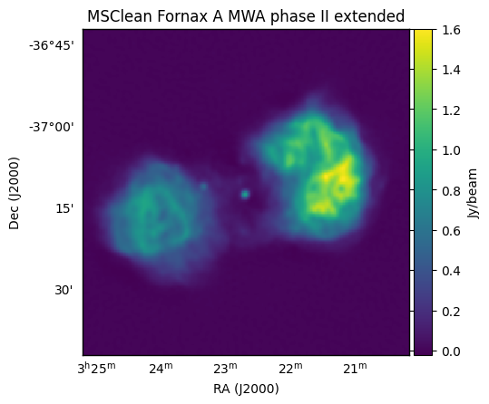
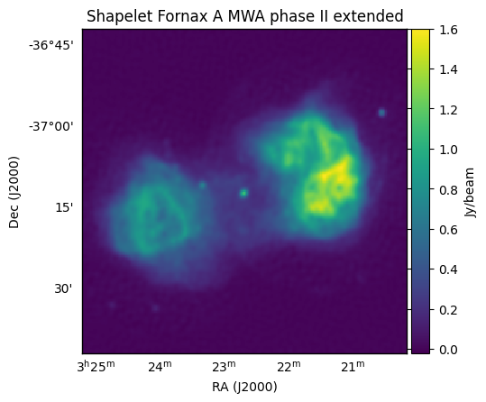

.. _`Line et al. 2020`: https://doi.org/10.1017/pasa.2020.18

Fornax A simulation
=========================================

This example not only compares two sky model types, but compares the speed of the
``float`` vs the ``double`` precision of ``WODEN``.

.. note:: Running and imaging both Fornax A simulations will need 3.6 GB of storage.

If you're itching to immediately run something, you can run and image the first simulation with the following commands. Note you'll have to have followed :ref:`Post compilation (optional)` to get the MWA FEE beam working.

Read on to find out what you've done or read the section before running the commands.

::

  $ cd WODEN/examples/FornaxA
  $ ./FornaxA_msclean_simulation.sh
  $ ./FornaxA_msclean_imaging.sh

In this simulation we'll compare two different models of Fornax A which were used in `Line et al. 2020`_. First up we'll look at a model made from ``WSClean`` multi-scale CLEAN outputs. The command looks like this::

  run_woden.py \
    --ra0=50.67 --dec0=-37.2 \
    --freq_res=80e+3 --num_freq_channels=16 \
    --time_res=8.0 --num_time_steps=14 \
    --metafits_filename=../metafits/1202815152_metafits_ppds.fits \
    --cat_filename=srclist_msclean_fornaxA_phase1+2.txt \
    --band_nums=1,2,3,4,5 \
    --output_uvfits_prepend=./data/FornaxA_msclean \
    --primary_beam=MWA_FEE \
    --precision=${precision}

where ``${precision}`` is either "float" or "double" to choose the precision of the simulation. Here we have set the phase centre to RA, Dec = 50.67, -37.2, the fine channel frequency to 80 kHz with 16 fine channels per coarse band, the time sampling to every 8 seconds for 14 time samples, and used a ``metafits`` file for all other observational settings. I've selected to run the first 5 coarse bands via the ``--band_nums`` parameters, which combined with the ``--output_uvfits_prepend`` argument should create 10 ``uvfits`` files::

  data/FornaxA_msclean_${precision}_band01.uvfits
  data/FornaxA_msclean_${precision}_band02.uvfits
  data/FornaxA_msclean_${precision}_band03.uvfits
  data/FornaxA_msclean_${precision}_band04.uvfits
  data/FornaxA_msclean_${precision}_band05.uvfits

each of which will contain 16 frequency and 14 time steps. I've selected to use the ``MWA_FEE`` primary beam, which will use the MWA fully embedded element (FEE) primary beam pattern (using the delays specified in the ``metafits`` to point the beam). As described in :ref:`Post compilation (optional)`, you'll need to grab an hdf5 file and set an environment variable to point to it for this to work.

The sky model is specified using ``--cat_filename``, which contains 4544 point and 1736 Gaussian components, and was made from WSClean CLEAN components. The "float" precision version took about 48 seconds on my card, with the "double" taking about 144 seconds. If you run the imaging, you should get something that looks like this:

This is an MWA phase II extended array simulation, hence the ~ arcmin resolution. Next, we can compare this to an equivalent shapelet simulation, where the only change to the command is to change the sky model::

  --cat_filename=srclist_shapelets_fornaxA_phase1+2.txt

You can run and image the shapelet simulation via::

  $ ./FornaxA_shapelet_simulation.sh
  $ ./FornaxA_shapelet_imaging.sh

with the "float" simulation taking 59 seconds on my GPU, the "double" taking 144 seconds, and the image looking like:

