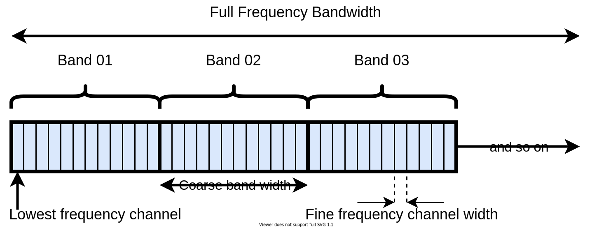

Frequency specifications and uvfits outputs
============================================

``WODEN`` writes visibilities into ``uvfits`` files, which are output in linear polarisations of ``XX, YY, XY, YX``, where ``X`` refers to a North-South aligned receiver and ``Y`` a East-West aligned receiver. These outputs are split up across frequency, into 'coarse bands'. Each coarse band is split into 'fine channels' like so:

When running MWA simulations using a ``metafits`` file, these frequency options are filled in automatically for the user, and can be overridden / alternatively supplied by keywords to ``run_woden.py``. The arguments that match the diagram above are listed here.

.. list-table::
   :widths: 50 50
   :header-rows: 1

   * - ``run_woden.py`` argument
     - Diagram label
   * - ``--coarse_band_width``
     - Coarse band width
   * - ``--freq_res``
     - Fine frequency channel width
   * - ``--lowest_channel_freq``
     - Lowest frequency channel
   * - ``--band_nums=1,2,3``
     - Band 01, Band 02, Band 03

As many coarse bands as needed can be run, allowing for straight-forward splitting of the simulation across multiple GPUs. We'll look at an example of that later.  If you run with following arguments::

  run_woden.py \
  --freq_res=10e+3 --coarse_band_width=1e+6 \
  --time_res=1.0 --num_time_steps=10 \
  --lowest_channel_freq=100e+6 \
  --band_nums=1,2,3 \
  --output_uvfits_prepend=epic_output

this will produce three uvfits files named with the following properties:

.. list-table::
   :widths: 20 10 10
   :header-rows: 1

   * - Output name
     - Lowest frequency channel (Hz)
     - Number frequency channels
   * - ``epic_output_band01.uvfits``
     - 100e+6
     - 100
   * - ``epic_output_band02.uvfits``
     - 101e+6
     - 100
   * - ``epic_output_band03.uvfits``
     - 102e+6
     - 100

.. note:: The command above won't work as many arguments are missing; I've left them out here to concentrate on the arguments that define the uvfits outputs.

You can run with whatever band numbers you want::

    run_woden.py \
    --freq_res=10e+3 --coarse_band_width=1e+6 \
    --time_res=1.0 --num_time_steps=10 \
    --lowest_channel_freq=100e+6 \
    --band_nums=4,7,24 \
    --output_uvfits_prepend=epic_output

which will create uvfits files like:

.. list-table::
   :widths: 20 10 10
   :header-rows: 1

   * - Output name
     - Lowest frequency channel (Hz)
     - Number frequency channels
   * - ``epic_output_band04.uvfits``
     - 104e+6
     - 100
   * - ``epic_output_band07.uvfits``
     - 107e+6
     - 100
   * - ``epic_output_band24.uvfits``
     - 124e+6
     - 100
