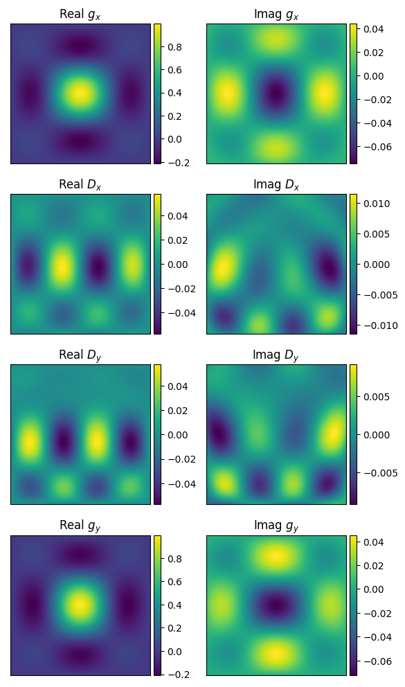
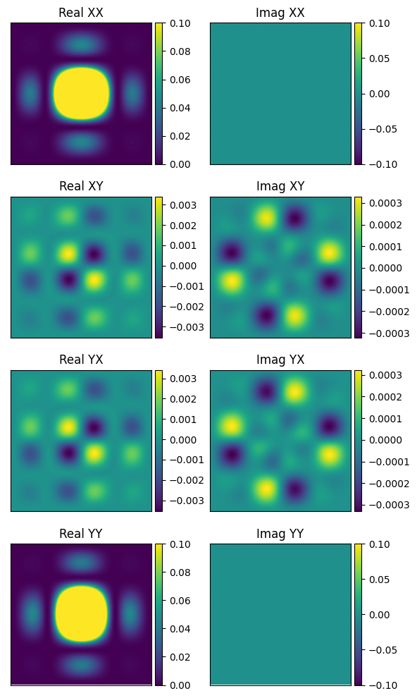
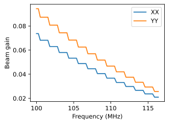
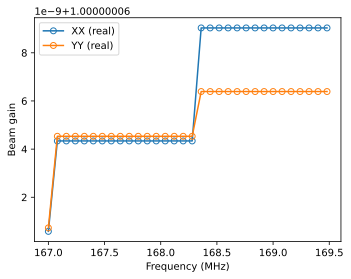
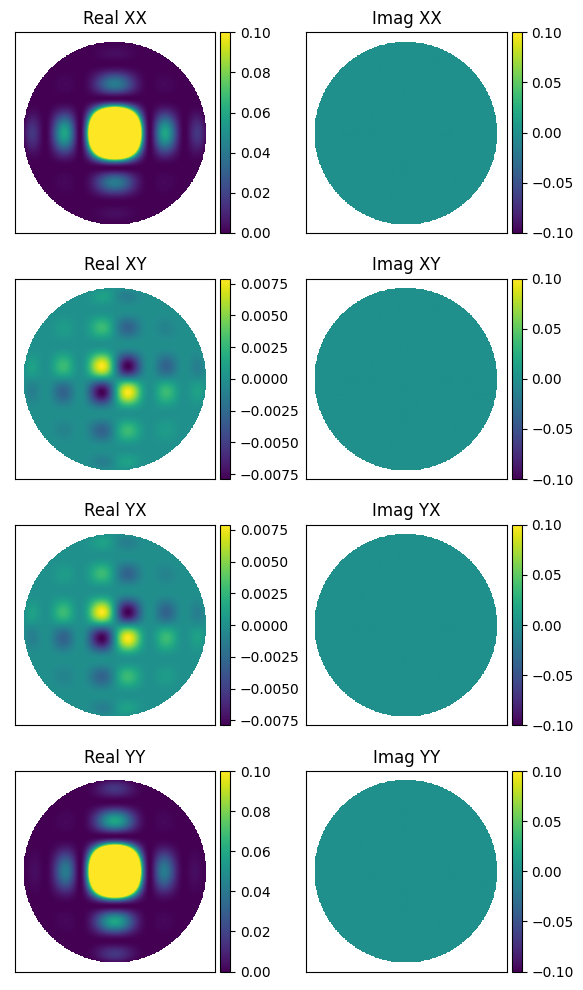
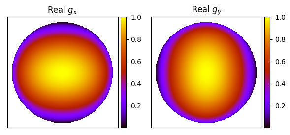
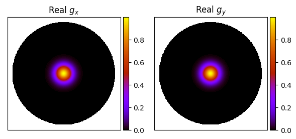
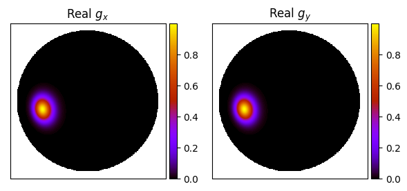

.. _Sokolowski et al. 2017: https://doi.org/10.1017/pasa.2017.54
.. _polarised_source_and_FEE_beam.ipynb which lives here: https://github.com/JLBLine/polarisation_tests_for_FEE
.. _Tingay et al. 2013: https://doi.org/10.1017/pasa.2012.007
.. _Wayth et al. 2017: https://doi.org/10.1017/pasa.2017.27
.. _mwa_hyperbeam: https://github.com/MWATelescope/mwa_hyperbeam

Primary Beams
================
``WODEN`` has been written to include stationary primary beams. That means the beam is pointed at a constant azimuth / zenith angle during an observation. These are the beam models available at the
moment:

 * **None** - gains of 1.0, leakages 0.0
 * **Gaussian** - a frequency dependent Gaussian beam; FWHM can be set by user
 * **EDA2** - a single MWA dipole on an infinite ground screen
 * **MWA analytic** - an analytic model of the MWA primary beam
 * **MWA FEE (coarse)** - the Fully Embedded Element MWA model (1.28 MHz frequency resolution)
 * **MWA FEE (interp)** - frequency interpolated MWA FEE model (80 kHz resolution between 167 - 197 MHz)

See below for details on each model.

MWA Fully Embedded Element
-----------------------------

The Murchison Widefield Array (MWA, `Tingay et al. 2013`_) has 16 bow-tie dipoles arranged in a 4 by 4 grid as receiving elements, yielding a grating-lobe style primary beam.

``WODEN`` uses the `mwa_hyperbeam`_ implementation of the MWA Fully Embedded Element (FEE) Beam pattern (`Sokolowski et al. 2017`_), which to date is the most accurate model of the MWA primary beam. This model is defined in a spherical harmonic coordinate system, which is polarisation-locked to instrumental azimuth / elevation coordinates. ``WODEN`` however uses Stokes parameters to define it's visibilities, so employs the ``hyperbeam`` option to rotate the beam about parallactic angle (as calculated using ``erfa``) to align it into the Stokes frame.

Due to convention issues with whether 'X' means East-West or North-South, and whether azimuth starts towards North and increase towards East, the rotation inside ``hyperbeam`` also applies a reordering of polarisations. For an *exhaustive* investigation into why this is necessary to obtain the expected Stokes parameters, see `polarised_source_and_FEE_beam.ipynb which lives here`_

I can define the Jones matrix of the primary beam as:

.. math::

  \mathbf{J_\mathrm{linear}} =
    \begin{bmatrix}
    g_{x} & D_{x} \\
    D_{y} & g_{y} \\
    \end{bmatrix}.

Here, the subscript :math:`x` means a polarisation angle of :math:`0^\circ` and :math:`y` an angle of :math:`90^\circ`, :math:`g` means a gain term, and :math:`D` means a leakage term (so :math:`x` means North-South and :math:`y` is East-West). Under this definition, a typical zenith-pointing looks like this (after rotation):

These plots are down to a zenith angle of about 20 deg, with northward at the top. If we assume the sky is totally Stokes I, this will yield linear polarisations (where 'XX' is North-South and 'YY' is East-West) like this:

The MWA beam is electronically steered, which can be defined via integer delays and supplied to the MWA FEE beam. ``run_woden.py`` can read these directly from an MWA metafits file, or can be directly supplied using the ``--MWA_FEE_delays`` argument.

Coarse resolution model ``--primary_beam=MWA_FEE``
***********************************************************

The frequency resolution of the default MWA FEE model, which is stored in the file ``mwa_full_embedded_element_pattern.h5``, is 1.28 MHz. If you need a smooth frequency
response, this might not be the best option for you, as you'll end up with something like
this plot, which shows the linear Stokes towards an arbitrary direction as a function of frequency:

In fact, when running using ``--primary_beam=MWA_FEE``, I only calculate the beam response once per coarse band. If you set your ``--coarse_band_width`` to greater than 1.28 MHz you'll make this effect even worse.

Interpolated resolution model ``--primary_beam=MWA_FEE_interp``
******************************************************************
Recently, Daniel Ung interpolated the spherical harmonic coefficients of the MWA FEE model, to
produce a new ``hdf5`` file, ``MWA_embedded_element_pattern_rev2_interp_167_197MHz.h5``.
This new file has an 80 kHz resolution, so if we look at a far smaller frequency range,
and choose an interesting direction on the sky:

we see that the frequency behaviour of the beam is well described and smooth.

.. warning:: However, this model is only interpolated between 167 and 197 MHz. Anything below 167 MHz will give the 167 MHz response, and similarly for above 197 MHz.

MWA Analytic
---------------------------
If you want something representative of the MWA beam, which is smooth in frequency,
the analytic MWA beam model (copied over from the ``RTS``) is a good option. It lacks
the mutual coupling effects present in the FEE model, and is purely real, but when
we plot the linear Stokes on the sky we see decent agreement with the FEE beam.

.. TODO:: Capture the actual mathematics behind the model so people can reproduce

EDA2
------

The 2nd version of the Engineering Development Array (EDA2, `Wayth et al. 2017`_), is an SKA_LOW test station, which swaps the planned logarithmic 'christmas tree' dipoles for MWA bow-tie dipoles. Currently, ``WODEN`` just assumes a perfect dipole with an infinite ground screen as a beam model. This makes the primary beam entirely real, with no leakage terms. Explicitly, the beam model is

.. math::

  \mathcal{G} = 2\sin\left(\pi \frac{2h}{\lambda} \cos(\theta) \right) \\
  g_x = \mathcal{G}\arccos\left(\sin(\theta)\cos(\phi)\right) \\
  g_y = \mathcal{G}\arccos\left(\sin(\theta)\sin(\phi)\right)

where :math:`h` is the height of the dipole, :math:`\lambda` is the wavelength, :math:`\theta` is the zenith angle, :math:`\phi` is the azimuth angle. I've set :math:`h=0.3` m.

The beams basically see the whole sky (this image shows some :math:`\mathbf{J_\mathrm{linear}}` values at 70 MHz):

.. note:: The EDA2 beam is neither physically nor electronically steered, so it always points towards zenith.

Gaussian
----------

This is a toy case of a symmetric (major = minor) Gaussian primary beam. The beam gets smaller on the sky with increasing frequency, but both polarisations are identical. You can control the pointing of the beam (which remains constant in az/za for a single observation) via an initial RA/Dec pointing (``--gauss_ra_point``, ``--gauss_dec_point``), and the FWHM of the beam (``--gauss_beam_FWHM``) at a reference frequency (``--gauss_beam_ref_freq``).

I've implemented this beam by creating a cosine angle coordinate system locked to the initial hour angle and declination of the specified RA,Dec pointing :math:`l_\mathrm{beam}, m_\mathrm{beam}, n_\mathrm{beam}`. The beam is then calculated as

.. math::

  G(l_\mathrm{beam}, m_\mathrm{beam}) = \exp \left( -\left( al_\mathrm{beam}^2 + 2bl_\mathrm{beam}m_\mathrm{beam} + cm_\mathrm{beam}^2 \right)  \right)

where

.. math::

  a  =  \frac{\cos(\phi_{\mathrm{PA}})^2}{2\sigma_l^2} + \frac{\sin(\phi_{\mathrm{PA}})^2}{2\sigma_m^2} \\
  b  =  -\frac{\sin(2\phi_{\mathrm{PA}})}{4\sigma_l^2} + \frac{\sin(2\phi_{\mathrm{PA}})}{4\sigma_m^2} \\
  c  =  \frac{\sin(\phi_{\mathrm{PA}})^2}{2\sigma_l^2} + \frac{\cos(\phi_{\mathrm{PA}})^2}{2\sigma_m^2}.

Currently, I have set the position angle of the beam :math:`\phi_{\mathrm{PA}}=0` the std :math:`\sigma_l = \sigma_m` to be equal, as:

.. math::

  \sigma_l = \sigma_m = \frac{\sin(\varphi_0)}{ 2\sqrt{2\ln(2)} }\frac{\nu_0}{\nu}

where :math:`\varphi_0` is the desired FWHM at reference frequency :math:`\nu_0`, and :math:`\nu` is the frequency to calculate the beam at.

An example of a zenith pointing, with :math:`\varphi_0 = 10^\circ, \nu_0=100` MHz looks like:

Using the same settings with an off-zenith pointing yields:

which at least visually looks like we are getting realistic-ish projection effects of the beam towards the horizon.

.. note:: The machinery is there to have different major / minor axes and a position angle if this is desired. Just open an `issue on the github`_ if you want this implemented.

.. _`issue on the github`: https://github.com/JLBLine/WODEN/issues
