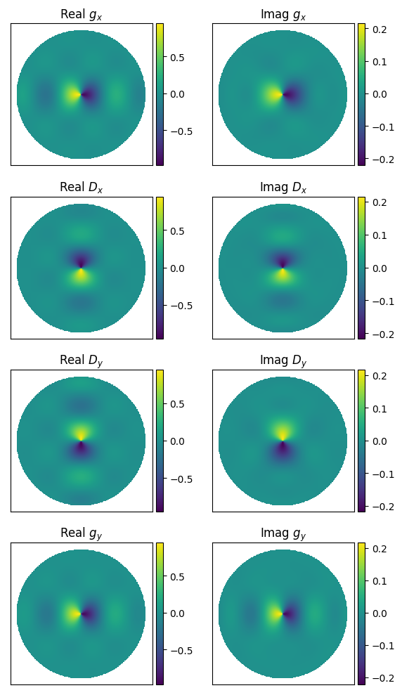
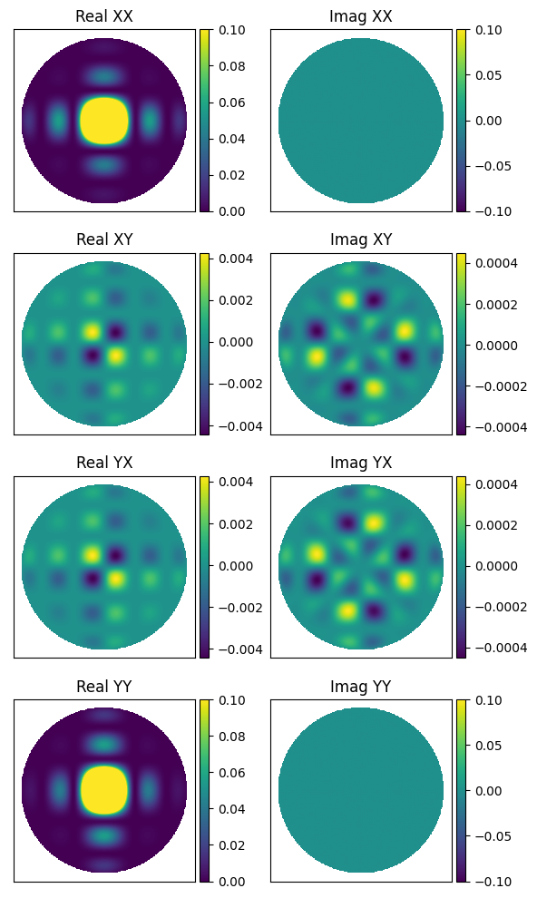

.. _Sokolowski et al. 2017: https://doi.org/10.1017/pasa.2017.54
.. _notebook that lives here: https://github.com/JLBLine/polarisation_tests_for_FEE
.. _Tingay et al. 2013: https://doi.org/10.1017/pasa.2012.007

Primary Beams
================
``WODEN`` has been written to include stationary primary beams. That means the beam is pointed at a constant azimuth / zenith angle during an observation. There are currently three primary beams available, which are detailed below.

MWA Fully Embedded Element
----------------------------

The Murchison Widefield Array (MWA, `Tingay et al. 2013`_) has 16 bow-tie dipoles arranged in a 4 by 4 grid as recieving elements, yielding a grating-lobe style primary beam.

``WODEN`` incudes a GPU-implementation of the MWA Fully Embedded Element (FEE) Beam pattern (`Sokolowski et al. 2017`_), which to date is the most accurate model of the MWA primary beam. This model is defined in a spherical harmonic coordinate system, which is polarisation-locked to instrumental azimuth / elevation coordinates. ``WODEN`` however uses Stokes parameters to define it's visibilities, and so a rotation of the beam about parallactic angle (as calculated using ``erfa``) is applied to align the FEE beam to move it into the Stokes frame.

Due to convention issues with whether 'X' means East-West or North-South, and whether azimuth starts towards North and increase towards East, we also find is necessary to reorder outputs and apply a sign flip to two of the outputs of the MWA FEE code. For an *exhaustive* investigation into why this is necessary to obtain the expected Stokes parameters, see the `notebook that lives here`_

I can define the Jones matrix of the primary beam as:

.. math::

  \mathbf{J_\mathrm{linear}} =
    \begin{bmatrix}
    g_{x} & D_{x} \\
    D_{y} & g_{y} \\
    \end{bmatrix}.

Here, the subscript :math:`x` means a polarisation angle of :math:`0^\circ` and :math:`y` an angle of :math:`90^\circ`, :math:`g` means a gain term, and :math:`D` means a leakage term (so :math:`x` means North-South and :math:`y` is East-West). Under this definition, a typical zenith-pointing looks like this:

These plots are all sky, with northward at the top. If we assume the sky is totally Stokes I, this will yield instrumental polarisations (where 'XX' is North-South and 'YY' is East-West) like this:

.. warning:: The frequency resolution of the MWA FEE model is 1.28 MHz. I have NOT yet coded up a frequency interpolation, so the frequency response for a given direction looks something like the below. This is coming in the future.

.. image:: MWAFEE_beam_vs_freq.svg
  :width: 400pt

In fact, when running using the MWA FEE band, I only calculate the beam response once per coarse band. If you set your ``--coarse_band_width`` to greater than 1.28 MHz you'll make this effect even worse. If you stick to normal MWA observational params (with the default 1.28 MHz) all will be fine.

EDA2
------

Gaussian
----------
