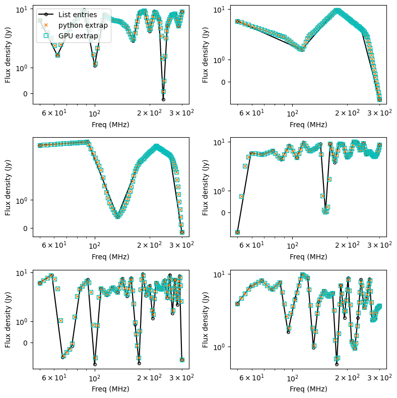

.. _defined for hyperdrive: https://github.com/MWATelescope/mwa_hyperdrive/wiki/Source-lists
.. _Line et al. 2020: https://doi.org/10.1017/pasa.2020.18
.. _SHAMFI readthedocs: https://shamfi.readthedocs.io/en/latest/
.. _Callingham et al. 2017: https://iopscience.iop.org/article/10.3847/1538-4357/836/2/174/pdf
.. _Lynch et al. 2021: https://doi.org/10.1017/pasa.2021.50
.. _Risely et al. 2020: https://doi.org/10.1017/pasa.2020.20
.. _Topcat: https://doi.org/10.1017/pasa.2020.20

.. _sky model formats:

Sky model
===========================
Going forward, only the ``FITS`` sky model format is being actively developed. This model has full IQUV polarisation options. The ``hyperdrive yaml`` format can be still be used for Stokes I only, as well as the deprecated native ``WODEN`` format. The ``FITS`` format is by far the most efficient in terms of read speed and manipulation however, and so I **strongly** suggest you suggest you use that format, as well as being able to add QUV information. Below, we'll define how the spectral information is used by ``WODEN``, and then specify the format of the FITS model.

Spectral models
^^^^^^^^^^^^^^^^^^^^

Stokes I
----------------

There are three spectral model types for Stokes I: ``power_law``; ``curved_power_law``; ``list``.
The ``power_law`` model is a simple power law with:

.. math::
  S_i = S_0 \left( \frac{\nu_i}{\nu_0} \right)^\alpha

where :math:`S_i` is the flux density extrapolated to frequency :math:`\nu_i`, with a reference flux density :math:`S_0`, reference frequency :math:`\nu_0`, and spectral index  :math:`\alpha`.
An example of these models (these plots are stolen from unit tests of ``WODEN``):

The ``curved_power_law`` model is defined in Equation 2 of `Callingham et al. 2017`_, and is
implemented in ``WODEN`` as:

.. math::
  S_i = S_0 \left( \frac{\nu_i}{\nu_0} \right)^\alpha e^{q\ln(\frac{\nu_i}{\nu_0})^2}

where :math:`q` is a curvature term. This allows for peaked-type SEDs:

.. image:: test_extrap_curve_power_laws.png
   :width: 500pt

Finally, the ``list`` model just takes a list of flux densities, and does a linear
interpolation between them. This is useful for simulating things like the 21cm
signal which should bounce around with frequency.

.. note::

	Most SEDs are assumed to be close to a power-law, and so are linear in log space. The linear interpolation is therefore done in log space. However, for some complicated modelling, negative flux values are required. For these values, the interpolation is done in *linear* space. Hence in the plot below, where the fluxes dip into negative territory, the extrapolated fluxes not longer lie on the straight lines, as these are log-log plots. A 21cm list-style SED has been tested to return the expected power spectra, even with this slightly odd log/linear extrapolation combo when bouncing around zero.

Linear polarisation (Stokes Q/U)
-----------------------------------

The linear polarisation :math:`P` can be defined (e.g. `Risely et al. 2020`_) as:

.. math::
  P = Q + iU = \mathrm{P}(\lambda) \exp\left( 2i (\chi_0 + \phi_{\textrm{RM}} \lambda^2) \right),

where :math:`Q,U` are Stokes parameters, :math:`\mathrm{P}` is the linear polarisation flux, :math:`\chi_0` is the intrinsic polarisation angle, and :math:`\phi_{\textrm{RM}}` is the rotation measure.

Using Euler's formula, this can be used to calculate :math:`Q,U` individually:

.. math::
  Q = \mathrm{P}(\lambda) \cos(2\chi_0 + 2\phi_{\textrm{RM}} \lambda^2), \\
  U = \mathrm{P}(\lambda) \sin(2\chi_0 + 2\phi_{\textrm{RM}} \lambda^2).

There are five models to calculate the linear polarisation flux :math:`\mathrm{P}(\lambda)` in ``WODEN``: ``power_law``; ``curved_power_law``; ``polarisation fraction``; ``list``; ``p-list``. The first two models work exactly the same as the Stokes I models, but with their own reference fluxes and spectral indices. The ``polarisation fraction`` model is a simple fraction of the Stokes I flux density, and is defined as:

.. math::
  \mathrm{P}(\lambda) = \Pi I(\lambda) ,

where :math:`\Pi` is the polarisation fraction, and :math:`I(\lambda)` is the Stokes I flux density. Note that :math:`\Pi` can be negative, and greater than one.

The ``list`` model is the same as the Stokes I list model, but the user enters two separate lists for Stokes :math:`Q` and :math:`U` as a function of frequency. This means :math:`Q`/:math:`U` are extrapolated independently of one another, and not related via :math:`\phi_{\textrm{RM}}`. With the ``p-list`` model the user enters a list of :math:`\mathrm{P}(\lambda)` fluxes, which is used in conjunction with the rotation measure to calculate :math:`Q` and :math:`U`. See below for exactly how to input these lists using the FITS format.

Circular polarisation (Stokes V)
-----------------------------------
Similarly to linear polarisation, circular polarisation can be calculated via three different models: ``power_law``; ``curved_power_law``; ``polarisation fraction``; ``list``. Again, both ``power_law`` and ``curved_power_law`` mean Stokes V will be modelled separately from Stokes I. ``polarisation fraction`` is again a fraction of the Stokes I flux density. Finally ``list`` is a list of flux densities as a function of frequency, and ``WODEN`` will interpolate between these values.

Example of a full Stokes SED
-----------------------------------
An example of these models for a single component (again, plots made using unit tests out of ``WODEN``) is below. Here, Stokes I is a ``power_law``, Stokes Q/U are a ``polarisation fraction``, and Stokes V is a ``curved_power_law``:

.. image:: eg_fluxes_comp02.png
   :width: 500pt

Sky model formats
^^^^^^^^^^^^^^^^^^^^
In ``WODEN`` nomenclature (which was inherited from the oracle ``RTS``), each astrophysical object is called a ``SOURCE``. Each ``SOURCE`` can have multiple components, which are called ``COMPONENTs``. Each ``COMPONENT`` can be a point source, Gaussian, or shapelet. 

FITS sky model format
----------------------------------
This sky model follows (and expands upon) the format of the LoBES catalogue `Lynch et al. 2021`_ and is the preferred format as it's the fastest and easiest to lazy load. There are three COMPONENT types: point source; Gaussian; shapelets. These are all the model types as defined in `Line et al. 2020`_ (including the mathematics of how each model is simulated). You can create any number of SOURCEs, each with any number of COMPONENTs, by using the `UNQ_SOURCE_ID` and `NAME` columns as detailed below. The sky model is a FITS file with at least one HDU (must appear first, and best to be given name ``MAIN``) with the following columns. Unless otherwise stated, all columns are optional (e.g. if you don't want to include polarisation information, you can leave out the polarisation columns): 

.. list-table:: ``MAIN`` HDU
   :header-rows: 1
   :widths: 10 10 80
   :stub-columns: 1

   *  - Column Name
      - Unit
      - Description
   *  - UNQ_SOURCE_ID
      -
      - (Required) Unique source ID. This is used to group COMPONENTs into SOURCEs. If you want to have multiple components in a single source, they must have the same ``UNQ_SOURCE_ID``.
   *  - NAME
      -
      - (Required) This is a COMPONENT name, and should read as UNQ_SOURCE_ID_C`number` where \`number\` is a COMPONENT number. For example, if you have a SOURCE with UNQ_SOURCE_ID = FornaxA, and you have two components, you should have two rows with NAME = FornaxA_C000 and FornaxA_C001.
   *  - RA
      - deg
      - (Required) Right Ascension (J2000)
   *  - DEC
      - deg
      - (Required) Declination (J2000)
   *  - COMP_TYPE
      -
      - (Required) Specifies if the component is a point source, Gaussian, or shapelet. Entered as either ``P``, ``G``, or ``S``.
   *  - MAJOR_DC
      - deg
      - Major axis of Gaussian or shapelet model
   *  - MINOR_DC
      - deg
      - Minor axis of Gaussian or shapelet model
   *  - PA_DC
      - deg
      - Position angle of Gaussian or shapelet model
   *  - MOD_TYPE
      -
      - (Required) The Stokes I flux model of this component. Can be either ``pl`` (power-law), ``cpl`` (curved power-law), or ``nan`` (list of flux densities).
   *  - NORM_COMP_PL
      - Jy
      - The Stokes I reference flux for a power-law ``pl`` component model, *must be at the reference frequency 200MHz.*
   *  - ALPHA_PL
      -
      - The sStokes I pectral index for a power-law ``pl`` component model
   *  - NORM_COMP_CPL
      - Jy
      - The Stokes I reference flux for a curved power-law ``cpl`` component model, *must be at the reference frequency 200MHz.*
   *  - ALPHA_CPL
      -
      - The Stokes I spectral index for a curved power-law ``cpl`` component model, *must be at the reference frequency 200MHz.*
   *  - CURVE_CPL
      -
      - The Stokes I curvature `q` for a curved power-law ``cpl`` component model
   *  - INT_FLX*frequency*
      - Jy
      - A reference Stokes I flux density, where *frequency* is the frequency in MHz. For a list type flux model, you can include as many INT_FLX*frequency* columns as necessary. For example, if you have three reference fluxes at 100, 150, and 200 MHz, you should have three columns INT_FLX100, INT_FLX150, and INT_FLX200.
   *  - V_MOD_TYPE
      - 
      - The Stokes V flux model of this component. Can be either ``pl`` (power-law), ``cpl`` (curved power-law), or ``pf`` (polarisation fraction).
   *  - V_POL_FRAC
      -
      - The Stokes V polarisation fraction; can be negative, and greater than one.
   *  - V_NORM_COMP_PL
      - Jy
      - The Stokes V reference flux for a power-law ``pl`` component model, *must be at the reference frequency 200MHz.*
   *  - V_ALPHA_PL
      -
      - The Stokes V pectral index for a power-law ``pl`` component model
   *  - V_NORM_COMP_CPL
      - Jy
      - The Stokes V reference flux for a curved power-law ``cpl`` component model, *must be at the reference frequency 200MHz.*
   *  - V_ALPHA_CPL
      -
      - The Stokes V spectral index for a curved power-law ``cpl`` component model, *must be at the reference frequency 200MHz.*
   *  - V_CURVE_CPL
      -
      - The Stokes V curvature `q` for a curved power-law ``cpl`` component model
   *  - LIN_MOD_TYPE
      -
      - The linear polarisation flux model of this component. Can be either ``pl`` (power-law), ``cpl`` (curved power-law), or ``pf`` (polarisation fraction).
   *  - RM
      - rad/m^2
      - The rotation measure of the linear polarisation
   *  - INTR_POL_ANGLE
      - rad
      - The intrinsic polarisation angle of the linear polarisation; if this column is missing, assume 0 degrees.
   *  - LIN_POL_FRAC
      -
      - The linear polarisation fraction; can be negative, and greater than one.
   *  - LIN_NORM_COMP_PL
      - Jy
      - The Linear Polarisation flux reference flux for a power-law ``pl`` component model, *must be at the reference frequency 200MHz.*
   *  - LIN_ALPHA_PL
      -
      - The Linear Polarisation flux pectral index for a power-law ``pl`` component model
   *  - LIN_NORM_COMP_CPL
      - Jy
      - The Linear Polarisation flux reference flux for a curved power-law ``cpl`` component model, *must be at the reference frequency 200MHz.*
   *  - LIN_ALPHA_CPL
      -
      - The Linear Polarisation flux spectral index for a curved power-law ``cpl`` component model, *must be at the reference frequency 200MHz.*
   *  - LIN_CURVE_CPL
      -
      - The Linear Polarisation flux curvature `q` for a curved power-law ``cpl`` component model

If you want to include SHAPELETS, you must include a second HDU that details the shapelet basis functions for each component, using the following columns. If the table does not appear directly after the ``MAIN`` table, it must be given the name ``SHAPELET``:

.. list-table:: ``SHAPELET`` HDU
   :header-rows: 1
   :widths: 10 80
   :stub-columns: 1

   *  - Column Name
      - Description
   *  - NAME
      - The COMPONENT name exactly as appears in the first HDU ``NAME`` column. You can have multiple rows for each COMPONENT, each with a unique combination of ``N1``, ``N2``, and ``COEFF``, to include as many shapelet basis functions as necessary. ``WODEN`` will cross-reference the two HDUs to use these basis functions in conjunction with the position and flux model in the first HDU.
   *  - N1
      - The first shapelet order
   *  - N2
      - The second shapelet order
   *  - COEFF
      - The coefficient to multiply this basis function by

The ``SHAPELET`` HDU is optional, and if it is not present, ``WODEN`` will assume all components are either point sources or Gaussians.

Polarisation list-style flux tables
~~~~~~~~~~~~~~~~~~~~~~~~~~~~~~~~~~~~~~~

If you want to include polarised list-style information, besides setting ``nan`` in the ``V_MOD_TYPE`` and/or ``nan`` / ``p_nan`` in the ``LIN_MOD_TYPE`` columns, you must include extra HDUs that contain the listed fluxes. See ``WODEN/examples/polarisation/polarisation_examples.ipynb`` for example Python code to create these tables.

To include a list of Stokes V fluxes, you must include an HDU with the name ``V_LIST_FLUXES`` (it MUST be named). This HDU must have the following columns:

.. list-table:: ``V_LIST_FLUXES`` HDU
   :header-rows: 1
   :widths: 20 10 70
   :stub-columns: 1

   *  - Column Name
      - Unit
      - Description
   *  - NAME
      -
      - The COMPONENT name exactly as appears in the ``MAIN`` HDU ``NAME`` column. ``WODEN`` will cross-reference the two HDUs to link the RA/DEC / Stokes I information for the COMPONENT.
   *  - V_INT_FLX*frequency*
      - Jy
      - A reference Stokes V flux density, where *frequency* is the frequency in MHz. For a list type flux model, you can include as many V_INT_FLX*frequency* columns as necessary. For example, if you have three reference fluxes at 100, 150, and 200 MHz, you should have three columns V_INT_FLX100, V_INT_FLX150, and V_INT_FLX200.

If you set ``p_nan`` in the ``LIN_MOD_TYPE`` columns, it means you want to include a list of polarised flux densities (:math:`P(\nu)`). These are used in conjunction with the ``RM`` and ``INTR_POL_ANGLE`` columns in the ``MAIN`` HDU to calculate Stokes Q/U. You must include an HDU with the name ``P_LIST_FLUXES`` (it MUST be named). This HDU must have the following columns:

.. list-table:: ``P_LIST_FLUXES`` HDU
   :header-rows: 1
   :widths: 20 10 70
   :stub-columns: 1

   *  - Column Name
      - Unit
      - Description
   *  - NAME
      -
      - The COMPONENT name exactly as appears in the ``MAIN`` HDU ``NAME`` column. ``WODEN`` will cross-reference the two HDUs to link the RA/DEC / Stokes I information for the COMPONENT.
   *  - P_INT_FLX*frequency*
      - Jy
      - A reference linear polarised flux density, where *frequency* is the frequency in MHz. For a list type flux model, you can include as many P_INT_FLX*frequency* columns as necessary. For example, if you have three reference fluxes at 100, 150, and 200 MHz, you should have three columns P_INT_FLX100, P_INT_FLX150, and P_INT_FLX200.

If you set ``nan`` in the ``LIN_MOD_TYPE`` columns, it means you want to include separate lists for Stokes Q and U. These lists will be used to extrapolate the Q and U fluxes separately. You must include two extra HDUs with the names ``Q_LIST_FLUXES`` and ``U_LIST_FLUXES`` (they MUST be named). Both HDUs must include the same number of COMPONENTs, as ``WODEN`` will try to extrapolate the Q/U fluxes for every ``nan`` entry in the ``LIN_MOD_TYPE`` column in the ``MAIN`` HDU. The HDUs must have the following columns:

.. list-table:: ``Q_LIST_FLUXES`` HDU
   :header-rows: 1
   :widths: 20 10 70
   :stub-columns: 1

   *  - Column Name
      - Unit
      - Description
   *  - NAME
      -
      - The COMPONENT name exactly as appears in the ``MAIN`` HDU ``NAME`` column. ``WODEN`` will cross-reference the two HDUs to link the RA/DEC / Stokes I information for the COMPONENT.
   *  - Q_INT_FLX*frequency*
      - Jy
      - A reference Stokes Q flux density, where *frequency* is the frequency in MHz. For a list type flux model, you can include as many Q_INT_FLX*frequency* columns as necessary. For example, if you have three reference fluxes at 100, 150, and 200 MHz, you should have three columns Q_INT_FLX100, Q_INT_FLX150, and Q_INT_FLX200.

.. list-table:: ``U_LIST_FLUXES`` HDU
   :header-rows: 1
   :widths: 20 10 70
   :stub-columns: 1

   *  - Column Name
      - Unit
      - Description
   *  - NAME
      -
      - The COMPONENT name exactly as appears in the ``MAIN`` HDU ``NAME`` column. ``WODEN`` will cross-reference the two HDUs to link the RA/DEC / Stokes I information for the COMPONENT.
   *  - U_INT_FLX*frequency*
      - Jy
      - A reference Stokes P flux density, where *frequency* is the frequency in MHz. For a list type flux model, you can include as many U_INT_FLX*frequency* columns as necessary. For example, if you have three reference fluxes at 100, 150, and 200 MHz, you should have three columns U_INT_FLX100, U_INT_FLX150, and U_INT_FLX200.