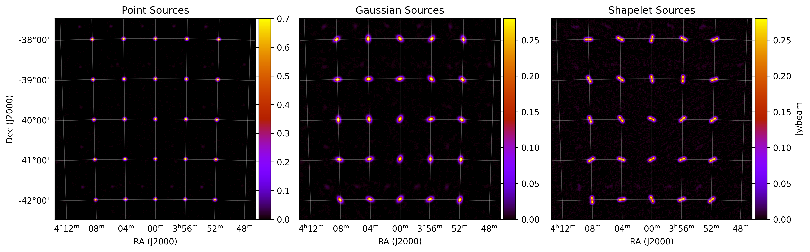

.. _`Thompson, Moran, & Swenson 2017`: https://link.springer.com/book/10.1007/978-3-319-44431-4
.. _`Line et al. 2020`: https://doi.org/10.1017/pasa.2020.18

Visibility Calculations
========================

This section assumes a basic understanding on radio interferometry, assuming you know what visibilities and baselines are, and are familiar with the :math:`u,v,w` and :math:`l,m,n` coordinate systems. I can recommend `Thompson, Moran, & Swenson 2017`_ if you are looking to learn / refresh these concepts. This section is basically a copy/paste from `Line et al. 2020`_.

.. note:: In `Line et al. 2020`_, I detailed that I was using the ``atomicAdd`` functionality in CUDA. This is no longer true, as I've found a loop inside my kernels is actually faster than being fully parallel and using ``atomicAdd``. The calculations being made have remained the same.

Measurement Equation and Point Sources
----------------------------------------

``WODEN`` analytically generates a sky model directly in visibility space via the measurement equation (c.f. `Thompson, Moran, & Swenson 2017`_)

.. math::

  V(u,v,w) =   \int \mathcal{B}(l,m) I(l,m) \exp[-2\pi i(ul + vm + w(n-1))] \dfrac{dldm}{n},

where :math:`V(u,v,w)` is the measured visibility at baseline coordinates :math:`u,v,w`, given the sky intensity :math:`\mathcal{S}(l,m)` and instrument beam pattern :math:`\mathcal{B}(l,m)`, which are functions of the direction cosines :math:`l,m`, with :math:`n=\sqrt{1-l^2-m^2}`. This can be discretised for point sources such that

.. math::

    V(u_i,v_i,w_i) = \sum_j \mathcal{B}(l_j,m_j)\mathcal{S}(l_j,m_j) \exp[-2\pi i(u_il_j + v_im_j + w_i(n_j-1))],

where :math:`u_i,v_i,w_i` are the visibility co-ordinates of the :math:`i^{\mathrm{th}}` baseline, and :math:`l_j`, :math:`m_j`, :math:`n_j` is the sky position of the :math:`j^{\mathrm{th}}` point source.

:math:`\mathcal{S}(l,m)` includes all the Stokes parameters :math:`I, Q, U, V` in ``WODEN``, with these parameters extrapolated from an input catalogue, along with the position on the sky. :math:`u,v,w` are set by a supplied array layout, phase centre, and location on the Earth.

.. note:: :math:`u_i,v_i,w_i`, :math:`\mathcal{S}`, and :math:`\mathcal{B}` are also functions of frequency, so must be calculated for each frequency steps as required.

Gaussian and Shapelet sources
------------------------------
You can inject morphology into your sources analytically by tranforming a visibility into a Gaussian or Shapelet source. We utilise the ``RTS`` methodology of inserting a visibility "envelope" :math:`\xi` into the visibility equation:

.. math::

  V(u_i,v_i,w_i) = \sum_j \xi_j(u_i,v_i)\mathcal{B}(l_j,m_j)\mathcal{S}(l_j,m_j) \exp[-2\pi i(u_il_j + v_im_j + w_i(n_j-1))],

For a Gaussian, this envelope looks like

.. math::

    \begin{align}
    &\xi_j = \exp\left( -\dfrac{\pi^2}{4\ln(2)} \left( k_x^2\theta_\mathrm{maj}^2 + k_y^2\theta_\mathrm{min}^2\right) \right); \\
    &k_x =  \cos(\phi_{\textrm{PA}})v_i + \sin(\phi_{\textrm{PA}})u_i; \\
    &k_y = -\sin(\phi_{\textrm{PA}})v_i + \cos(\phi_{\textrm{PA}})u_i;
    \end{align}

where :math:`\theta_\mathrm{maj}` and :math:`\theta_\mathrm{min}` are the major and minor axes and :math:`\phi_{\textrm{PA}}` the position angle of an elliptical Gaussian.

For a shapelet model, the envelope looks like:

.. math::

    \begin{align}
    &\xi_j = \sum^{p_k +p_l < p_\mathrm{max}}_{k,l} C_{p_k,p_l} \tilde{B}_{p_k,p_l}(k_x,k_y); \label{eq:shape-env} \\
    &k_x =  \dfrac{\pi}{\sqrt{2\ln(2)}} \left[\cos(\phi_{PA})v_{i,j} + \sin(\phi_{PA})u_{i,j} \right]; \label{eq:scale-shape-x} \\
    &k_y = \dfrac{\pi}{\sqrt{2\ln(2)}} \left[-\sin(\phi_{PA})v_{i,j} + \cos(\phi_{PA})u_{i,j} \right], \label{eq:scale-shape-y}
    \end{align}

where :math:`u_{i,j},v_{i,j}` are visibility co-ordinates for baseline :math:`i`, calculated with a phase-centre :math:`RA_j,\delta_j`, which corresponds to the central position :math:`x_0,y_0` used to fit the shapelet model in image-space. The shapelet basis function values :math:`\tilde{B}_{p_k,p_l}(u,v)` can be calculated by interpolating from one dimensional look-up tables of :math:`\tilde{B}(k_x;1)`, and scaling by the appropriate :math:`\beta` (c.f. Equation 1 in `Line et al. 2020`_ - see for a introduction and breakdown of shapelets bais functions).

You can see the difference between the three types of sky model component below. You can generate this plot yourself, checkout the section :ref:`Grid Component Models`.

