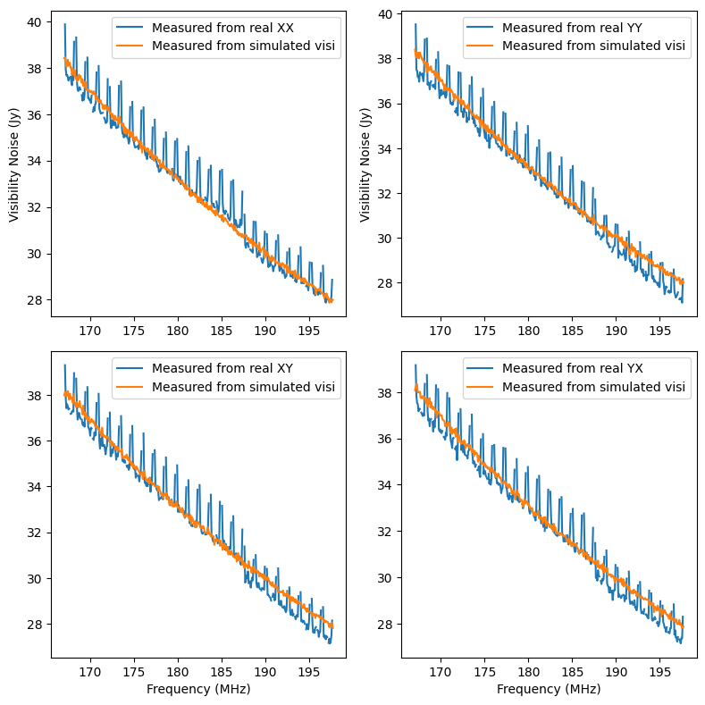
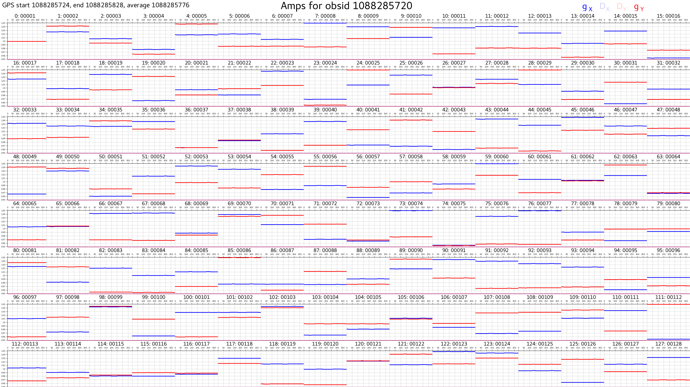
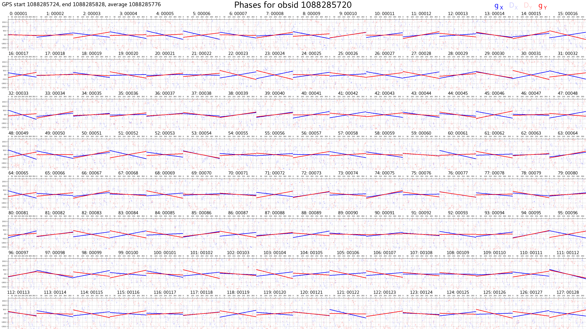
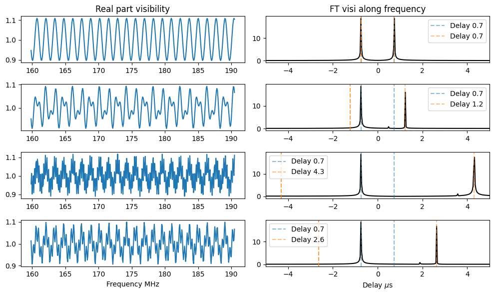

.. _Beardsley et al (2016): https://arxiv.org/pdf/1608.06281.pdf

``add_instrumental_effects_woden.py``
======================================

Use this script to add instrumental effects to a WODEN ``uvfits`` output. The script is designed to be run on a single ``uvfits``, so I suggest running ``add_woden_uvfits.py`` if you have 24 separate ``uvfits`` files. Read on for details on how different types of instrumental effects are added.

Adding noise
-------------
.. warning:: Everything is set for MWA highband simulations currently. This script needs developing. 

The noise on cross-correlations is drawn for a normal distribution with a mean of zero and a standard deviation of $\sigma_{\mathrm{cross}}$, which is calculated via the following (see Equation 6.50 in TMS 3rd edition for details):

$$
\sigma_{\mathrm{cross}} = \frac{\sqrt{2}k_b(T_{sky} + T_{rec})}{A_{eff}\sqrt{\Delta\nu\Delta t}},
$$

where variables and there defaults are listed below

.. list-table:: 
   :widths: 25 25 50
   :header-rows: 1

   * - Variable
     - Default
     - Description
   * - $T_{sky}$
     - $228(\frac{\nu}{150\mathrm{MHz}})^{-2.53}$
     - The sky temperature in Kelvin; estimated by extrapolating values from 150 MHz
   * - $T_{rec}$
     - 50
     - The receiver temperature in Kelvin (estimate for MWA highband)
   * - $A_{eff}$
     - 20.35
     - The effective area of the antenna in square metres (estimate for MWA highband)
   * - $\Delta\nu$
     - Value in ``uvfits`` header
     - The frequency resolution in Hz
   * - $\Delta t$
     - Inferred from ``uvfits``
     - The time integration in seconds

The noise is drawn randomly and added separately for the real and imaginary parts of each visibility, for all instrumental polarisations.

According to Kraus "Radio Astronomy" 2nd Edition, the noise on the auto-correlations is given by $\sqrt{2}\sigma_{\mathrm{cross}}$. This noise is added in the same way as the crosses.

A comparison of measured noise from calibrated MWA data and noise added by ``add_instrumental_effects_woden.py`` for the cross-correlations is shown below:

These noise values were estimated by differencing odd and even time step visibilities on 8s,80kHz averaged data. The real data are from 2014 when there was a digital gain jump, hence the discontinuity at around 187 MHz. The edges and centre of every MWA coarse band have also been flagged as they have extra noise from the bandpass. The simulated data includes the entire LoBES catalogue plus GLEAM for surrounding areas, with a total of around 200,000 sources.

Adding antenna (tile) gains and leakages
-----------------------------------------
Each receiving element (often called a tile for MWA, called an antenna hereon) in a dual polarisation interferometer can have a gain ($g_x, g_y$) and leakage ($D_x,D_y$) term for each polarisation. Each visibility is a correlation of two antennas. ``WODEN`` implements any antenna gains and leakages by multiplying the visibility between tiles 1 and 2 through the following operation:

.. math::
   \begin{bmatrix}
   V^`_{12\,XX} & V^`_{12\,XY} \\
   V^`_{12\,YX} & V^`_{12\,YY}
   \end{bmatrix} =
   \begin{bmatrix}
   g_{x1} & D_{x1} \\
   D_{y1} & g_{y1}
   \end{bmatrix}
   \begin{bmatrix}
   V_{12\,XX} & V_{12\,XY} \\
   V_{12\,YX} & V_{12\,YY}
   \end{bmatrix}
   \begin{bmatrix}
   g_{x2}^{\ast} & D_{x2}^{\ast} \\
   D_{y2}^{\ast} & g_{y2}^{\ast}
   \end{bmatrix},

where $V$ is a visibility in the ``uvfits`` file, $\ast$ means the complex conjugate, and $V^`$ is the visibility after the antenna gains and leakages have been applied. In ``WODEN`` 2.0.0, you can add a random frequency independent amplitude and a phase dependent slope to each antenna gain (see ``--ant_gain_amp_error`` and ``--ant_gain_phase_error``below for more detail).  The leakage terms are calculated via Equation A4.5 from TMS third edition where

$
\begin{align}
D_x = \Psi - i \chi \\
D_y = -\Psi + i \chi
\end{align}
$

where $\Psi, \chi$ are alignment errors of the dipoles. This equation is really designed for single antennas, but in the MWA case, you could imagine that all the dipoles in a tile are aligned aligned perfectly to the mesh, and the mesh is slightly offset, so the alignment errors for all dipoles are the same. The parameters. $\Psi, \chi$ are set by the user via ``--ant_leak_errs`` so you can tune however much leakage you want.

An example of calibration solutions obtained through ``hyperdrive`` when gains have been added by ``add_instrumental_effects_woden.py`` is shown below:

Cable reflections
----------------------
Mismatched impedance at the cable ends can cause internal reflections that setup standing waves, adding frequency-dependent ripples to the visibilities. We follow the formalism from `Beardsley et al (2016)`_ to define the cable reflection gain seen by antenna $i$ for polarisation $\mathrm{pol}$ as

$
R_{\mathrm{pol},i}(\nu) = R_{0,i} \exp(-2\pi i \nu \tau_i),
$

where $R_{0,i}$ is the complex reflection coefficient, and $\tau_i$ is the time delay caused by the cable length connected to antenna $i$. The time delay is given by

$
\tau_i = \frac{2l_i}{0.81c},
$

where $l_i$ is the length of the cable connected to antenna $i$, and $c$ is the speed of light. The factor 0.81 comes from the velocity factor of the cable, which we again take from `Beardsley et al (2016)`_. The cable lengths are listed in the MWA `metafits` file, so `add_instrumental_effects_woden.py` reads them directly from there. The reflection coefficient amplitudes are drawn from a uniform distribution between ``--cable_reflection_coeff_amp_min=0.02`` and ``--cable_reflection_coeff_amp_max=0.01``. These default values are based one a set of fitted FHD cable reflection solutions, but can be changed by the user. A random phase offset between 0 and 180 degrees is added to the reflection coefficient. 

.. warning:: Really, the reflection coefficient tied to the cable length, but I'm just chucking a random one on each tile for now. Still answers question of whether we can fit them with ``hyperdrive``, but ``FHD`` might average by cable type and then fit the reflections? Should the phase offset be the same for cable types?

Applying these reflections to a simulation of a 1 Jy point source at zenith (so visibilities all of $1 + 0i$) allows us to test the applied reflections by Fourier transforming visibilities and checking the input delays:

*Command line running arguments*
---------------------------------

.. argparse::
   :filename: ../../scripts/add_instrumental_effects_woden.py
   :func: get_parser
   :prog: add_instrumental_effects_woden.py

*Function documentation*
------------------------

.. automodule:: add_instrumental_effects_woden
   :members:
