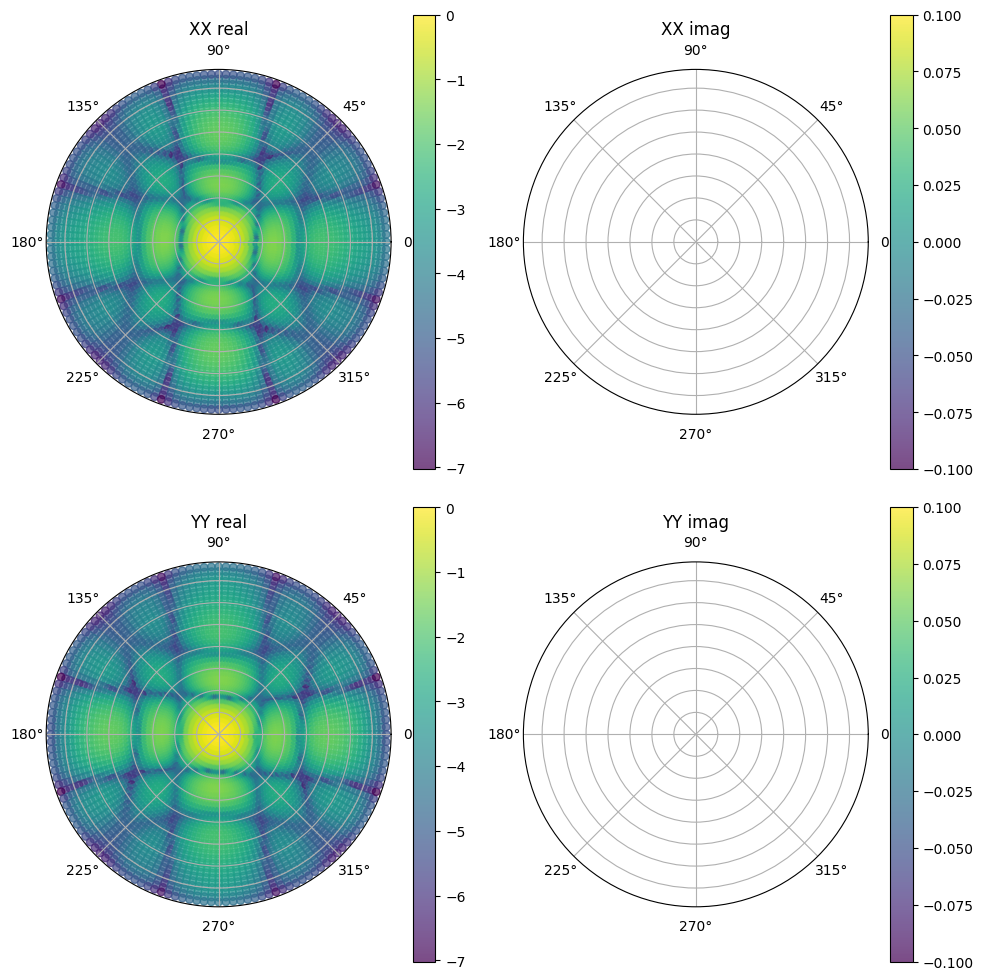
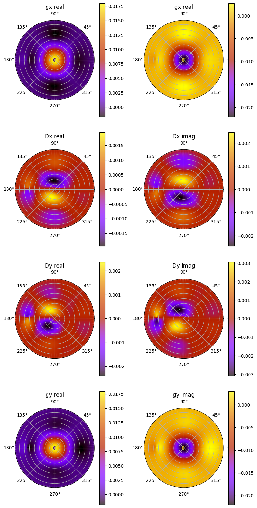
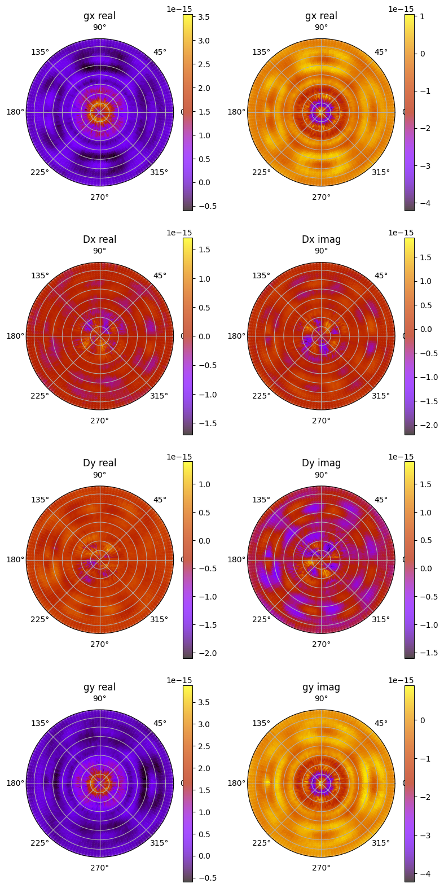

.. _mwa_hyperbeam: https://pypi.org/project/mwa-hyperbeam/

``FEE_primary_beam_cuda``
=========================
Tests for the functions in ``WODEN/src/FEE_primary_beam_cuda.cu``. This is more
of an integration test rather than a suite of individual function tests.

test_RTS_FEE_beam.c
*********************************
This runs ``create_sky_model::test_RTS_CUDA_FEE_beam``, which in turn calls
the following functions:

 - ``create_sky_model::get_HDFBeam_normalisation`` - get values to normalise to zenith
 - ``create_sky_model::copy_FEE_primary_beam_to_GPU`` - move values from host to device
 - ``create_sky_model::calc_CUDA_FEE_beam`` - calculate the MWA FEE beam response
 - ``create_sky_model::free_FEE_primary_beam_from_GPU`` - free things from the device

after copying the MWA FEE beam values from the device back to the host for testing.

The MWA beam pointing direction on the sky is controlled by a set of 16 delays.
In these tests, three different delays settings are tested at 50MHz, 150MHz, and
250MHz (a total of nine tests). Each test is run with ~5000 sky directions,
spanning the whole sky. For each combination of settings, the beam gains
output by ``test_RTS_CUDA_FEE_beam`` are compared to those stored in the header
``test_RTS_FEE_beam.h``.

That header ``test_RTS_FEE_beam.h`` is stitched together from values stored
in text files like ``hyperbeam_zenith_200.txt`` and ``hyperbeam_zenith_200_rot.txt``,
which are generated using the script ``compare_to_hyperdrive.py`` using the
python package `mwa_hyperbeam`_. Each text file stores the az/za, real and imaginary
values for the gain and leakage for both the north-south and east-west dipoles,
either with the parallactic angle rotation applied or not.

All delay and frequency combinations are run with both parallactic angle rotation
applied and not. For the FLOAT precision, the real and imaginary must match
the ``hyperbeam`` values to within a absolute tolerance of 3e-2. For DOUBLE,
they must match to within 1e-9.

.. note:: Given that the accuracy of the FLOAT precision is <= 3%, I suggest if you are comparing simulated visibilities to real data, that DOUBLE is the only way to go (which is accurate to <= 0.0000001%). However, if you are running some comparison simulations, the inaccuracy is a constant bias, and is still a good representation of the beam model, so is probably fine for internal comparison.

To convince yourself sensible values are stored in those test files, a very rough
plotting script is included in as ``WODEN/cmake_testing/FEE_primary_beam_cuda/plot_beam_results.py``,
which converts the beam gains and leakages into Stokes
XX and YY polarisations, assuming a fully Stokes I sky. The script can be used
as::

  python plot_beam_results.py hyperbeam_zenith_200_rot.txt

which will produce a plot like the below (this is log10(gain) for a parallactic
rotated zenith pointing at 200 MHz).

(Plot looks a little warped purely because I've just done a scatter plot which
is a quick and dirty way of showing the info).

If you are *really* interested in the differences, you can run::

  $ source plot_all_beam_diffs.sh

which will produce a bunch of plots in a directory
``WODEN/cmake_testing/FEE_primary_beam_cuda/beam_plots``. Included are difference
plots, showing the offset from the ``WODEN`` output to ``hyperbeam`` for real
and imaginary in the gain and leakage terms of the Jones matrix. An example at
FLOAT precision for zenith at 100MHz is (note this is the difference
in gain, NOT log10(gain)):

The equivalent plot for DOUBLE is shown below, showing the vast improvement in
accuracy:

