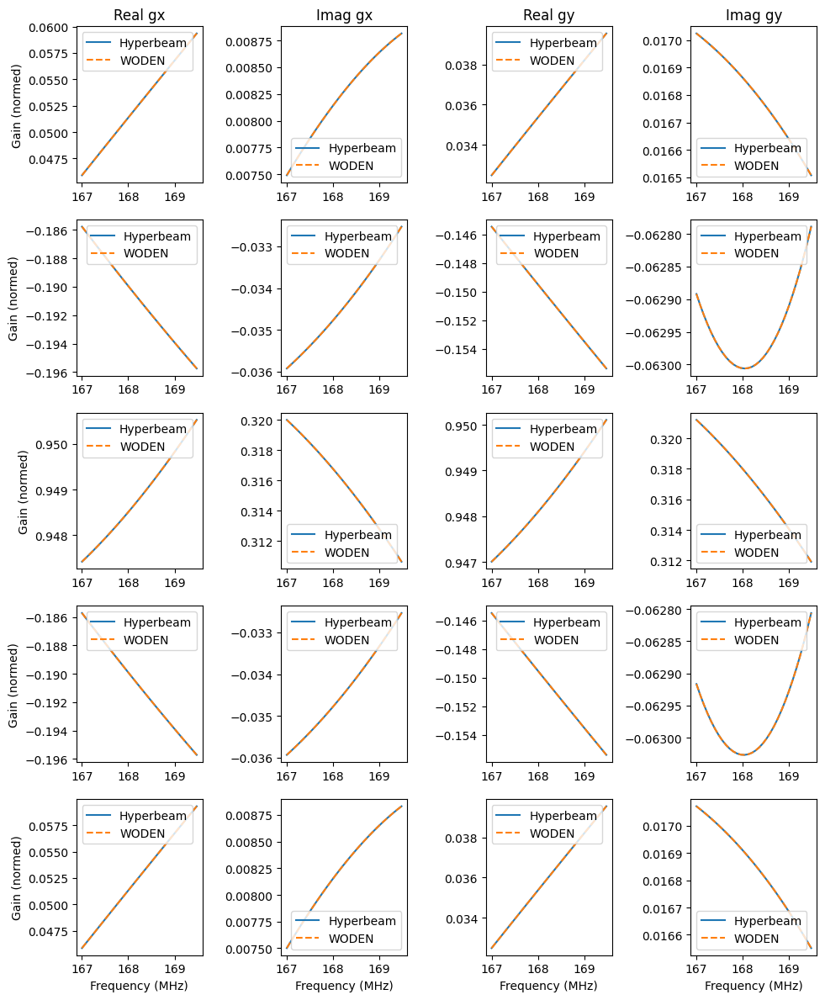

.. _mwa_hyperbeam: https://pypi.org/project/mwa-hyperbeam/

.. _FEE_primary_beam_cuda_cmake:

``FEE_primary_beam_cuda``
===========================
Tests for the functions in ``WODEN/src/FEE_primary_beam_cuda.cu``. The first
single frequency function tests in depth whether the code is faithfully
reproducing the MWA FEE beam for all directions on the sky, for a number of
frequencies and delays. The multi-freq tests check that multiple frequencies
are calculated in the same call, only for a few directions on the sky, as the
accuracy is tested in depth in the single direction tests.

test_RTS_FEE_beam.c
*********************************
This runs ``create_sky_model::test_RTS_CUDA_FEE_beam``, which in turn calls
the following functions:

 - ``create_sky_model::get_HDFBeam_normalisation`` - get values to normalise to zenith
 - ``create_sky_model::copy_FEE_primary_beam_to_GPU`` - move values from host to device
 - ``create_sky_model::calc_CUDA_FEE_beam`` - calculate the MWA FEE beam response
 - ``create_sky_model::free_FEE_primary_beam_from_GPU`` - free things from the device

after copying the MWA FEE beam values from the device back to the host for testing.

The MWA beam pointing direction on the sky is controlled by a set of 16 delays.
In these tests, three different delays settings are tested at 50MHz, 150MHz, and
250MHz (a total of nine tests). Each test is run with ~5000 sky directions,
spanning the whole sky. For each combination of settings, the beam gains
output by ``test_RTS_CUDA_FEE_beam`` are compared to those stored in the header
``test_RTS_FEE_beam.h``.

That header ``test_RTS_FEE_beam.h`` is stitched together from values stored
in text files like ``hyperbeam_zenith_200.txt`` and ``hyperbeam_zenith_200_rot.txt``,
which are generated using the script ``compare_to_hyperdrive.py`` using the
python package `mwa_hyperbeam`_. Each text file stores the az/za, real and imaginary
values for the gain and leakage for both the north-south and east-west dipoles,
either with the parallactic angle rotation applied or not.

All delay and frequency combinations are run with both parallactic angle rotation
applied and not. For the FLOAT precision, the real and imaginary must match
the ``hyperbeam`` values to within a absolute tolerance of 3e-2. For DOUBLE,
they must match to within 1e-13.

.. note:: Given that the accuracy of the FLOAT precision is <= 3%, I suggest if you are comparing simulated visibilities to real data, that DOUBLE is the only way to go (which is accurate to <= 0.00000000001%). However, if you are running some comparison simulations, the inaccuracy is a constant bias, and is still a good representation of the beam model, so is probably fine for internal comparison.

To convince yourself sensible values are stored in those test files, a very rough
plotting script is included in as ``WODEN/cmake_testing/FEE_primary_beam_cuda/plot_beam_results.py``,
which converts the beam gains and leakages into Stokes
XX and YY polarisations, assuming a fully Stokes I sky. The script can be used
as::

  python plot_beam_results.py hyperbeam_zenith_200_rot.txt

which will produce a plot like the below (this is log10(gain) for a parallactic
rotated zenith pointing at 200 MHz).

.. image:: hyperbeam_zenith_200_rot.png
  :width: 400

(Plot looks a little warped purely because I've just done a scatter plot which
is a quick and dirty way of showing the info).

If you are *really* interested in the differences, you can run::

  $ source plot_all_beam_diffs.sh

which will produce a bunch of plots in a directory
``WODEN/cmake_testing/FEE_primary_beam_cuda/beam_plots``. Included are difference
plots, showing the offset from the ``WODEN`` output to ``hyperbeam`` for real
and imaginary in the gain and leakage terms of the Jones matrix. An example at
FLOAT precision for zenith at 100MHz is (note this is the difference
in gain, NOT log10(gain)):

.. image:: hyperbeam_zenith_100_rotzenith_100_rot_float_diff.png
  :width: 400

The equivalent plot for DOUBLE is shown below, showing the vast improvement in
accuracy:

.. image:: hyperbeam_zenith_100_rotzenith_100_rot_double_diff.png
  :width: 400

test_multifreq_get_MWAFEE_normalisation.c
*************************************************

Calls ``FEE_primary_beam_cuda::multifreq_get_MWAFEE_normalisation``, which gets
the normalisation values for the FEE beams for all frequencies when using the
interpolated MWA FEE beam. Test runs for two different combinations of delays
and frequencies. Just tests the real values come back as correct, as the
full integration test in ``test_run_and_map_multifreq_calc_CUDA_FEE_beam.c``
tests everything.

test_map_FEE_beam_gains_multi_freq.c
*************************************************************
Calls ``FEE_primary_beam_cuda::test_map_FEE_beam_gains_multi_freq``, which
tests the function ``FEE_primary_beam_cuda::map_FEE_beam_gains_multi_freq``,
which maps the outputs from ``FEE_primary_beam_cuda::multifreq_calc_CUDA_FEE_beam``
into the primary beam gain arrays as used by the rest of the GPU code. Tests
by inputting a set of dummy gains where the gain is based on the time, sky
direction, and frequency index. The test checks these gains end up in the
expected order after applying the mapping

test_multifreq_calc_CUDA_FEE_beam.c
**************************************
This calls ``FEE_primary_beam_cuda::test_multifreq_calc_CUDA_FEE_beam``, which
tests the function ``FEE_primary_beam_cuda::multifreq_calc_CUDA_FEE_beam``,
which calculates the interpolated MWA FEE for multiple directions and frequencies.
Tests by running with two combinations of delays, frequencies, and sky directions,
and compares to stored values. This is one step away from the full integration test
below, but it doesn't map the final gains into the 4 separate beam gain
arrays used by the rest of the GPU code.

test_run_and_map_multifreq_calc_CUDA_FEE_beam.c
****************************************************
This calls ``FEE_primary_beam_cuda::test_run_and_map_multifreq_calc_CUDA_FEE_beam``
which in turn calls ``FEE_primary_beam_cuda:run_and_map_multifreq_calc_CUDA_FEE_beam``.
This function handles calculating the MWA FEE beam for a given number of
frequencies. It takes an initialised array of ``RTS_MWA_FEE_beam_t`` types and
gathers the normalisation factors, beam values in all directions, and
normalises them and rotates by parallactic angle. The test code takes az/za
as inputs and calculates the parallactic angle values from those. Three
tests are run, with three different pointings and three different frequency
ranges. The output values are then tested against values output by ``hyperdrive``,
with the FLOAT precision code tested to an absolute tolerance of 3e-2, and
the DOUBLE a tolerance of 1e-13.

Only five coordinate directions are tested, as the accuracy of the beam across
the sky is tested for many many directions by ``test_RTS_FEE_beam.c``, which
is using the same code. This test is really check that the correct frequencies
are called. To visually compare the outputs of to ``hyperbeam``, you can
run the script ``plot_multifreq_comparison.sh``, which yields output plots
like this (for the DOUBLE code):

