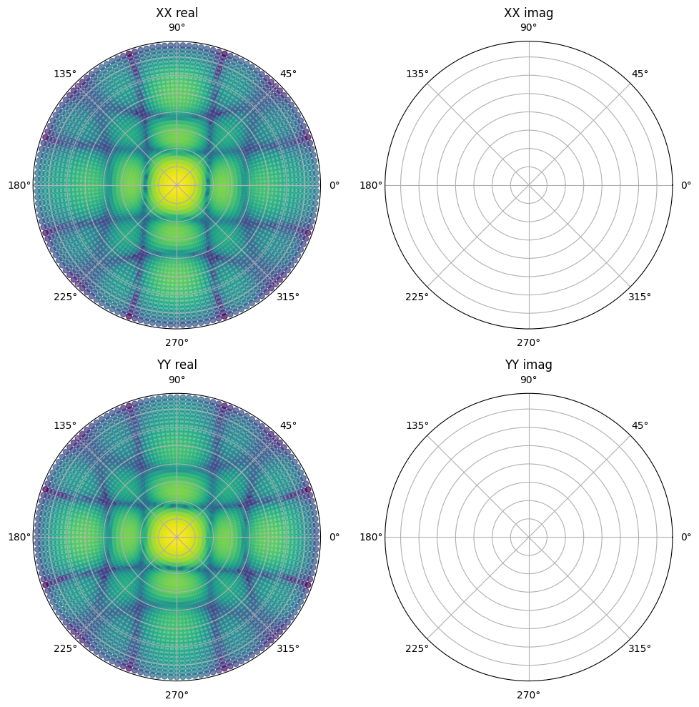

``FEE_primary_beam_cuda``
=========================
Tests for the functions in ``WODEN/src/FEE_primary_beam_cuda.cu``. This is more
of an integration test rather than a suite of individual function tests.

test_RTS_FEE_beam.c
*********************************
This runs ``create_sky_model::test_RTS_CUDA_FEE_beam``, which in turn calls
the following functions:

 - ``create_sky_model::get_HDFBeam_normalisation`` - get values to normalise to zenith
 - ``create_sky_model::copy_FEE_primary_beam_to_GPU`` - move values from host to device
 - ``create_sky_model::calc_CUDA_FEE_beam`` - calculate the MWA FEE beam response
 - ``create_sky_model::free_FEE_primary_beam_from_GPU`` - free things from the device

after copying the MWA FEE beam values from the device back to the host for testing.

The MWA beam pointing direction on the sky is controlled by a set of 16 delays.
In these tests, three different delays settings are tested at 50MHz, 150MHz, and
250MHz (a total of nine tests). Each test is run with ~5000 sky directions,
spanning the whole sky. For each combination of settings, the beam gains
output by ``test_RTS_CUDA_FEE_beam`` are compared to those stored in the header
``test_RTS_FEE_beam.h``. Each value must be within an absolute tolerance
of 1e-6 to pass.

That header ``test_RTS_FEE_beam.h`` is stitched together from values stored
in text files like ``zenith_200.txt``, which stores the az/za, real and imaginary
values for the gain and leakage for both the north-south and east-west dipoles.
To convince yourself sensible values are stored in those test files, a very rough
plotting script is included in as ``WODEN/cmake_testing/FEE_primary_beam_cuda/plot_beam_results.py``,
which converts the beam gains and leakages into
XX and YY polarisations, assuming a fully Stokes I sky. The script can be used
as::

  python plot_beam_results.py zenith_200.txt

which will produce a plot like the below (this is log10(gain) for a zenith pointing at 200 MHz).

(Plot looks a little warped purely because I've just done a scatter plot which
is a quick and dirty way of showing the info).
