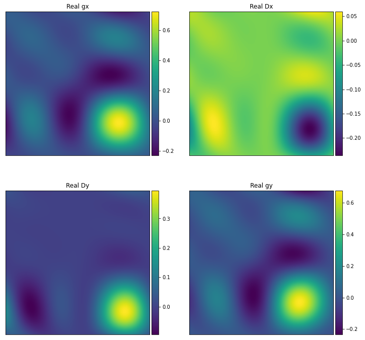
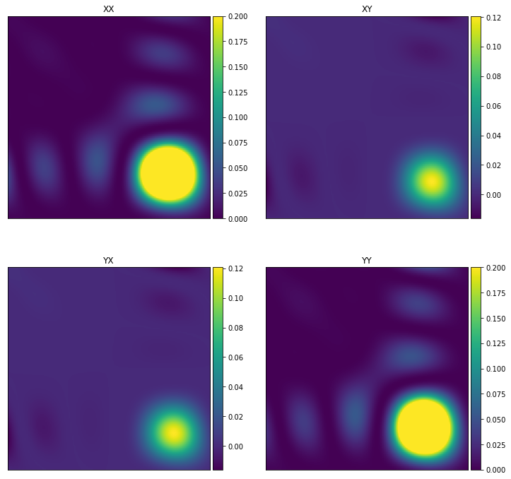
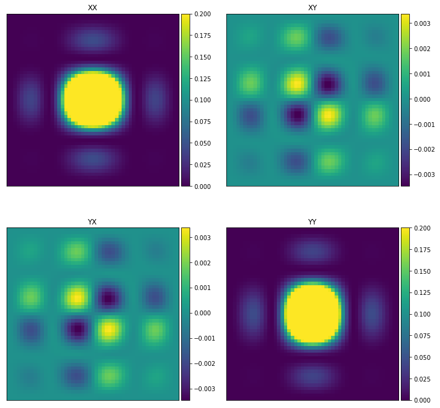
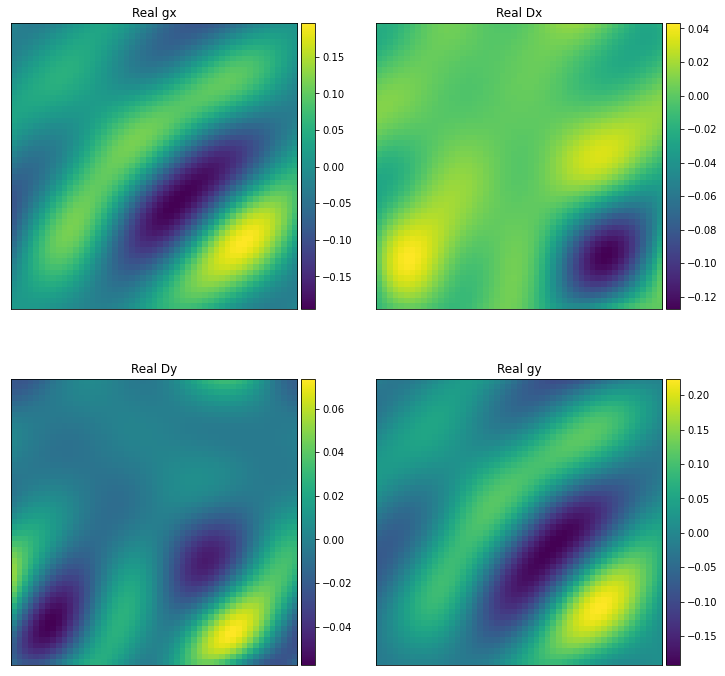
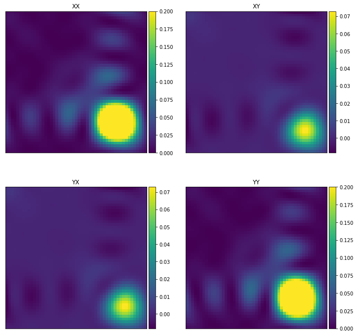
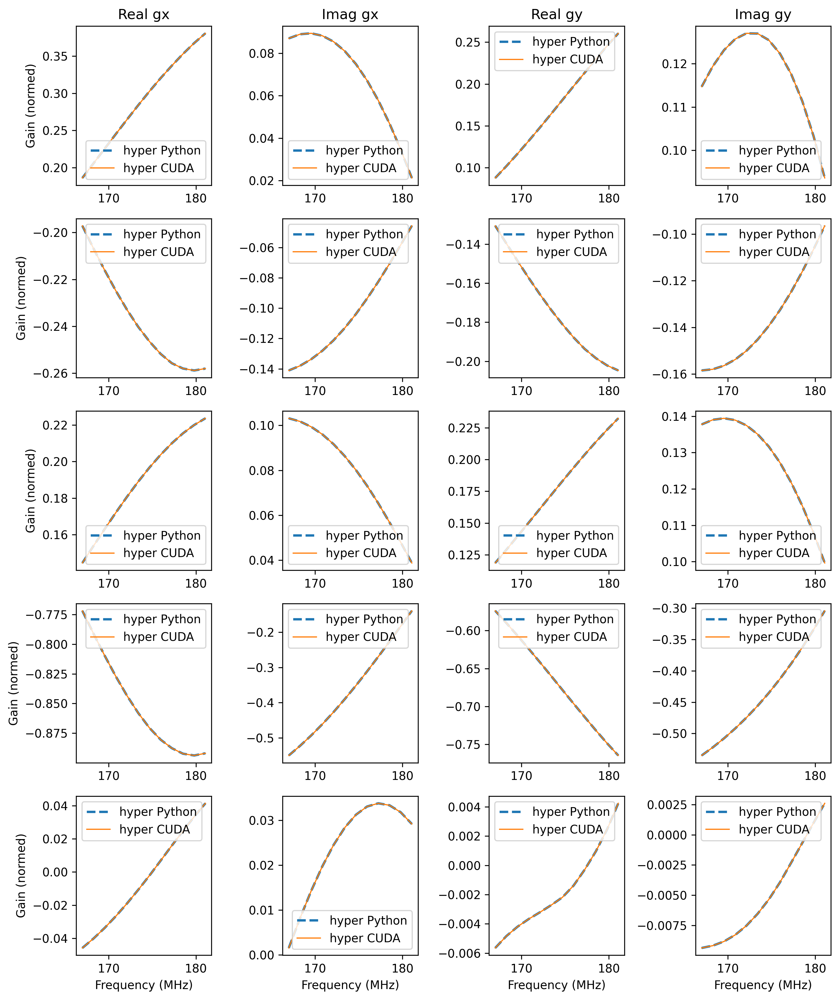

.. _mwa_hyperbeam: https://github.com/MWATelescope/mwa_hyperbeam

``primary_beam``
=========================
Tests for the functions in ``WODEN/src/primary_beam_gpu.cu``. These functions
calculate the beam responses for the following beam models:

 * **Gaussian** - a frequency dependent Gaussian beam; FWHM can be set by user
 * **EDA2** - a single MWA dipole on an infinite ground screen
 * **MWA analytic** - an analytic model of the MWA primary beam taken from the RTS
 * **MWA FEE (coarse)** - the Fully Embedded Element MWA model (1.28 MHz frequency resolution)
 * **MWA FEE (interp)** - frequency interpolated MWA FEE model (80 kHz resolution between 167 - 197 MHz)

See :ref:`Primary Beams` for more discussion on primary beams.

test_gaussian_beam.c
*********************************
This calls ``primary_beam_gpu::test_kern_gaussian_beam``, which in turn
tests ``primary_beam_gpu::kern_gaussian_beam``, the kernel that calculates
the Gaussian primary beam response. As a Gaussian is an easy function to
calculate, I've setup tests that calculate a north-south and east-west strip
of the beam response, and then compare that to a 1D Gaussian calculation.

As ``kern_gaussian_beam`` just takes in *l,m* coords, these tests just generate
100 *l,m* coords that span from -1 to +1. The tests check whether the kernel
produces the expected coordinates in the *l* and *m* strips, as well as changing
with frequency as expected, by testing 5 input frequencies with a given
reference frequency. For each input frequency :math:`\nu`, the output is
checked against the following calculations:

 - When setting *m* = 0, assert gain = :math:`\exp\left[-\frac{1}{2} \left( \frac{l}{\sigma} \frac{\nu}{\nu_0} \right)^2 \right]`
 - When setting *l* = 0, assert gain = :math:`\exp\left[-\frac{1}{2} \left( \frac{m}{\sigma} \frac{\nu}{\nu_0} \right)^2 \right]`

where :math:`\nu_0` is the reference frequency, and :math:`\sigma_0` the std of
the Gaussian in terms of *l,m* coords. These calculations are made using ``C``
with 64 bit precision.  The beam responses are tested to be within an absolute
tolerance of 1e-10 from expectations for the FLOAT compiled code, and 1e-16 for
the DOUBLE compiled code.

test_analytic_dipole_beam.c
***********************************
This calls ``primary_beam_gpu::test_analytic_dipole_beam``, which in turn
tests ``primary_beam_gpu::calculate_analytic_dipole_beam``, code that copies
az/za angles into GPU memory, calculates an analytic dipole response toward
those directions, and then frees the az/za coords from GPU memory.

Nothing exiting in this test, just call the function for 25 directions on
the sky, for two time steps and two frequencies (a total of 100 beam calculations),
and check that the real beam gains match stored expected values, and the imaginary
values equal zero. The expected values have been generated using the DOUBLE
precision compiled code, and so the absolute tolerance of within 1e-12 is set
by how many decimal places I've stored in the lookup table. The FLOAT precision
must match within 1e-6 of these stored values.

test_MWA_analytic.c
***********************************
.. TODO:: stick the maths of what the analytic beam does here (it is involved).

This calls ``primary_beam_gpu::test_calculate_MWA_analytic_beam``, which calls
``primary_beam_gpu::calculate_MWA_analytic_beam``, which calculates an
analytic version of the MWA primary beam, based on ideal dipoles. This code calculates
the primary beam response of the MWA using methods from ``RTS``. The analytic
beam is purely real.

This test runs with an off-zenith pointing, with a grid of 101 by 101 of az/za
or two time steps, and two frequencies (150 and 200MHz). The az/za coords for both
time steps are identical, but test whether the time/frequency ordering of the
outputs are correct. The beam responses are tested to be within an absolute
tolerance of 1e-6 from expectations for the FLOAT compiled code, and 1e-8 for the
DOUBLE compiled code (the responses are only stored to 1e-8 precision for testing
to save space on disk).

If you want to look at your outputs, you can run the notebook located at
``cmake_testing/primary_beam_gpu/run_header_setup_and_plots.ipynb``. Along with
setting up the az/za coords used in the testing, it will generate a number of
plots. It will plot the real gains and leakages of the MWA analytic
beam (e.g. ``jones_MWA_analy_gains_nside101_t00_f200.000MHz.png``):

as well as the linear Stokes polarisations (e.g.
``linear_pol_MWA_analy_gains_nside101_t00_f200.000MHz.png``):

.. In the following Section, we'll look at the gains and leakages for the ``mwa_hyperbeam`` MWA Fully Embedded Element Beam. For some reason, the real values of the gains and leakages for the RTS analytic beam and the MWA FEE model are negative of one another. Once converted into linear Stokes polarisations, which is how they are applied to the visibilities, they are the same sign. For now this means they match, and so has no effect to ``WODEN`` outputs.

test_run_hyperbeam.c
***********************************
This calls ``primary_beam_gpu::test_run_hyperbeam_gpu``, which calls
``primary_beam_gpu::run_hyperbeam_gpu``, which is a wrapper around
`mwa_hyperbeam`_ to calculate the MWA FEE beam.

The MWA beam pointing direction on the sky is controlled by a set of 16 delays.
In these tests, three different delays settings are tested at 50MHz, 150MHz, and
250MHz (a total of nine tests). Each test is run with ~10,000 sky directions, for
two time steps (with identical az/za coords; in reality, those change with time)
and three fine frequency channels. The fine frequency channels all lie with
a 1.28MHz frequency resolution of the FEE beam model, so should come out
identically. Test with two times and three freqs to check our indexing is
working correctly. For each combination of settings, the beam gains
output by ``test_run_hyperbeam.c`` are compared to those stored in the header
``test_run_hyperbeam.h``.

The header ``test_run_hyperbeam.h`` is generated by the notebook
``run_header_setup_and_plots.ipynb``, which uses the ``Python`` implementation
of ``mwa_hyperbeam`` to calculate expected outcomes.

All delay and frequency combinations are run with both parallactic angle rotation
applied and not. Both the FLOAT and DOUBLE codes are checked to match the ``Python``
version of ``mwa_hyperbeam`` to a tolerance of 1e-6 (only one library is linked
from ``mwa_hyperbeam`` so the accuracy is the same). Again, running
``run_header_setup_and_plots.ipynb`` will produce plots.

When applying parallactic angle rotation, and latitude is required, which
can change with time (happens when precessing the array back to J2000 for
every time step). To check things are working, two time steps with different
latitudes are called. To accomodate all these variables, a smaller number of
directions on the sky are used to save space / computation.

First, an example zenith pointing in Stokes linear
(``linear_pol_hyperbeam_rot_zenith_gains_nside51_t00_f200.000MHz.png``):

and the equivalent ``hyperbeam`` outputs to the pointing used above in
``test_MWA_analytic.c`` for comparison:

as well as the linear Stokes polarisations (e.g.
``linear_pol_MWA_analy_gains_nside101_t00_f200.000MHz.png``):

which shows qualitatively the Stokes polarisation responses off zenith
are broadly similar between the analytic and FEE beams, but the mutual
coupling does modify the response. The gains and leakages are strikingly
different, but this is in part because the analytic beam is purely real, whereas
the FEE model is complex.

test_run_hyperbeam_interp.c
***********************************

This calls ``primary_beam_gpu::test_run_hyperbeam_gpu``, which calls
``primary_beam_gpu::run_hyperbeam_gpu``, which is a wrapper around `mwa_hyperbeam`_ to calculate the MWA FEE beam. Unlike ``test_run_hyperbeam.c`` however, we used
the interpolated hdf5 file which has a higher frequency resolution, to give
a smooth response as a function of frequency.

Three tests are run, with three different pointings and three different frequency
ranges. The output values are then tested against values output by python version of ``hyperdrive``, with the outputs tested to a tolerance of 1e-10.

Only five coordinate directions are tested, as the accuracy of the beam across
the sky is tested for many many directions by ``test_run_hyperbeam.c``, which
is using the same code. This test is really check that the correct frequencies
are called, and subsequently mapped correctly. Again, we can plot the outputs using
``run_header_setup_and_plots.ipynb``,which yields plots like ``offzen1_freqs2.png``,
plotting the gains and leakages as a function of frequency, for five different direction on the sky (each a different row):

