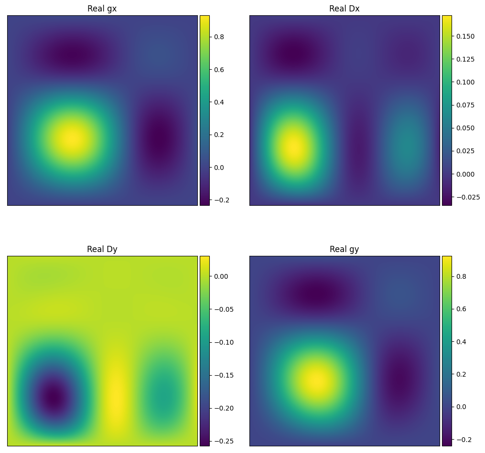
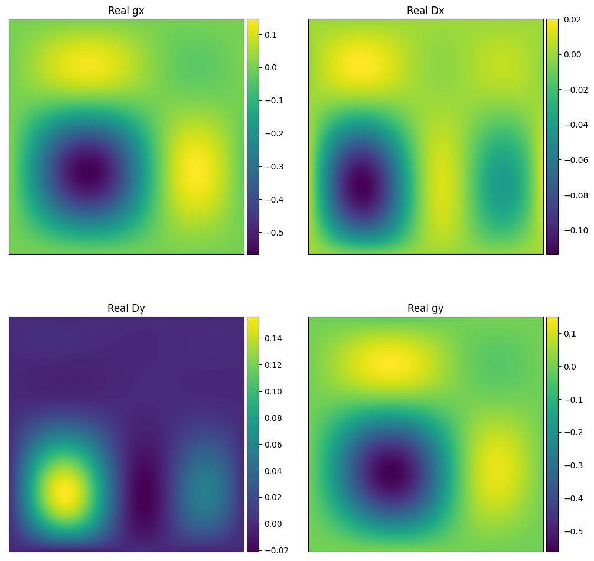
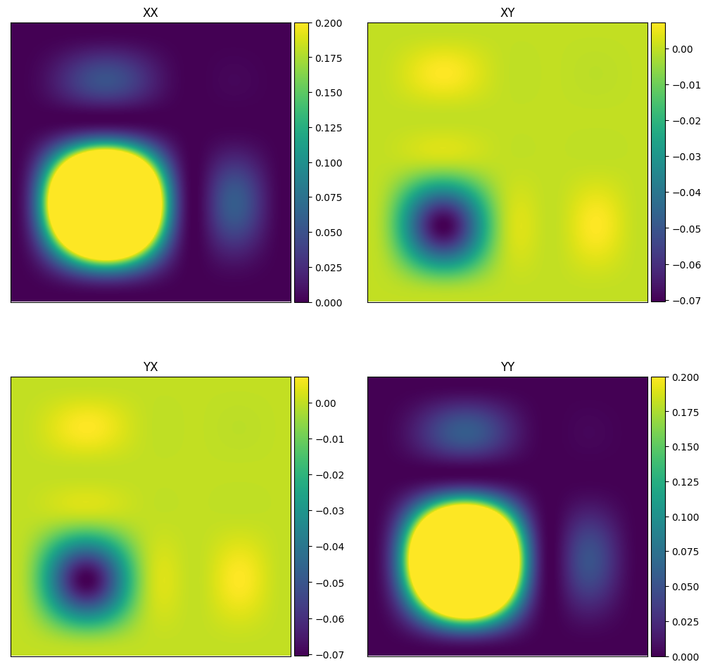
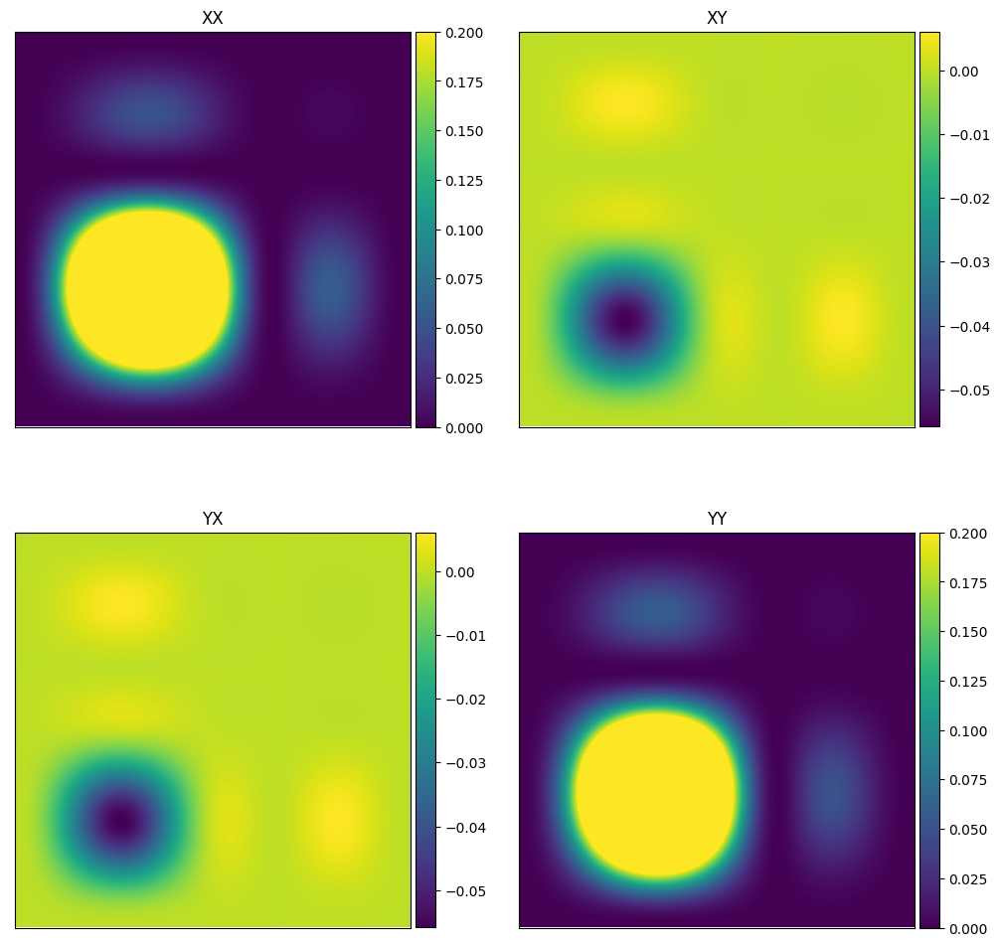

``primary_beam_cuda``
=========================
Tests for the functions in ``WODEN/src/primary_beam_cuda.cu``. These functions
calculate the beam responses for the EDA2 and Gaussian beam models.

test_gaussian_beam.c
*********************************
This calls ``primary_beam_cuda::test_kern_gaussian_beam``, which in turn
tests ``primary_beam_cuda::kern_gaussian_beam``, the kernel that calculates
the Gaussian primary beam response. As a Gaussian is an easy function to
calculate, I've setup tests that calculate a north-south and east-west strip
of the beam response, and then compare that to a 1D Gaussian calculation.

As ``kern_gaussian_beam`` just takes in *l,m* coords, these tests just generate
100 *l,m* coords that span from -1 to +1. The tests check whether the kernel
produces the expected coordinates in the *l* and *m* strips, as well as changing
with frequency as expected, by testing 5 input frequencies with a given
reference frequency. For each input frequency :math:`\nu`, the output is
checked against the following calculations:

 - When setting *m* = 0, assert gain = :math:`\exp\left[-\frac{1}{2} \left( \frac{l}{\sigma} \frac{\nu}{\nu_0} \right)^2 \right]`
 - When setting *l* = 0, assert gain = :math:`\exp\left[-\frac{1}{2} \left( \frac{m}{\sigma} \frac{\nu}{\nu_0} \right)^2 \right]`

where :math:`\nu_0` is the reference frequency, and :math:`\sigma_0` the std of
the Gaussian in terms of *l,m* coords. These calculations are made using ``C``
with 64 bit precision.  The beam responses are tested to be within an absolute
tolerance of 1e-10 from expectations for the FLOAT compiled code, and 1e-16 for
the DOUBLE compiled code.

test_analytic_dipole_beam.c
***********************************
This calls ``primary_beam_cuda::test_analytic_dipole_beam``, which in turn
tests ``primary_beam_cuda::calculate_analytic_dipole_beam``, code that copies
az/za angles into GPU memory, calculates an analytic dipole response toward
those directions, and then frees the az/za coords from GPU memory.

Nothing exiting in this test, just call the function for 25 directions on
the sky, for two time steps and two frequencies (a total of 100 beam calculations),
and check that the real beam gains match stored expected values, and the imaginary
values equal zero. The expected values have been generated using the DOUBLE
precision compiled code, and so the absolute tolerance of within 1e-12 is set
by how many decimal places I've stored in the lookup table. The FLOAT precision
must match within 1e-6 of these stored values.

test_MWA_analytic.c
***********************************
.. TODO:: stick the maths of what the analytic beam does here (it is involved).

This calls ``primary_beam_cuda::test_calculate_MWA_analytic_beam``, which calls
``primary_beam_cuda::calculate_MWA_analytic_beam``, which calculates an
analytic version of the MWA primary beam, based on ideal dipoles. This code calculates
the primary beam response of the MWA using methods from ``RTS``. The analytic
beam is purely real.

This test runs with an off-zenith pointing, with a grid of 201 by 201 of az/za
or two time steps, and two frequencies (150 and 200MHz). The az/za coords for both
time steps are identical, but test whether the time/frequency ordering of the
outputs are correct. The beam responses are tested to be within an absolute
tolerance of 1e-6 from expectations for the FLOAT compiled code, and 1e-8 for the
DOUBLE compiled code (the responses are only stored to 1e-8 precision for testing
to save space on disk).

If you want to look at your outputs, you can run::

  $ python plot_MWA_analytic.py

will will plot the real components of beam responses of both the MWA analytic
beam (``jones_MWA_analy_gains_nside201_t00_f150.000MHz.png``):

The testing here also runs ``comp_MWA_analytic_to_FEE.c``, which runs the
MWA FEE beam code for the same sky directions. This comparison is also plotted
as (``jones_MWA_analy_gains_nside201_t00_f150.000MHz.png``):

which gives us a sanity check that both beams point in the same direction for
the same input az/za coords, and that they have similar structures on the sky,
albeit they are negative of one another.

When we combine the gains and leakages to create linear Stokes, we see that
we get similar beams. First of all, here is the RTS MWA analytic ``linear_pol_MWA_analy_gains_nside201_t00_f150.000MHz.png``:

Comparing that the MWA FEE beam ``linear_pol_MWA_FEE_gains_nside201_t00_f150.000MHz.png``:

we see that all linear polarisations have the same signs and simliar structures.

The plotting script plots both frequencies and time steps for the analytic
beam, letting you visually check that the outputs are ordered as expected.
