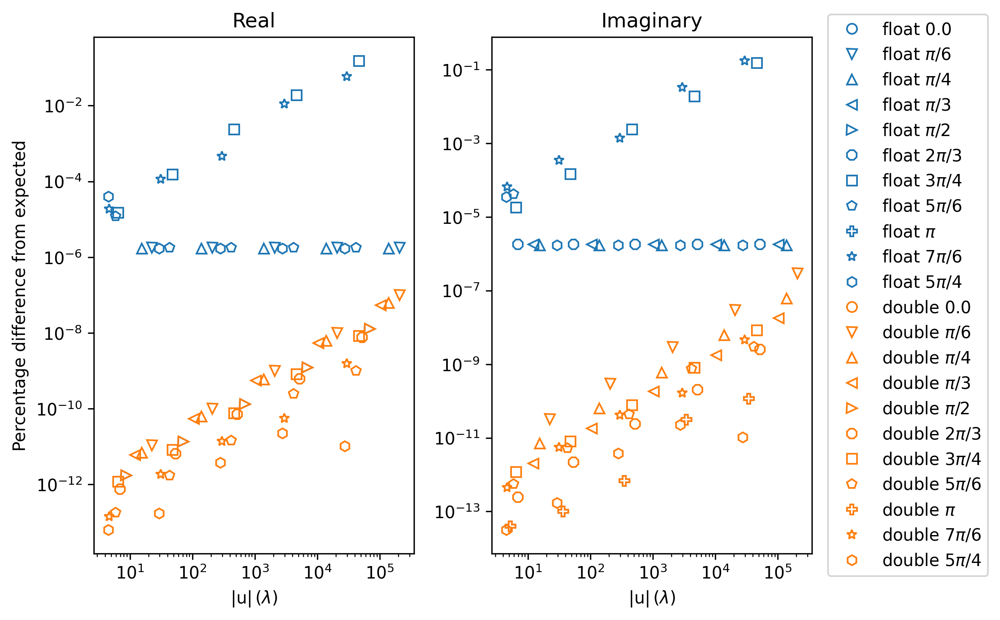
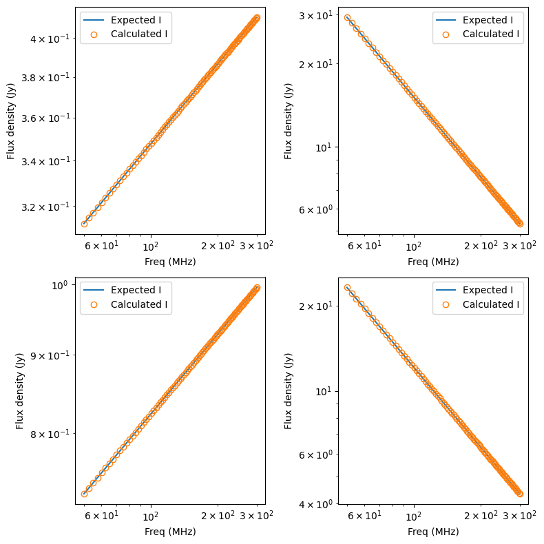

``source_components``
=========================
Tests for the functions in ``src/source_components_common.c``,
``src/source_components_cpu.c`` and ``src/source_components_gpu.cpp`` These functions
run calculations common to all COMPONENT types, namely calculating ``lmn`` coordinates,
extrapolating Stokes flux densities, calculating primary beam gains,
visibility calculations, and calculating auto-correlations.

As always, all CPU and GPU functions are run through the same tests to ensure
consistency between the two.

test_apply_beam_gains*.c
************************************
This calls ``source_components_gpu.cpp::kern_apply_beam_gains`` or ``source_components_cpu.c::apply_beam_gains_arrays_cpu``. These functions apply beam gain and leakage terms to Stokes visibilities to create linear Stokes polarisation visibilities via:

.. math::

   \begin{eqnarray}
   \mathrm{V}^{XX}_{12} = (g_{1x}g_{2x}^{\ast} + D_{1x}D_{2x}^{\ast})\mathrm{V}^{I}_{12}
    +  (g_{1x}g_{2x}^{\ast} - D_{1x}D_{2x}^{\ast})\mathrm{V}^{Q}_{12} \\
    +  (g_{1x}D_{2x}^{\ast} + D_{1x}g_{2x}^{\ast})\mathrm{V}^{U}_{12}
    +  i(g_{1x}D_{2x}^{\ast} - D_{1x}g_{2x}^{\ast})\mathrm{V}^{V}_{12}
   \end{eqnarray}

.. math::

   \begin{eqnarray}
   \mathrm{V}^{XY}_{12} =
        (g_{1x}D_{2y}^{\ast} + D_{1x}g_{2y}^{\ast})\mathrm{V}^{I}_{12}
     +  (g_{1x}D_{2y}^{\ast} - D_{1x}g_{2y}^{\ast})\mathrm{V}^{Q}_{12} \\
     +  (g_{1x}g_{2y}^{\ast} + D_{1x}D_{2y}^{\ast})\mathrm{V}^{U}_{12}
     +  i(g_{1x}g_{2y}^{\ast} - D_{1x}D_{2y}^{\ast})\mathrm{V}^{V}_{12}
   \end{eqnarray}

.. math::

   \begin{eqnarray}
   \mathrm{V}^{XY}_{12} =
        (g_{1x}D_{2y}^{\ast} + D_{1x}g_{2y}^{\ast})\mathrm{V}^{I}_{12}
     +  (g_{1x}D_{2y}^{\ast} - D_{1x}g_{2y}^{\ast})\mathrm{V}^{Q}_{12} \\
     +  (g_{1x}g_{2y}^{\ast} + D_{1x}D_{2y}^{\ast})\mathrm{V}^{U}_{12}
     +  i(g_{1x}g_{2y}^{\ast} - D_{1x}D_{2y}^{\ast})\mathrm{V}^{V}_{12}
   \end{eqnarray}

.. math::

   \begin{eqnarray}
   \mathrm{V}^{YY}_{12} =
        (D_{1y}D_{2y}^{\ast} + g_{1y}g_{2y}^{\ast})\mathrm{V}^{I}_{12}
     +  (D_{1y}D_{2y}^{\ast} - g_{1y}g_{2y}^{\ast})\mathrm{V}^{Q}_{12} \\
     +  (D_{1y}g_{2y}^{\ast} + g_{1y}D_{2y}^{\ast})\mathrm{V}^{U}_{12}
     +  i(D_{1y}g_{2y}^{\ast} - g_{1y}D_{2y}^{\ast})\mathrm{V}^{V}_{12}
   \end{eqnarray}

where :math:`\ast` means complex conjugate, :math:`g_x, D_x, D_y, g_y` are beam
gain and leakage terms, with subscript 1 and 2 meaning antenna 1 and 2, and
:math:`\mathrm{V}^I, \mathrm{V}^Q, \mathrm{V}^U, \mathrm{V}^V` the Stokes
visibilities. These tests try a number of combinations of values that have
a simple outcome, and tests that the function returns the expected values. The
combinations are shown in the table below. For all combinations, the beam gain
and leakage is used for both antennas in the above equations. Each entry is a
complex values and should be read as *real,imag*. Both FLOAT and DOUBLE code
are just tested to a 32 bit accuracy here as these a simple numbers that require
little precision.

.. list-table::
   :widths: 25 25 25 25 25 25 25 25 25 25 25 25
   :header-rows: 1

   * - :math:`g_x`
     - :math:`D_x`
     - :math:`D_y`
     - :math:`g_y`
     - :math:`\mathrm{V}^I`
     - :math:`\mathrm{V}^Q`
     - :math:`\mathrm{V}^U`
     - :math:`\mathrm{V}^V`
     - :math:`\mathrm{V}^{XX}`
     - :math:`\mathrm{V}^{XY}`
     - :math:`\mathrm{V}^{YX}`
     - :math:`\mathrm{V}^{YY}`
   * - 1,0
     - 0,0
     - 0,0
     - 1,0
     - 1,0
     - 0,0
     - 0,0
     - 0,0
     - 1,0
     - 0,0
     - 0,0
     - 1,0
   * - 1,0
     - 0,0
     - 0,0
     - 1,0
     - 0,0
     - 1,0
     - 0,0
     - 0,0
     - 1,0
     - 0,0
     - 0,0
     - -1,0
   * - 1,0
     - 0,0
     - 0,0
     - 1,0
     - 0,0
     - 0,0
     - 1,0
     - 0,0
     - 0,0
     - 1,0
     - 1,0
     - 0,0
   * - 1,0
     - 0,0
     - 0,0
     - 1,0
     - 0,0
     - 0,0
     - 0,0
     - 1,0
     - 0,0
     - 0,1
     - 0,-1
     - 0,0
   * - 0,0
     - 1,0
     - 1,0
     - 0,0
     - 1,0
     - 0,0
     - 0,0
     - 0,0
     - 1,0
     - 0,0
     - 0,0
     - 1,0
   * - 0,0
     - 1,0
     - 1,0
     - 0,0
     - 0,0
     - 1,0
     - 0,0
     - 0,0
     - -1,0
     - 0,0
     - 0,0
     - 1,0
   * - 0,0
     - 1,0
     - 1,0
     - 0,0
     - 0,0
     - 0,0
     - 1,0
     - 0,0
     - 0,0
     - 1,0
     - 1,0
     - 0,0
   * - 0,0
     - 1,0
     - 1,0
     - 0,0
     - 0,0
     - 0,0
     - 0,0
     - 1,0
     - 0,0
     - 0,-1
     - 0,1
     - 0,0
   * - 2,0
     - 2,0
     - 2,0
     - 2,0
     - 1,0
     - 0,0
     - 0,0
     - 0,0
     - 8,0
     - 8,0
     - 8,0
     - 8,0
   * - 2,0
     - 2,0
     - 2,0
     - 2,0
     - 0,0
     - 1,0
     - 0,0
     - 0,0
     - 0,0
     - 0,0
     - 0,0
     - 0,0
   * - 2,0
     - 2,0
     - 2,0
     - 2,0
     - 0,0
     - 0,0
     - 1,0
     - 0,0
     - 8,0
     - 8,0
     - 8,0
     - 8,0
   * - 2,0
     - 2,0
     - 2,0
     - 2,0
     - 0,0
     - 0,0
     - 0,0
     - 1,0
     - 0,0
     - 0,0
     - 0,0
     - 0,0
   * - 1,2
     - 3,4
     - 5,6
     - 7,8
     - 1,0
     - 0,0
     - 0,0
     - 0,0
     - 30,0
     - 70,8
     - 70,-8
     - 174,0
   * - 1,2
     - 3,4
     - 5,6
     - 7,8
     - 0,0
     - 1,0
     - 0,0
     - 0,0
     - -20,0
     - -36,0
     - -36,0
     - -52,0
   * - 1,2
     - 3,4
     - 5,6
     - 7,8
     - 0,0
     - 0,0
     - 1,0
     - 0,0
     - 22,0
     - 62,8
     - 62,-8
     - 166,0
   * - 1,2
     - 3,4
     - 5,6
     - 7,8
     - 0,0
     - 0,0
     - 0,0
     - 1,0
     - -4,0
     - -4,-16
     - -4,16
     - -4,0

test_calc_measurement_equation*.c
************************************
This calls ``source_components_gpu.cpp::kern_calc_measurement_equation`` or
``source_components_cpu.c::calc_measurement_equation_arrays_cpu``.
These functions calculate the phase-tracking measurement equation for a visibility, given the baseline coordinates and the source coordinates.

The following methodology is also written up in the JOSS ``WODEN`` paper where
it's used in a sky model + array layout through to visibility end-to-end version.
Here we directly test the functions above.

``calc_measurement_equation`` calculates the phase-tracking measurement equation:

.. math::

  V(u,v,w) =  \exp \left[ 2\pi i\left( ul + vm + w(n-1) \right) \right]

We can use Euler's formula to split this into real and imaginary components. If
I label the phase for a particular source and baseline as

.. math::

  \phi = 2\pi \left( ul + vm + w(n-1)\right)

then the real and imaginary parts of the visibility :math:`V_{re}`, :math:`V_{im}` are

.. math::

  V_{re} = \cos(\phi) \\
  V_{im} = \sin(\phi)

A definitive test of the ``calc_measurement_equation`` function then is to then set
:math:`\phi` to a number of values which produce known sine and cosine outputs, by
selecting specific combinations of *u,v,w* and *l,m,n*. First of all, consider the case when
*u,v,w = 1,1,1*. In that case,

.. math::

  \frac{\phi_{\mathrm{simple}}}{2\pi} = l + m + (n-1).

if we further set *l == m*, we end up with

.. math::

  \frac{\phi_{\mathrm{simple}}}{2\pi} = 2l + (n-1), \\
  l = \sqrt{\left( \frac{1 - n^2}{2} \right)}

I shoved those two equations into `Wolfram Alpha`_ who assured me that a solution
for *n* here is

.. _Wolfram Alpha: https://www.wolframalpha.com/widgets/view.jsp?id=c07cc70f1e81887dfd0971d3fe17cfcd

.. math::

  n = \frac{\sqrt{2}\sqrt{-\phi_{\mathrm{simple}}^2 - 4\pi\phi_{\mathrm{simple}} + 8\pi^2} + \phi_{\mathrm{simple}} + 2\pi}{6\pi}

which we can then use to calculate values for *l,m* through

.. math::

  l = m = \sqrt{\frac{1 - n^2}{2}}.

By selecting the following values for :math:`\phi`, we can create the following
set of *l,m,n* coords, which have the a known set of outcomes:

.. list-table::
   :widths: 25 25 25 25 25
   :header-rows: 1

   * - :math:`\phi_{\mathrm{simple}}`
     - *l,m*
     - *n*
     - :math:`\cos(\phi)`
     - :math:`\sin(\phi)`
   * - :math:`0`
     - 0.0
     - 1.0
     - :math:`1.0`
     - :math:`0`
   * - :math:`\pi/6`
     - 0.0425737516338956
     - 0.9981858300655398
     - :math:`\sqrt{3}/2`
     - :math:`0.5`
   * - :math:`\pi/4`
     - 0.0645903244635131
     - 0.9958193510729726
     - :math:`\sqrt{2}/2`
     - :math:`\sqrt{2}/2`
   * - :math:`\pi/3`
     - 0.0871449863555500
     - 0.9923766939555675
     - :math:`0.5`
     - :math:`\sqrt{3}/2`
   * - :math:`\pi/2`
     - 0.1340695840364469
     - 0.9818608319271057
     - :math:`0.0`
     - :math:`1.0`
   * - :math:`2\pi/3`
     - 0.1838657911209207
     - 0.9656017510914922
     - :math:`-0.5`
     - :math:`\sqrt{3}/2`
   * - :math:`3\pi/4`
     - 0.2100755148372292
     - 0.9548489703255412
     - :math:`-\sqrt{2}/2`
     - :math:`\sqrt{2}/2`
   * - :math:`5\pi/6`
     - 0.2373397982598921
     - 0.9419870701468823
     - :math:`-\sqrt{3}/2`
     - :math:`0.5`
   * - :math:`\pi`
     - 0.2958758547680685
     - 0.9082482904638630
     - :math:`-1.0`
     - :math:`0.0`
   * - :math:`7\pi/6`
     - 0.3622725654470420
     - 0.8587882024392495
     - :math:`-\sqrt{3}/2`
     - :math:`-0.5`
   * - :math:`5\pi/4`
     - 0.4003681253515569
     - 0.8242637492968862
     - :math:`-\sqrt{2}/2`
     - :math:`-\sqrt{2}/2`

.. note:: If you try and go higher in :math:`\phi` then because I set :math:`l == m` you no longer honour :math:`\sqrt{l^2 + m^2 + n^2} <= 1.0` I think this range of angles is good enough coverage though.

This is a great test for when :math:`u,v,w = 1`, but we want to test a range of
baseline lengths to check our function is consistent for short and long baselines.
We can play another trick, and set all baseline coords to be equal, i.e. :math:`u = v = w = b` where :math:`b` is baseline length. In this form, the phase including
the baseline length :math:`\phi_{b}` is

.. math::

  \phi_{b} = 2\pi b\left( l + m + n - 1 \right) = b\phi_{\mathrm{simple}}.

As sine/cosine are periodic functions, the following is true:

.. math::

  \phi_{\mathrm{simple}} = \phi_{\mathrm{simple}} + 2\pi \mathrm{n}

where :math:`\mathrm{n}` is some integer. This means for a given :math:`\phi_{\mathrm{simple}}` from
the table above, we can find an appropriate :math:`b` that should still result in the
expected sine and cosine outputs by setting

.. math::

  b\phi_{\mathrm{simple}} = \phi_{\mathrm{simple}} + 2\pi \mathrm{n} \\
  b = \frac{\phi_{\mathrm{simple}} + 2\pi \mathrm{n}}{\phi_{\mathrm{simple}}}

for a range of :math:`\mathrm{n}` values. The values of :math:`\mathrm{n}` and the
resultant size of :math:`b` that I use in testing are shown in the table below (note for :math:`\phi_{\mathrm{simple}} = 0` I just set :math:`b = 2\pi \mathrm{n}` as the effects of :math:`l,m,n` should set everything to zero regardless of baseline coords).

.. list-table::
   :widths: 25 25 25 25 25 25 25
   :header-rows: 1

   * - :math:`\phi_{\mathrm{simple}}`
     - :math:`b(\mathrm{n=0})`
     - :math:`b(\mathrm{n=1})`
     - :math:`b(\mathrm{n=10})`
     - :math:`b(\mathrm{n=100})`
     - :math:`b(\mathrm{n=1000})`
     - :math:`b(\mathrm{n=10000})`
   * - :math:`0`
     - 0.0
     - 6.3
     - 62.8
     - 628.3
     - 6283.2
     - 62831.9
   * - :math:`\pi/6`
     - 1.0
     - 13.0
     - 121.0
     - 1201.0
     - 12001.0
     - 120001.0
   * - :math:`\pi/4`
     - 1.0
     - 9.0
     - 81.0
     - 801.0
     - 8001.0
     - 80001.0
   * - :math:`\pi/3`
     - 1.0
     - 7.0
     - 61.0
     - 601.0
     - 6001.0
     - 60001.0
   * - :math:`\pi/2`
     - 1.0
     - 5.0
     - 41.0
     - 401.0
     - 4001.0
     - 40001.0
   * - :math:`2\pi/3`
     - 1.0
     - 4.0
     - 31.0
     - 301.0
     - 3001.0
     - 30001.0
   * - :math:`3\pi/4`
     - 1.0
     - 3.7
     - 27.7
     - 267.7
     - 2667.7
     - 26667.7
   * - :math:`5\pi/6`
     - 1.0
     - 3.4
     - 25.0
     - 241.0
     - 2401.0
     - 24001.0
   * - :math:`\pi`
     - 1.0
     - 3.0
     - 21.0
     - 201.0
     - 2001.0
     - 20001.0
   * - :math:`7\pi/6`
     - 1.0
     - 2.7
     - 18.1
     - 172.4
     - 1715.3
     - 17143.9
   * - :math:`5\pi/4`
     - 1.0
     - 2.6
     - 17.0
     - 161.0
     - 1601.0
     - 16001.0

This gives a range of baseline lengths from 1 to :math:`> 10^4` wavelengths.

In this test, I run every combination of :math:`l,m,n` and :math:`u,v,w = b` for each
:math:`\phi_{\mathrm{simple}}` from the tables above, and assert that the real and
imaginary of every output visibility match the expected values of
:math:`\sin(\phi_{\mathrm{simple}})` and :math:`\cos(\phi_{\mathrm{simple}})`.
When compiling with FLOAT precision, I assert the outputs must be within
an absolute tolerance of 2e-3, and for DOUBLE a tolerance of 2e-9.

The error scales with the length of baseline, as shown in this plot below. Here,
I have plotted the fractional offset of the recovered value of
:math:`\sin(\phi_{\mathrm{simple}})` (imaginary part of the visibility) and
:math:`\cos(\phi_{\mathrm{simple}})` (real part of the visibility), compared
to their analytically expected outcome. I've plotted each :math:`\phi_{\mathrm{simple}}`
as a different symbol, with the FLOAT in blue and DOUBLE in orange.

You can create this plot for yourself after running ``ctest`` via
running ``python plot_measure_eq_results.py`` in
``cmake_testing/GPU_or_C_code/source_components``.

You can see as you increase baseline length, a general trend of increasing error
is seen. Note these are the absolute differences plotted here, to work on a log10
scale. For the DOUBLE results, it's close to 50% a negative or positive offset
from expected. The FLOAT results that perform the worst (where
:math:`\phi_{\mathrm{simple}} = 3\pi/4,\, 7\pi/6`) correspond to values of :math:`b`
with large fractional values (see the table above), showing how the 32 bit
precision fails to truthfully report large fractional numbers.

As a second test, I setup 10,000 *u,v,w* ranging from -1000 to 1000 wavelengths,
and 3600 *l,m,n* coordinates that span the entire sky, and run them through
and check they equal the equivalent measurement equation as calculated by an 
equivalent test function.

test_extrap_stokes*.c
************************************
This calls ``source_components_common::extrapolate_Stokes``, which calls
many many different functions in ``source_components_cpu.c`` or 
``source_components_gpu.cpp``. ``extrapolate_Stokes`` handles extrapolating
the flux density of component to a given set of frequencies. This covers
all types of flux behaviours. Currently that POWER_LAW, CURVED_POWER_LAW,
and LIST types for Stokes I, and POWER_LAW, CURVED_POWER_LAW, POLARISATION FRACTION, LIST,
for linear and circular polarisation. Linear polarisation also has a P_LIST type,
where a list of polarised fluxes are given, which are still used in conjunction with
an RM. The LIST for linear polarisation requires two separate lists for Q and U.

Five components of each type of Stokes I flux behaviour are tested, each with randomly
assigned values (these values are generated using the script
``WODEN/cmake_testing/source_components/write_test_extrap_stokes_header.py``).
For the LIST flux types, each list has a random number of entries, as well
as each list entry begin given a random flux. Every component is also assigned
random polarisation model for linear and circular polarisation.

The values are copied into a ``source_t`` struct, passed into functions being tested,
and extrapolated to 100 frequencies between 50 and 300 MHz. The outputs
are tested against equivalent ``C`` functions in double precision. 

To visualise the Stokes I results, run
``WODEN/cmake_testing/source_components/test_extrap_stokes.py``,
which will produce the following plots. The plots only show the Stokes I outputs,
but all Stokes values are tested against the ``C`` test code.

For the POWER_LAW type components:

For the CURVED_POWER_LAW type components (where I have set the curve of the peak
to be within 100 to 200 MHz so they should all curve in these plots):

Finally, for the LIST type components. Note here, the black line is the information
contained in the sky model, the little orange crosses are a ``python``
implementation of the linear interpolation between points to double check
everything, and the cyan squares are what is output by the ``GPU`` code.

.. note::

	Most SEDs are assumed to be close to a power-law, and so are linear in log space. The linear interpolation is therefore done in log space. However, for some complicated modelling, negative flux values are required. For these values, the interpolation is done in *linear* space. Hence in the plot below, where the fluxes dip into negative territory, the extrapolated fluxes not longer lie on the straight lines, as these are log-log plots.

To visualise the full Stokes result for each component, run ``plot_extrap_stokes.py``. An example of a Stokes I ``power_law``, Stokes Q/U ``polarisation fraction``, and Stokes V ``curved_power_law`` is:

test_get_beam_gains.c
************************************
This calls ``source_components_gpu.cpp::test_kern_get_beam_gains`` or
``source_components_cpu.c::get_beam_gains_cpu``. These functions handle grabbing
the pre-calculated beam gains for a specific beam model, time, and frequency
(assuming the beam gains have already been calculated). 

In the test, mock beam gains are stored in ``primay_beam_J*`` arrays, including
all frequency and time steps, as well as all directions on the sky. This test
sets all real entries in the four ``primay_beam_J*`` beam gain arrays to the
value of their index. In this way, we can easily predict the expected value
in the outputs as being the index of the beam gain we wanted to select. I've
set the imaginary to zero.

This test runs with two time steps, two frequency steps, three baselines,
and four beam models. Three different outcomes are expected given the beam model:

 - ANALY_DIPOLE, GAUSS_BEAM: The values of the gains are tested to match the expected index. The leakage terms are tested to be zero as the models have no leakage terms
 - NO_BEAM: The gain terms are tested to be 1.0, and leakage to be 0.0
 - All other beam models: Both the beam gain and leakage terms are tested as these models include leakage terms
 

test_source_component_common.c
************************************
This calls ``source_components_common.c::source_component_common``, which
calls ``source_components::source_component_common``. ``source_component_common``
is run by all visibility calculation functions (the functions
``calc_visi_point*``, ``calc_visi_gauss*``, ``calc_visi_shape*``).
It handles calculating the *l,m,n* coordinates and beam response for all
COMPONENTs in a sky model, regardless of the type of COMPONENT.

Similarly to the tests in :ref:`test_lmn_coords.c`, I setup a slice of 9 *RA*
coordinates, and hold the *Dec* constant, set the phase centre to
*RA*:math:`_{\textrm{phase}}`, *Dec*:math:`_{\textrm{phase}}` = :math:`0^\circ, 0^\circ`.
This way I can analytically predict what the *l,m,n* calculated coordinates
should be (which are tested to be within 1e-15 of expected values).

In these tests I run with three time steps, two frequency steps (100 and 200 MHz),
and five baselines (the coordinates of which don't matter, but change the size
of the outputs, so good to have a non-one value). I input a set of *az,za* coords
that match the *RA,Dec* coords for an *LST* = 0.0. As I have other tests that check
the sky moves with time, I just set the sky to be stationary with time here, to
keep the test clean.

For each primary beam type, I run the 9 COMPONENTs through the test, and check
the calcualted *l,m,n* are correct, and check that the calculated beam values
match a set of expected values, which are stored in ``test_source_component_common.h``.
As with previous tests varying the primary beam, I check that leakage terms
should be zero when the model doesn't include them.

Of the nine components tested, 3 are given POWER_LAW, 3 are CURVED_POWER_LAW, and
3 are LIST flux styles. Similarly to ``test_extrap_stokes.c``, each component
is given a random set of parameters, and compared to a C version of the functions
to extrapolate the Stokes parameters. Again, all components are also give both
linear and circular polarisation models. 

This test has to create many many input values to run through the function, so
is as much of an integration test as a unit test on ``source_component_common``.

test_calc_visi_point*.c
************************************
This calls ``source_components_gpu.cpp::calc_visi_point_or_gauss_gpu``
of ``source_components_cpu.c::calc_visi_point_or_gauss_cpu`` (in this case
being used for POINT components). These functions calculate
the visibility response for POINT COMPONENTs for a number of sky directions, for
all time and frequency steps, and all baselines.

I set up a grid of 25 *l,m* coords with *l,m* coords ranging over -0.5, -0.25,
0.0, 0.25, 0.5. I run a simulation with 10 baselines, where I set *u,v,w* to:

.. math::

   u,v = 100(b_{\mathrm{ind}} + 1) \\
   w = 10(b_{\mathrm{ind}} + 1)

where :math:`b_{\mathrm{ind}}` is the baseline index, meaning the test covers
the baseline range :math:`100 < u,v <= 1000` and :math:`10 < w <= 100`. The test
also runs three frequncies, 150, 175, 200 MHz, and two time steps. As I am providing
predefined *u,v,w*, I don't need to worry about LST effects, but I simulate with
two time steps to make sure the resultant visibilities end up in the right order.

Overall, I run three groups of tests here:

 - Keeping the beam gains and flux densities constant at 1.0
 - Varying the flux densities with frequency and keeping the beam gains constant at 1.0. There are 10 POWER_LAW, 10 CURVED_POWER_LAW, and 5 LIST type components, each with randomly generated values. Equivalent C code is used to calculate the expected fluxes. Some sources are given linear and circular polarisation models; some are not. This tests not only correct polarised flux extrapolation, but also checks those without polarisation information return zeros.
 - Varying the beam gains with frequency and keeping the flux densities constant at 1.0. As the beam can vary with time, frequency, and direction on sky, I assign each beam gain a different value. As *num_freqs*num_times*num_components* = 375, I set the real of all beam gains to :math:`\frac{1}{375}(B_{\mathrm{ind}} + 1)`, where :math:`B_{\mathrm{ind}}` is the beam value index. This way we get a unique value between 0 and 1 for all beam gains, allowing us to test time/frequency is handled correctly by the function under test

Each set of tests is run for all six primary beam types, so a total of 18 tests
are called. Each test calls ``calc_visi_point_or_gauss*``, which should calculate
the measurement equation for all baselines, time steps, frequency steps, and COMPONENTs.
It should also sum over COMPONENTs to get the resultant visibility for each
baseline, time, and freq. To test the outputs, I have created equivalent ``C``
functions at 64 bit precision in ``calc_visi_common.c`` to calculate
the measurement equation for the given inputs. Now that we are testing CPU
code, it's a little bit chicken and egg testing the CPU code (which is ``C`` code)
itself against a stripped down version here in testing. However, if the test code,
GPU code, and CPU code all agree, either we've made the same bug happen three
times in three separate implementations, or we're correct. Let's give ourselves
the benefit of the doubt.

Note in this tests, I've switched to fractional tolerance here as the range of
magnitudes covered by these visibilities means a small absolute tolerance will
fail a large magnitude visibility when it reports a value that is correct to 1e-11%.

test_calc_visi_gauss*.c
************************************
This calls ``source_components_gpu.cpp::calc_visi_point_or_gauss_gpu``
of ``source_components_cpu.c::calc_visi_point_or_gauss_cpu``  (in this case
being used for GAUSSIAN components). These functions calculate
the visibility response for GAUSSIAN COMPONENTs for a number of sky directions, for
all time and frequency steps, and all baselines.

This runs all tests as described by :ref:`test_calc_visi_gauss*.c`, plus a
fourth set of tests that varies the position angle, major, and minor axis of the
input GAUSSIAN components, for a total of 24 tests. Again, I have ``C`` code to
test the ``CPU/GPU`` code against. The Gaussian calculations are given a bigger
tolerance than the POINT calculations, as the Gaussian envelope that the
visibilities are multiplied by adds more precision error.

test_calc_visi_shape*.c
************************************
This calls ``source_components_gpu.cpp::calc_visi_shapelets_gpu`` or. 
``source_components_cpu.c::calc_visi_shapelets_cpu``. These functions calculate
the visibility response for SHAPELET COMPONENTs for a number of sky directions, for
all time and frequency steps, and all baselines.

This runs all tests as described by :ref:`test_calc_visi_gauss*.c`, plus a
fifth set of tests that gives multiple shapelet basis function parameters to the
input SHAPELET components, for a total of 30 tests. Again, I have ``C`` code
to test the ``CPU/GPU`` code against.

test_update_sum_visis*.c
************************************
This calls ``source_components_gpu.cpp::kern_update_sum_visis_stokesIQUV`` or
``source_components_cpu.c::update_sum_visis_stokesIQUV_cpu``. These functions 
gather pre-calculated primary beam values, unpolarised visibilities, Stokes flux densities, and
combines them all into linear polarisation Stokes visibilities. It then
sums all COMPONENTs together onto the final set of linear polarisation
visibilities.

This code runs three sets of tests, each with three baselines, four time steps, three frequencies, and ten COMPONENTs. For each set of tests, the input
arrays that are being tested have their values set to the index of the value,
making the summation able to test whether the correct time, frequency, and
beam indexes are being summed into the resultant visibilities. The
three sets of tests consist of:

   - Varying the beam gains, while keeping the flux densities and unpolarised measurement equations constant.
   - Varying the flux densities, while keeping the beam gains and unpolarised measurement equations constant.
   - Varying the unpolarised measurement equations, while keeping the beam gains and flux densities constant.

Each set of tests is run for all primary beam types, for a total of 18 tests.
The different beam models have different expected values depending on whether
they include leakage terms or not. Note this test actually doesn't test with
Stokes QUV, it sets QUV to zero. But it's used in an integration test in
``test_calculate_visibilities.c`` with full polarisation.

test_calc_autos*.c
************************************
This calls ``source_components_gpu.cpp::kern_calc_autos`` or
``source_components_cpu.c::calc_autos_cpu``. This functions gather pre-calculated
primary beam values, and Stokes flux densities, and performs a dot-product
to calculate the auto-correlations of all antennas, for all time steps.

This test runs by creating full Stokes IQUV model of 4 components, extrapolated
to three frequencies and two time steps. Complex beam gains are generated for all
directions, times, and frequencies. The auto-correlation calculation is then
performed by separate ``C`` code, which the outputs of the CPU/GPU code are tested against.

As some primary beam models are real only, and only some have leakage, the
function is tested for all beam model types separately, with the expected
outcomes calculated accordingly.

test_get_beam_gains_multiants*.c
***************************************
This works the same as ``test_get_beam_gains*.c``, but we run using a unique primary
beam per station (a.k.a tile a.k.a antenna), meaning we input three times the number of gains. Still input each beam gain as it's index in ``primay_beam_J``. The selected beam gains are now expected to be different for antenna 1 and antenna 2, depending on which visibility they correspond to; they are duly tested to be so. Currently tests using all
beams which can produce unique primary beams, which are ``FEE_BEAM, FEE_BEAM_INTERP,
EB_LOFAR, EB_OSKAR`` (even though the beam values aren't calculated, check function
works as expected with beamtype set).

test_update_sum_visis_multiants*.c
***************************************
This works similarly to same as ``test_update_sum_visis*.c``, but we run using three unqiue different primary beams, meaning we input three times the number of gains. Still input each beam gain as it's index in ``primay_beam_J``, which means all three primary beams get
different values for every time, freq, direction. Do a bunch of index maths to predict that what value each pair of beam gains should have and check the summed visibilities are correct.
Currently tests using all beams which can produce unique primary beams, which are ``FEE_BEAM, FEE_BEAM_INTERP, EB_LOFAR, EB_OSKAR``. (even though the beam values aren't
calculated, check function works as expected with beamtype set).

test_source_component_common_multiants*.c
*******************************************
This works similarly to same as ``test_source_component_common*.c``, but we run using three different primary beams, meaning we calculate three times the number of gains. 

We test against stored ``hyperbeam`` beam gains for a given set of directions on the sky used in ``test_source_component_common.c`` to check it's calling the primary beam function correctly. 
However, for each tile/pol, we pass it dipole amplitudes of all of either 0.0, 0.2, 0.4, 0.6, 0.8, 1.0. That way we can just multiply the expected ``hyperbeam`` beam gain by the dipole amplitudes to check they're being implemented and returned correctly. Although this
limits the test to only work with ``FEE_BEAM, FEE_BEAM_INTERP``, it tests the order
of the outputs, and that most of the machinery to handle multiple primary beams is working correctly.

test_calc_autos_multiants*.c
************************************
This calls ``source_components::test_kern_calc_autos``, which in turn calls
``source_components::kern_calc_autos``. This runs the same as ``test_kern_calc_autos.c``, but we run using three different primary beams, meaning we input three times the number of gains. Still input each beam gain as it's index in ``primay_beam_J``. The selected beam gains are now expected to be different for antenna 1 and antenna 2, depending on which visibility they correspond to; they are duly tested to be so.