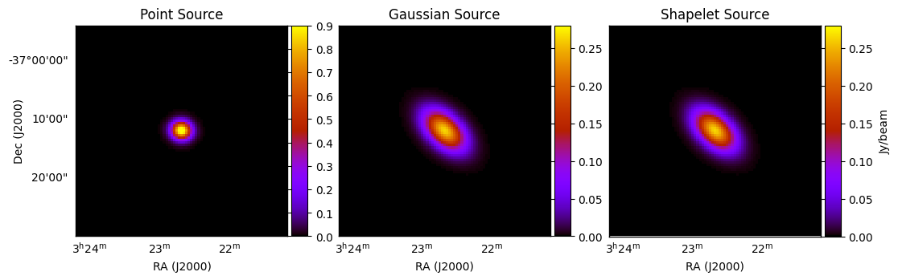
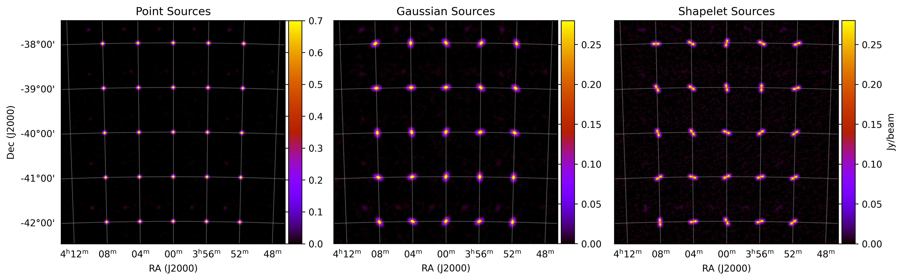
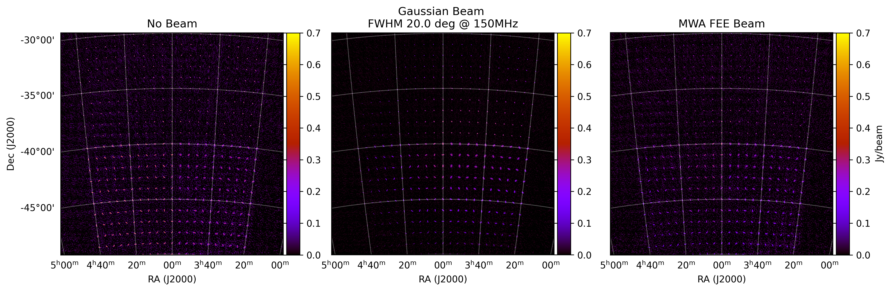
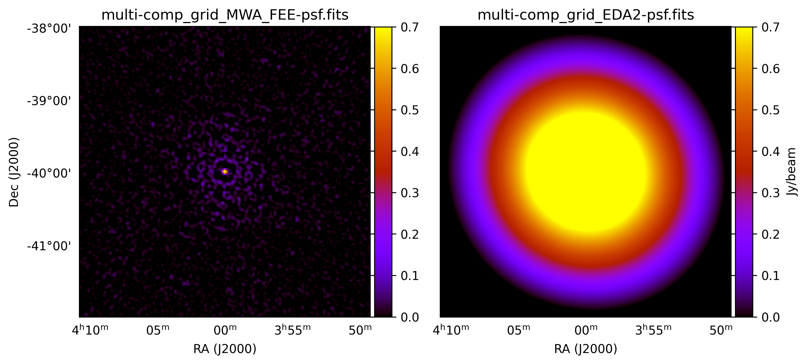
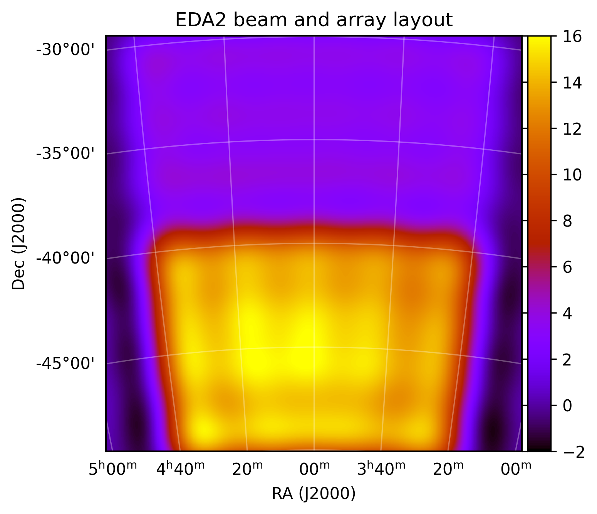

Testing installation via scripts
=================================

This is a straight-forward way to check your installation is working; just run some simple small simulations to check various functionality. Easiest way to check is to create images of the results. I've included a second set of scripts to convert the outputs to measurement sets and image them using ``WSClean``.

.. note:: I've tried to make these tests computationally low, so they need < 1.5 GB of GPU RAM, and < 8 GB system RAM. Running all the simulations will need about 600 MB of storage, with the imaging adding a further 800 MB (for a total of < 1.5 GB storage). The simulations should take < 2 minutes on most GPUs, and imaging less that 10 minutes for most CPUs (far less for fancier CPUs). I ran these tests fine on my laptop which has an Intel i7 2.8 GHz CPU, 16 GB system RAM, and an NVIDIA GeForce 940MX card with 2 GB RAM.

Running the simulations
------------------------

Once you've built ``WODEN``, and you have variables defined by calling ``WODEN/build/init_WODEN.sh``,
navigate to ``WODEN/test_installation``. To run all the tests immediately, you'll need to have obtained the defined the environment variable ``MWA_FEE_HDF5`` (see :ref:`Post compilation (optional)` for instructions on how to define that). To run all scripted test (including MWA FEE simulations)::

  $ cd WODEN/test_installation
  $ ./run_all_simulations.sh

This should rattle through a number of tests, with various combinations of component types (point, Gaussian, or shapelet) and different primary beams. If you don't want to run MWA FEE simulations, you can run::

  $ ./run_all_but_MWAFEE_simulations.sh

If you then want to run MWA FEE tests alone at a later date, you can run::

  $ ./run_only_MWAFEE_simulations.sh

If you want to incrementally run through tests, you can navigate through the ``single_component_models``, ``grid_component_models``, and ``different_beam_models`` directories to run each set individually.

Imaging the simulations
------------------------

Dependencies
^^^^^^^^^^^^^

To image the tests, you'll need a way to convert the uvfits files to measurement sets, and then image them. Which means dependencies (again).

+ **CASA** - https://casa.nrao.edu/casa_obtaining.shtml. Download an appropriate tarball (at the time 6.2 is the best version as it's ``python3``) and decompress it::

  $ wget https://casa.nrao.edu/download/distro/casa/release/rhel/casa-6.2.0-124.tar.xz
  $ tar -xvf casa-6.2.0-124.tar.xz

  That's it, it doesn't need installation
+ **WSClean** - https://wsclean.readthedocs.io/en/latest/installation.html. Head to this link to find out how to install ``WSClean``. You can of course use any other CLEANing software you want, but ``WSClean`` is excellent.

I'm assuming if you want to simulate interferometric data, you'll have some kind of FITS file imager already, but if not, ``DS9`` is a good place to start - https://sites.google.com/cfa.harvard.edu/saoimageds9.

Imaging scripts
^^^^^^^^^^^^^^^^

To use the imaging scripts, you **must** set an environment variable ``CASA_DIR`` to point towards the ``casa/bin`` of where you installed your ``casa``. For example, I did this::

  $ export CASA_DIR="/usr/local/casa-6.2.0-124/bin"

This will enable the scripts to convert the uvfits files to measurement sets. Once that variable is set, you can either image all the test outputs with::

  $ ./run_all_imaging.sh

or run the following as required::

  $ ./run_all_but_MWAFEE_imaging.sh
  $ ./run_only_MWAFEE_imaging.sh

Expected outcomes
------------------------

Nearly all of these simulations use the MWA phase 1 array layout, with a maximum baseline length of about 3 km, giving a resolution of around 3 arcmin.

Single Component Models
^^^^^^^^^^^^^^^^^^^^^^^^

You should end up with three very basis images, each of just a single component of type point, Gaussian, and shapelet::

  $ cd WODEN/test_installation/single_component_models/images
  $ ls *image.fits
     single_gauss-image.fits  single_point-image.fits  single_shapelet-image.fits

which should look like

For these simulations, I've switched off the primary beam, and set the spectral index to zero. I've also intentionally set the Gaussian and shapelet models to produce the same output, as the very first shapelet basis function is a Gaussian. All sources should have an integrated flux density of 1 Jy. If you're a sadist like me and still use ``kvis`` (https://www.atnf.csiro.au/computing/software/karma/) to look at FITS files, you can zoom into the source, and press 's' which will measure the integrated flux for you on the command line. This is quick and dirty, but gives us a good indication that the flux scale for all source types is working::

  points  mean mJy/Beam     std dev      min          max          sum
  2601     +16.917           +90.4008     -0.00196195  +999.997     +44001
  Total flux: 1000.00 mJy
  npoints  mean mJy/Beam     std dev      min          max          sum
  2601     +16.9164          +44.104      -0.110186    +264.247     +43999.5
  Total flux: 999.97 mJy
  npoints  mean mJy/Beam     std dev      min          max          sum
  2601     +16.916           +44.1038     -0.104652    +264.247     +43998.6
  Total flux: 999.95 mJy

This shows that we are within 50 micro Jy of the expected 1 Jy (taking into account that this is a CLEANed image with pixelisation effects).

Grid Component Models
^^^^^^^^^^^^^^^^^^^^^^^^

This should end up with three 5 by 5 grids, of the three component types::

  $ cd WODEN/test_installation/grid_component_models/images
  $ ls *image.fits
     grid_gauss-image.fits  grid_point-image.fits  grid_shapelet-image.fits

which should look like

The CLEAN isn't fantastic here as I've intentionally simulated a small amount of data to keep the size of the outputs down. But this tests that we can have multiple components and they are located at the requested positions (at every degree marker). I've included a very low-res model of PicA for the shapelet components, testing that we can have multiple shapelets with multiple basis functions. I've thrown in random position angles for the Gaussian and shapelets for a bit of variety.

Different Beam Models
^^^^^^^^^^^^^^^^^^^^^^^^

This should end up with a larger grid of a mix of components, with 4 different beam types (None, Gaussian, EDA2 (analytic dipole), and MWA FEE)::

  $ cd WODEN/test_installation/different_beam_models/images
  $ ls *image.fits
     multi-comp_grid_EDA2-image.fits      multi-comp_grid_MWA_FEE-image.fits
     multi-comp_grid_Gaussian-image.fits  multi-comp_grid_None-image.fits

The images with no beam, the Gaussian beam, and MWA FEE beam should look like this:

In the sky model, the top half are point sources, bottom left are shapelets, and bottom right are Gaussians. Again, limited data, so the CLEAN has some residuals. But we've successfully run a simulation with all three component types. We should also see different results for the Gaussian and MWA FEE beam plots, which we do, as we've used different primary beams. In particular I've made the Gaussian small enough of the sky to chop off the top left corner. The MWA FEE beam has a larger foot print.

For the EDA2 image, I've called the EDA2 array layout to override the settings in the metafits. The EDA2 has very short baselines, maximum of around 30 metres. If you compare the MWA phase 1 psf and the EDA psf we should be able to see the difference:

This tests that we can override the array layout with a specified text file. Unsurprisingly, this turns our EDA2 image of the same sky model into a bunch of blobs:

but this is what we expect. That's it for the simple installation tests. If you want to really test out the simulation capabilities of ``WODEN``, check out the :ref:`Example simulations`  section, which has bigger and better simulations.

Deleting test outputs
------------------------
If you don't want a bunch of files hanging around on your system for no reason, just run::

  $ ./delete_sim_outputs.sh
  $ ./delete_images.sh

which will nuke the outputs for you.
